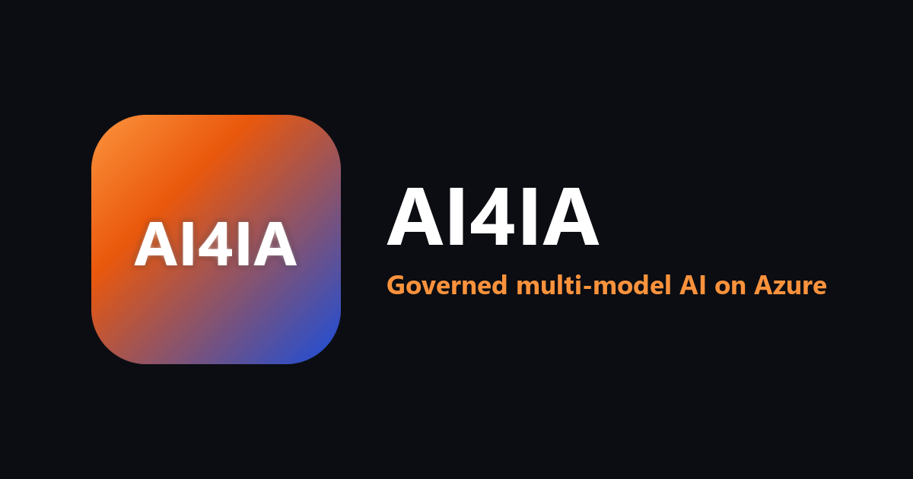

# AI4IA

AI4IA is a multi-model, multi-region **agentic chat application** for personal use
and customer demos. The repo is a monorepo: application code, model gateway, and
Azure infrastructure all live here and deploy through `azd`.

## Current state

*Deployed state below verified against live Azure and repo variables on
2026-08-04. Flag values can be changed after that date without touching this
file — `infra/main.parameters.json` plus the repo variables are authoritative,
and a repo variable overrides the parameter file's default. See
[`docs/configuration-reference.md`](docs/configuration-reference.md) for which
mechanism governs each flag.*

Implemented: governed HTTP/SSE model traffic through SimpleL7Proxy -> APIM,
realtime through the FastAPI relay -> APIM, Entra/MSAL auth, agents
and workflows (with opt-in durable execution on Durable Task Scheduler, so a
run survives a deploy, scale-in, or crash), per-user memory, usage metering and
entitlements, voice/STT/TTS +
Voice Live, image/video generation, document and multimodal understanding,
custom remote MCP tools, admin usage/resource dashboards, and Azure Monitor /
Application Insights telemetry.

The live deployment is in the Planet Express tenant
(`6907d2a4-685a-4aea-92ab-d930217467f1`; Entra may still display "Contoso") and
subscription `sub-planetexpress-slurmfactory`
(`e852113b-6cb5-441c-ac68-26cff884e479`), resource group
`rg-ai4ia-slurmfactory`. Public entry points are
`https://ai4ia.nomad-analytics.com` for the app and
`https://genaiproxy.nomad-analytics.com` for compatible model traffic.

Advanced capabilities are feature-gated. Code defaults stay safe and mostly OFF;
the deployed environment is controlled by `infra/main.parameters.json` and azd
environment values. The checked-in live parameters enable the application
capabilities, including Web IQ search (the `/research` command) and the
inline-attachment Code Interpreter. Request-priority banding is also live
(`AI4IA_PROXY_PRIORITIES_ENABLED=true` overrides the parameter file's `false`
default, so admins get the reserved band), while the multi-application profile,
Event Hub telemetry, and durable-async gateway controls remain off. Web IQ
authenticates with the API's managed identity unless `AI4IA_WEBIQ_API_KEY` is set. See
[`docs/runbooks/feature-enablement.md`](docs/runbooks/feature-enablement.md).

Known gaps to keep visible:

- The document library UI is still document-centric; custom analyzer authoring,
  folder-level sharing, and unauthenticated public links are not implemented.
- Memory has save/forget APIs and automatic recall, but no global user-facing
  memory toggle or recalled-memory indicator in chat.
- Multi-application profiles remain blocked until the public proxy edge validates
  a workload identity; shared-key ingress is not sufficient for trusted app
  identity or per-app policy.

## Repository layout

```text
/infra      Bicep modules, main.bicep, parameters, and model catalog
/app/web    Next.js web app: chat, admin dashboard, document/media UI, auth
/app/api    FastAPI backend: auth, chat, agents, tools, memory, documents, usage
/proxy      Vendored SimpleL7Proxy model gateway plus AI4IA Dockerfile/notes
/scripts    Catalog, inventory, teardown, purge, and azd hook scripts
/site       Self-documenting portal (docs + timestamped status), published to GitHub Pages
/docs       Architecture, capability map, naming/tagging, and runbooks
azure.yaml  Azure Developer CLI service map
```

## Key decisions

- **IaC:** Bicep + Azure Developer CLI (`azd`).
- **Stack:** Next.js/TypeScript web, Python FastAPI API, .NET SimpleL7Proxy.
- **Model gateway:** compatible HTTP/SSE calls go SimpleL7Proxy -> APIM; realtime
  WebSockets go FastAPI relay -> APIM. Two explicit direct Foundry exceptions are
  documented in `AGENTS.md`: Content Understanding's native data plane and the
  Responses-API Code Interpreter (the stateful sandbox is not a routable
  chat-completions deployment). Azure Monitor is a separate native control/data
  plane, not model inference.
- **Catalog-driven models:** `infra/models.json` is the deployment source of truth
  and generates the packaged API model catalog, including per-model
  `reasoning_effort` values.
- **Regions:** East US 2 and Sweden Central are the primary US/EU regions; West US
  carries targeted models such as MAI Image and deep research. See
  [`docs/region-capability-matrix.md`](docs/region-capability-matrix.md).
- **Identity:** Entra workforce/B2B now, with an internal user id decoupled from
  the identity provider.

## Deploy

> `azd up` is appropriate only for an **already configured** environment. A
> clean tenant also needs Entra app registrations, provider/model quota
> preflight, deployment identity/RBAC, auth variables, and the custom-domain
> two-pass sequence. The checked-in profile enables paid capabilities and
> intentionally refuses insecure dev auth in a deployed environment.

```powershell
# After completing the prerequisites in the deployment runbook:
az login
azd env new ai4ia-dev
azd up
```

Merges to `main` deploy only after the one-time GitHub OIDC setup is complete.
See [`docs/runbooks/deployment.md`](docs/runbooks/deployment.md).

## Documentation

The **[self-documenting portal](https://ian-t-adams.github.io/AI4IA/)** (published from
[`site/`](site/) to GitHub Pages) is the friendliest entry point: it explains the app,
renders the architecture diagrams, catalogues every deployed Azure service, lists the
requirements (IaC, permissions, packages), and shows a
**[timestamped status/health snapshot](https://ian-t-adams.github.io/AI4IA/status.html)** of the
deployed resources. The authoritative Markdown lives here:

- [User guide](docs/user-guide.md)
- [Architecture](docs/architecture.md)
- [Editable architecture visual](docs/architecture-overview.excalidraw)
- [Region & capability map](docs/region-capability-matrix.md)
- [Naming & tagging](docs/naming-and-tagging.md)
- [Configuration reference](docs/configuration-reference.md)
- [Roadmap & open items](docs/roadmap.md)
- [Deployment runbook](docs/runbooks/deployment.md)
- [Feature enablement runbook](docs/runbooks/feature-enablement.md)
- [Teardown & rebuild runbook](docs/runbooks/teardown.md)
- [Document & multimodal understanding](docs/document-multimodal-understanding.md)

## Branding



Brand assets live in [`assets/branding/`](assets/branding/), and are all generated
by `python scripts/gen-brand-assets.py` — never edit them by hand:

- `ai4ia-lettermark.png` — primary lettermark (1200x630, opaque). Byte-identical to
  the portal's Open Graph card so the two cannot drift.
- `ai4ia-icon-1024.png` — 1024x1024 icon with transparent rounded corners.
- `ai4ia-icon.ico` — multi-size Windows icon (16-256px).

The generator also owns the web app and portal icons. `scripts/tests/test_brand_assets.py`
fails if any committed image is not covered by it, or if one still carries the
previous palette.
