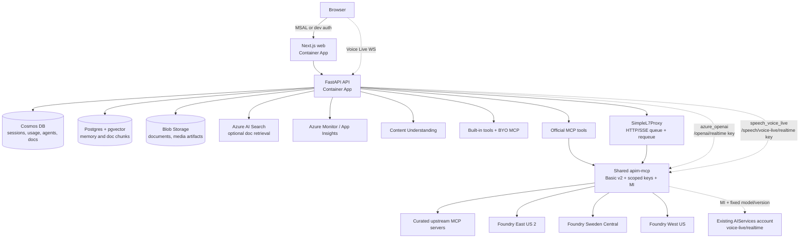
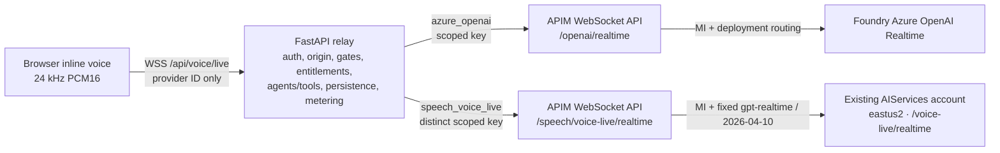
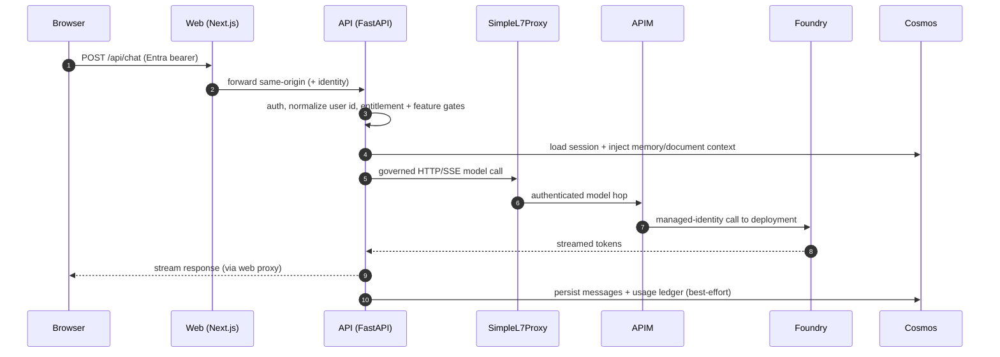
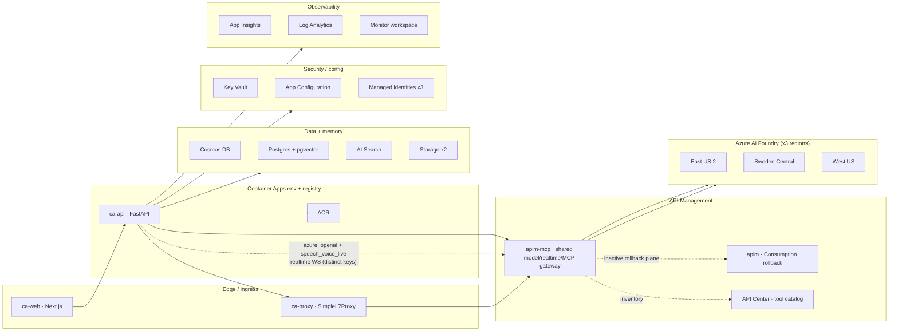
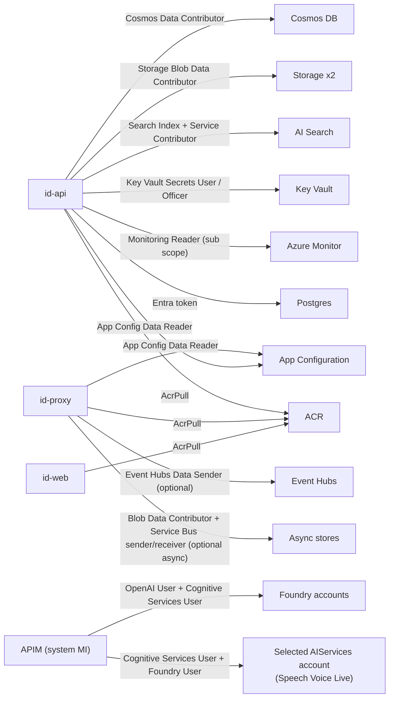
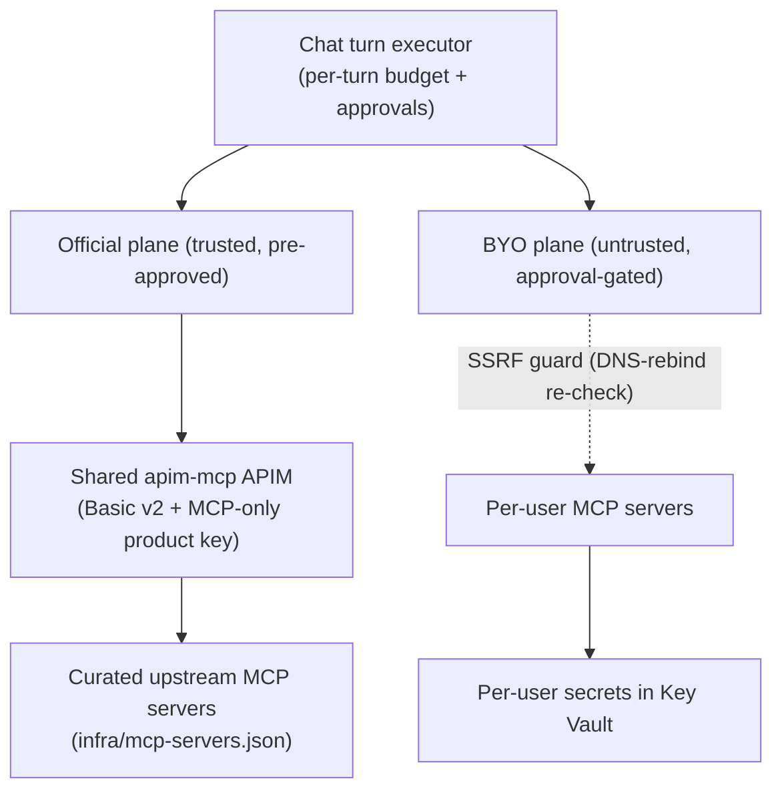

# AI4IA Architecture

AI4IA is a governed, multi-model chat and agent app on Azure Container Apps. The
web frontend calls the FastAPI backend; the backend owns auth, session state,
tools, memory, document/library access, usage metering, and all model routing.

Editable visual: [`architecture-overview.excalidraw`](./architecture-overview.excalidraw).
Live, always-current view: the [status &amp; documentation portal](https://ian-t-adams.github.io/AI4IA/).

## High-level flow

Voice Live connects directly from the browser to the API because the Next.js HTTP
proxy cannot proxy WebSockets. The API relay still enforces auth, Origin checks,
entitlements, metering, deployment resolution, and optional governed tool calling.
Its upstream WebSocket goes to one of two separately scoped APIM WebSocket APIs on
the same shared active Basic v2 APIM, selected by the `provider` the browser sent:
`azure_openai` (catalog deployment routing) or `speech_voice_live` (fixed managed
model, second provider, default OFF). SimpleL7Proxy is deliberately bypassed for
both because it supports HTTP/SSE, not WebSockets.

### Voice providers

AI4IA advertises two stable voice provider IDs — `azure_openai` and
`speech_voice_live` — behind one `/api/voice/live` relay and one inline chat
transcript:

- `azure_openai` is the default-safe provider: it stays enabled and default unless
  an operator deliberately reconfigures `AI4IA_VOICE_DEFAULT_PROVIDER`. It resolves
  a realtime model/region from `infra/models.json` exactly as before.
- `speech_voice_live` is an additive, default-off second provider. It is fixed to
  the managed `gpt-realtime` model at API version `2026-04-10` against the initial
  existing `eastus2` AIServices account, with only curated `azure-standard`
  built-in voices/capabilities from the generated voice provider catalog — no
  custom endpoint, lexicon, or personal voice is accepted.
- Both providers share the same governed relay path (auth, Origin, feature and
  entitlement checks, agents/tools, transcript persistence, provider-aware usage
  metering, and cleanup) and the same inline transcript/session. A provider switch
  applies only to the **next** connection; it never triggers a silent reconnect of
  an active session.
- Each provider holds a distinct APIM subscription key scoped to its own
  WebSocket API, so neither key can invoke the other provider's API, the normal
  model API, the MCP plane, or the proxy ingress product.

## Request lifecycle

1. The browser authenticates through Entra/MSAL or local dev identity and calls the
   Next.js app.
2. The web app forwards API requests server-side with the current identity context
   and feature visibility from runtime environment variables.
3. The FastAPI service normalizes the user id, enforces admin/feature/tool gates,
   loads session state, and builds the governed model/tool plan.
4. Compatible model calls route through SimpleL7Proxy, then APIM, to a
   catalog-selected Foundry deployment. APIM performs bounded immediate regional
   failover; a full-capacity `429` carries the `S7PREQUEUE`/`retry-after-ms`
   contract back to the proxy for delayed requeue. Native Azure service planes
   such as Content Understanding, Azure
   Monitor, Key Vault, Blob Storage, Cosmos, and AI Search are called directly with
   managed identity or configured service auth.
5. Durable state is written to Cosmos and Blob Storage; derived memory/search/chunk
   stores are updated best-effort and can be rebuilt.

## Core principles

1. **Gateway-first model calls.** Chat, agents, embeddings, image/video generation,
   and REST speech route SimpleL7Proxy -> APIM. Realtime/Voice Live (both
   `azure_openai` and `speech_voice_live`) stays on the governed FastAPI relay ->
   APIM path because the proxy is not a WebSocket server. Non-chat Azure
   service planes such as Content Understanding and Azure Monitor use their native
   endpoints with managed identity or configured service auth.
2. **Catalog-driven deployments.** `infra/models.json` is the deployment source of
   truth and generates the packaged API model catalog. Capability models stay out
   of chat pickers unless their category is explicitly allowed.
3. **Feature-gated advanced surfaces.** Voice Live, document understanding,
   document compute, inline attachment compute, custom (BYO) MCP tools, the
   official APIM-fronted MCP plane, Web IQ, search, image/video generation, and
   memory all have explicit config gates and fail-closed prerequisites.
4. **Cosmos is canonical; derived stores are rebuildable.** Sessions, messages,
   usage, user agents/workflows, MCP server records, and document manifests live in
   Cosmos. Memory vectors, document chunks, search indexes, and parsed artifacts
   can be regenerated from canonical records and blobs.
5. **Per-user isolation.** User ids are normalized at the API boundary. Cosmos
   partitions, blob prefixes, vector filters, memory records, and MCP secrets are
   scoped to the authenticated user; document sharing widens reads through a
   single access gate.
6. **Telemetry without blocking the hot path.** Usage writes, custom events,
   resource metrics, and optional App Insights export are best-effort and never
   break a chat turn.

## Gateway execution boundaries

- DNS/custom domain terminates on the public SimpleL7Proxy Container App. APIM is
  the proxy's backend and never routes back to the proxy.
- FastAPI receives the realtime-only APIM key. It uses that same value to
  authenticate to the proxy for normal calls; the proxy strips it and injects a
  separate model-API subscription key. The realtime subscription cannot invoke
  the normal APIM model API.
- `speech_voice_live` adds a second, independently scoped APIM subscription held
  only by FastAPI, bound to the `/speech/voice-live/realtime` WebSocket API. That
  key cannot invoke `/openai/realtime`, the normal model API, the MCP plane, or the
  proxy ingress product, and the `/openai/realtime` key cannot invoke it either.
- APIM performs bounded immediate attempts across compatible regional
  deployments. SimpleL7Proxy performs delayed requeue and owns queue TTL and
  per-replica circuit breaking. The synchronous queue is not durable or global.
- Event Hub carries optional metadata telemetry only. Dedicated Blob and Service
  Bus resources are provisioned only for explicit durable async mode.
- Cosmos remains canonical. The proxy has no Cosmos RBAC. A minimal profile
  snapshot can be mounted as a secret file, but enablement is blocked until the
  edge can prove application identity.

## Components

| Layer | Tech | Notes |
|---|---|---|
| Web | Next.js + TypeScript | Chat, voice, library/media, admin, auth runtime config |
| API | FastAPI + Pydantic | Auth, chat, agents, tools, documents, usage, metrics |
| Agent runtime | In-process Python | Gateway-native tool loop and user-defined agents |
| Model gateway | SimpleL7Proxy + APIM | HTTP/SSE priority queue and delayed requeue; catalog routing and managed identity to Foundry |
| App data | Cosmos DB | Sessions, messages, usage, agents, workflows, documents |
| Memory/chunks | Postgres + pgvector / mem0 | Per-user semantic recall and document chunks |
| Search | Azure AI Search | Optional hybrid/semantic document retrieval backend |
| Storage | Blob Storage | Raw documents, parsed artifacts, generated media |
| AI services | Foundry + Content Understanding | Models, realtime, speech, image/video, CU ingest |
| Observability | Log Analytics + App Insights + Monitor | Logs, traces, metrics, admin resource panels |

## Deployment topology

The live footprint in `rg-ai4ia-slurmfactory` (East US 2 primary), grouped by role.
A live, always-current view is published on the
[status portal](https://ian-t-adams.github.io/AI4IA/status.html).

## Identity and RBAC

Azure service data planes use managed identities and scoped role assignments. The
current proxy/APIM transition uses two independently scoped APIM subscription keys:
one secret for proxy -> normal-model APIM and one realtime-only key that also
authenticates FastAPI -> proxy. Both remain Container App secrets and are stripped
before forwarding. The migration target is Entra workload authentication on both hops.
`speech_voice_live` adds a third, distinct APIM subscription key (`ai4ia-api-speech-voice-live`)
held only by FastAPI and scoped only to the Speech Voice Live WebSocket API.

The shared active APIM's system-assigned managed identity gets the additional
**Foundry User** role (formerly Azure AI User) on the single existing AIServices
account Speech Voice Live is approved to reach, on top of the **Cognitive Services
User** role every Foundry backend already grants it. Both roles are scoped only to
that one account, never broadened to every regional Foundry backend. APIM
authenticates to it using a managed-identity audience (`speechVoiceLiveManagedIdentityAudience`,
default `https://ai.azure.com`) that is a deployment-only Bicep parameter, not a
runtime setting the app or browser can influence; confirming that this specific
account accepts that audience remains a pending live-validation gate tracked in
the operator's local (gitignored) approval plan, not this repository's published docs.

## MCP tool planes

Remote MCP tools reach the model through two independent planes that share one
governed per-turn executor:

- **BYO (bring-your-own).** Per-user servers a signed-in user registers. Called
  **directly** behind the SSRF guard (DNS-rebind re-validation at call time), with
  credentials in per-user Key Vault. Untrusted by default, so their tools are
  approval-gated.
- **Official (curated).** An admin-defined catalog (`infra/mcp-servers.json`)
  reached **through the shared `apim-mcp-*` APIM** (`apimcore.bicep` owns the
  Basic v2 service; `mcpgateway.bicep` owns its MCP children)
  with a product-scoped app-global subscription key. Trusted ⇒ pre-approved. The
  MCP product associates only MCP APIs, so its key cannot call the model/realtime
  APIs. The legacy Consumption model gateway remains a temporary rollback plane.

The BYO plane is **default-OFF**. The official plane's bicep params default off too, but in this
repo it is **activated**: `enableOfficialMcp=true` and the catalog registers the Foundry toolbox
(`ai4ia-toolbox`). Each turn builds the official plane first and BYO second, then merges them: on a
tool name collision the **official tool wins**, auto-approvals are unioned, and a single per-turn
budget caps total MCP calls across both planes.

## Regions

See [region-capability-matrix.md](./region-capability-matrix.md). The default
strategy uses:

- **East US 2** for the primary US model set, realtime, image/video, router, and
  evaluations.
- **Sweden Central** for EU-resident model parity where available.
- **West US** for targeted models such as MAI Image and deep research.

## Current gaps

- Multi-application profiles remain default-off and the deployment validator
  refuses to enable them while ingress uses a shared key. A verified
  identity-aware application header (target: Entra workload auth) is required
  before the mounted server-owned profile projection may become authoritative.
- SimpleL7Proxy queue priority/fairness state is in-memory and per replica. Keeping
  a warm replica removes cold-start risk but does not create durable, global
  ordering across replicas.
- External ID/CIAM is not wired; current auth is Entra workforce/B2B.
- Folder-level document sharing and unauthenticated public links are not
  implemented; `public` documents are tenant-walled.
- The library UI does not yet expose custom analyzer authoring or first-class
  non-document modality uploads.
- Memory lacks a global user-facing toggle and recalled-memory indicator.
- `speech_voice_live` is implemented but disabled by default
  (`speechVoiceLiveEnabled=false`) pending a separately approved live-validation
  pass confirming the selected AIServices account's Cognitive Services User +
  Foundry User RBAC and managed-identity audience, an APIM policy compiler run,
  and a zero-delete production what-if. It must not be enabled before those
  approvals close.

### APIM replacement cutover

The active APIM is a deterministic Basic v2 service with system-assigned identity. It carries both catalog-routed HTTP/SSE and the WSS realtime onHandshake API from one gateway base with separately scoped keys, including the additive `speech_voice_live` WebSocket API and its own distinct subscription. The prior Consumption APIM remains fully configured but receives no active traffic during a temporary stabilization window. This overlap is migration state, not permanent architecture; removing Consumption is a later destructive change with separate approval.
