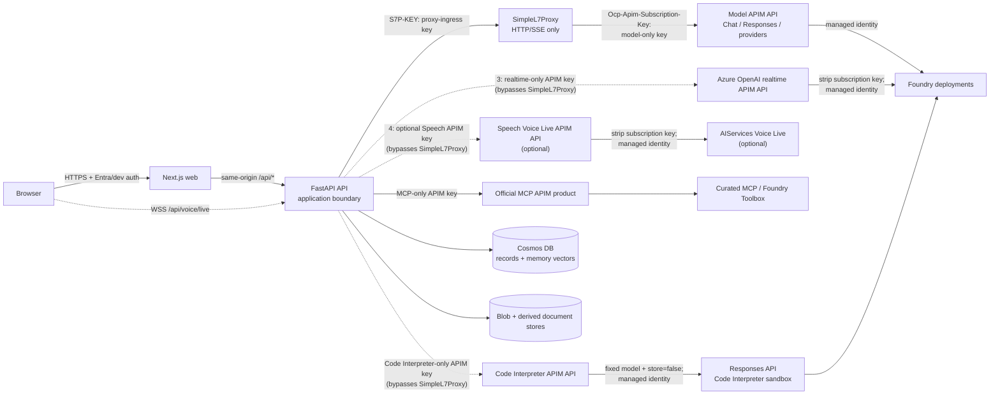

# AI4IA Architecture

AI4IA is a governed, multi-model chat and agent platform on Azure Container Apps.
The Next.js app is the browser experience; FastAPI is the application trust
boundary and owns identity, authorization, sessions, tools, memory, documents,
usage, and model routing.

Editable source:
[`architecture-overview.excalidraw`](./architecture-overview.excalidraw). The SVG
is a deterministic, dependency-free rendering of the same coordinates and labels;
it is generated locally and never through excalidraw.com.

## Architectural invariants

1. **Gateway-first model traffic.** HTTP/SSE chat, agents, embeddings,
   image/video, REST speech, and Anthropic Messages calls flow
   `FastAPI -> SimpleL7Proxy -> model APIM -> Foundry`.
2. **WebSockets bypass only the HTTP proxy.** Realtime and Voice Live flow
   `Browser -> FastAPI relay -> realtime APIM -> Foundry` because
   SimpleL7Proxy does not support WebSockets. They never bypass APIM.
3. **Code Interpreter bypasses only the compatible HTTP proxy.** Document compute
   calls a dedicated APIM API for `/openai/v1/responses` and the Files API. The
   stateful Azure-managed container is not a chat-completions deployment, so
   SimpleL7Proxy's catalog route cannot carry it. APIM accepts only the configured
   model, `store=false`, and exactly one `code_interpreter` tool; it strips the
   API-scoped subscription key and authenticates to the primary Foundry account
   with managed identity. FastAPI has no direct OpenAI inference role. Call-site
   entitlement, ownership, approval, file-size, and attempt-metering controls
   still apply.
4. **Scoped credentials protect every model hop.** FastAPI holds separate
   proxy-ingress, realtime, and Code Interpreter APIM keys. SimpleL7Proxy alone
   holds the normal model-APIM key. Optional Speech Voice Live and official MCP
   each add another independently scoped key. No one credential can invoke every
   model/tool API.
5. **Models are catalog-driven.** `infra/models.json` is authoritative for
   deployments, regions, categories, per-model reasoning effort, capabilities, and
   generated runtime data. Entitlement-gated providers may remain in that complete
   source while Bicep and the runtime omit them together; Claude is default-off
   under `AI4IA_CLAUDE_ENABLED`.
6. **Cosmos is canonical.** User sessions, messages, usage, agents, workflows,
   MCP records, document manifests, and memory text/vectors are durable and
   user-scoped in Cosmos. Document chunks, search indexes, and parsed artifacts
   are derived and rebuildable.
7. **FastAPI enforces feature posture.** Browser visibility is not authorization.
   Startup validation fails closed for enabled features with missing prerequisites.
8. **Tools are authorized when they run.** Registration-time checks do not replace
   execution-time scope, approval, ownership, host, and SSRF validation.

## Components

| Boundary | Component | Responsibility |
| --- | --- | --- |
| User | Browser | Chat, agents, workflows, library/media, voice, settings, and admin views |
| Web edge | Next.js Container App | MSAL integration, same-origin HTTP proxy, runtime feature visibility, and static UI |
| Application | FastAPI Container App | Auth, user normalization, sessions, chat/agent execution, tool governance, documents, memory, usage, and telemetry |
| Compatible model edge | SimpleL7Proxy Container App | Authenticated HTTP/SSE ingress, in-memory queueing, delayed requeue, and per-replica circuit breaking |
| AI gateway | Basic v2 APIM | Model catalog routing, bounded immediate regional failover, scoped subscriptions, policy enforcement, and managed identity to Foundry |
| Agent tools | Built-ins, BYO MCP, official MCP, and Foundry Toolbox | Governed tool discovery and execution with budgets, approvals, redaction, and health state |
| Web grounding | WebIQ | Separate feature-gated server-side search/browse tools whose bounded results are treated as untrusted model context |
| Canonical state | Cosmos DB and Blob Storage | User-scoped records and memory text/vectors plus source documents and durable generated artifacts |
| Derived state | Azure AI Search | Rebuildable document chunks and retrieval indexes |
| Native Azure planes | Content Understanding, Monitor, Key Vault, Storage, Cosmos, Search | Non-model control/data planes called directly with managed identity or configured service auth |
| Sandboxed compute | Code Interpreter APIM + Azure OpenAI Responses API | API-scoped APIM route to the Azure-managed Python container for `run_code` and `analyze_attachment`; `export_document` writes the resulting owner-scoped artifact |
| Observability | Application Insights, Log Analytics, Azure Monitor | Correlated logs, traces, usage, resource metrics, and fixed operator queries |

## Trust boundaries and request paths

### Credential map

| Credential | Holder | Permitted hop | Scope |
| --- | --- | --- | --- |
| Proxy-ingress key | FastAPI and proxy ingress validator | FastAPI -> SimpleL7Proxy | Opaque `S7P-KEY`; the backing APIM product has no APIs, so it cannot call model or realtime APIs |
| Model-APIM subscription key | SimpleL7Proxy only | SimpleL7Proxy -> model APIM | Normal compatible model API only; stored as proxy Container App secret |
| Realtime APIM subscription key | FastAPI only | FastAPI relay -> `/openai/realtime` | Realtime API only; cannot invoke the normal model API |
| Speech Voice Live key (optional) | FastAPI only when enabled | FastAPI relay -> `/speech/voice-live/realtime` | Separate default-off API and subscription; distinct from all three core keys |
| Official MCP subscription key | FastAPI official MCP service | FastAPI -> official MCP APIM product | MCP APIs only; cannot invoke model/realtime APIs |
| Code Interpreter APIM subscription key | FastAPI only when document or inline compute is enabled | FastAPI -> `/code-interpreter/openai/v1/responses` and `/files` | Dedicated API only. APIM requires the configured model, `store=false`, and one Code Interpreter tool, then uses managed identity against the primary Foundry account. |

Each APIM API validates its own scoped subscription at ingress, removes the
subscription-key header before the backend hop, and uses managed identity for
Foundry or the approved AIServices backend. User tokens and gateway keys therefore
do not flow downstream. Browser-supplied internal identity headers are not
authoritative.

### Resolved: Code Interpreter authority is isolated at APIM

`infra/main.bicep` passes an empty `nativeFoundryPrincipalIds` array, so a
greenfield API UAMI receives no direct inference assignment. ARM uses incremental
mode, so an existing environment may retain assignments created by an older
template. The deploy workflow now enumerates the literal account-scoped
assignments by scope and principal and fails before image promotion if either
`Cognitive Services OpenAI User` or the broader `Cognitive Services User` remains;
it prints exact assignment IDs for a human-reviewed one-time revocation and never
deletes RBAC automatically.

The existing Basic v2 APIM owns an additive `code-interpreter` API with its own subscription. Its
policy rejects a Responses request unless it names the configured deployment,
sets `store=false`, and carries exactly one `code_interpreter` tool. Multipart
Files uploads and deletes pass through without body rewriting; all caller
credentials/internal headers are removed before APIM obtains a
`https://ai.azure.com` token.

After that one-time legacy-role revocation, this narrows a compromised FastAPI process from account-wide Foundry inference
authority to one API whose policy exposes only the sandbox contract. APIM remains
the model data-plane trust boundary. ACA Sandboxes are being evaluated separately
as a future customizable execution substrate; preview research does not weaken
this production boundary.

### Compatible HTTP/SSE lifecycle

1. The browser calls the same-origin Next.js API route with Entra identity, or the
   development proxy supplies the configured local identity.
2. FastAPI normalizes the internal user id, loads the owned session, checks feature
   and entitlement posture, composes memory/document context, and authorizes tools.
3. FastAPI sends the catalog-shaped request to SimpleL7Proxy with the
   proxy-ingress key. Chat Completions is the internal agent-loop shape. The
   gateway adapter translates it to Responses input/function items or Anthropic
   Messages when the catalog selects those provider APIs.
4. SimpleL7Proxy strips caller auth/internal headers, injects its own model-APIM
   key, derives `x-LLMModel` from the deployment path or the Responses `model`
   body field, and forwards the request.
5. APIM validates the model catalog, performs bounded immediate attempts across
   eligible regions, and calls Foundry with managed identity. For Claude it
   switches the audience to `https://ai.azure.com`, rewrites the upstream path to
   `/anthropic/v1/messages`, fixes `anthropic-version`, and drops OpenAI query
   parameters; callers cannot select those values. MAI chat and image deployments
   use the account's `.services.ai.azure.com/mai/v1/*` surface, while Sora 2 uses
   the Azure OpenAI v1 `/videos` create/status/content operations. FastAPI keeps
   the deployment in the proxy-facing path so SimpleL7Proxy can stamp the trusted
   model header even on bodyless status and content reads; APIM owns the final
   provider path and regional deployment binding.
   Responses requests explicitly set `store=false`; AI4IA resends Cosmos history
   instead of chaining provider-stored turns with `previous_response_id`. During
   one tool loop, opaque encrypted reasoning items remain in memory long enough
   to continue statelessly and are excluded from persisted receipts and messages.
6. If every eligible backend is throttled, APIM returns the
   `429` + `S7PREQUEUE` + `retry-after-ms` contract; SimpleL7Proxy owns delayed
   requeue. `MaxAttempts=1` prevents retry multiplication.
7. FastAPI streams the answer and persists messages and usage.

Claude's Azure-hosted v2 response does not carry Azure
`content_filter_results`. Foundry documents that Claude has no built-in Azure
content filtering at deployment time, so those turns remain safety-unattested in
AI4IA rather than receiving a fabricated "safe" verdict. Anthropic's own safety
systems still apply; this is not equivalent to the annotate-only Azure signal
captured for Azure OpenAI chat models.

### Realtime and voice lifecycle

The browser opens `/api/voice/live` directly on FastAPI because the Next.js HTTP
proxy and SimpleL7Proxy do not proxy WebSockets. FastAPI validates auth, Origin,
session ownership, feature gates, entitlements, provider/model selection, and
voice-capable tools before opening the APIM socket. The API replaces client voice
instructions with the selected agent persona or saved session prompt.

`azure_openai` resolves a realtime deployment from `infra/models.json` and remains
the server-authoritative default. The additive `speech_voice_live` provider has a
separate APIM API/key and account-scoped managed-identity path. Its Bicep template
default is off. When enabled, run the authenticated canary for both providers
(target the `wss://` form of `AZURE_API_URL`, never the web/Next.js hostname)
before relying on either.
FastAPI presents key 3 only to the Azure OpenAI realtime APIM API and optional key
4 only to the Speech Voice Live APIM API; neither key crosses the APIM boundary.
Turn-based transcription and text-to-speech remain compatible HTTP calls and use
the normal SimpleL7Proxy path.

## State, ownership, and consistency

| Data | System of record | Ownership and consistency |
| --- | --- | --- |
| Sessions and messages | Cosmos | Partitioned and queried by normalized internal user id; writes use field-scoped patches and guarded replacement |
| Usage and entitlements | Cosmos | User-scoped ledger; unknown provider usage is represented as unknown, not fabricated zero |
| User agents/workflows | Cosmos | Owned records; selected/inherited tools are re-authorized at execution |
| MCP server records | Cosmos | User-owned metadata; durable secrets live in Key Vault, not Cosmos |
| Document manifests/shares | Cosmos | Owner-scoped writes and a common access predicate for owned, email-shared, and tenant-public reads |
| Source documents and artifacts | Blob Storage | Private; bytes are served through authenticated API routes |
| Memory text and vectors | Cosmos `memories` | Canonical; `/userId` partition, point operations always include the authenticated user partition, ETag writes, per-user write epochs, and scoped deletion cutoffs |
| Document chunks/indexes | Azure AI Search | Derived, filtered by user/document ownership, and rebuildable from canonical manifests/blobs |

Session policy changes use atomic patches. Explicit document selection is an exact
allowlist; missing selection preserves legacy all-accessible behavior, while an
empty list disables library context. Revoked access is rechecked at retrieval and
tool execution, so stale ids do not restore access. Summary writes carry a
monotonic version so stale workers cannot reintroduce cleared context.

Telemetry and secondary-index updates are best-effort and may be partial, but
canonical message/session writes must report failures rather than presenting a
false success.

The admin usage dashboard is the one deliberate cross-partition ledger read. It
is a **single** window-bounded, row-capped, field-projected scan per page load
(`GET /api/admin/usage/overview`), from which every rollup is folded in one pass;
the per-panel endpoints remain for single-report callers. Consolidation is a
memory bound, not a nicety: seven concurrent full-row scans of the same window
could hold roughly seven copies of a 50,000-row window in an API replica capped
at 1 GiB that is also serving chat. When the row cap is hit the response reports
`truncated`, so totals are shown as a lower bound rather than a wrong total, and
a rollup that fails is named in `partialSections` so panels still degrade
individually.

Cosmos memory stores plaintext and its embedding in one item. Explicit create,
update, and delete use idempotency receipts and ETags; user-created or edited
records are locked against automatic planner mutation. Forget first advances a
per-user write epoch, then purges only matching older records, so stale writes
cannot resurrect deleted memory and post-forget writes survive. Document memory
replacement and source markers share a partition transaction; a permanent source
tombstone prevents a stale save from recreating memory after its document is
deleted. See [Memory architecture](./memory.md).

## Agent and tool execution

The in-process agent runtime receives only server-approved tool schemas. Per turn:

1. FastAPI composes built-in, official MCP, and optional BYO MCP capabilities.
2. Repository-curated Foundry skills are advertised by bounded MCP resource
   metadata. The full `SKILL.md` is fetched only when the model selects
   `load_skill`; its URI, content digest, version/default resolution, and
   truncation state become observable execution metadata.
3. Remote MCP tools receive deterministic provider-safe aliases while dispatch
   retains the exact remote name. Plane/server identity is part of the alias and
   approval binding; deterministic precedence resolves any remaining collision.
4. The registry rechecks scopes, approvals, ownership, host policy, and SSRF rules.
5. The invocation policy holds gated external/destructive calls for exact-argument
   approval unless an explicit, valid session/run consent covers the enabled tool
   contract. Consent does not bypass the registry or handler's authorization.
6. Tool errors and denials become structured outcomes the model can handle; call
   budgets and orchestration depth bound fan-out.
7. The assistant answer, usage, artifacts, and metadata-only activity trace are
   persisted.

BYO MCP servers are untrusted and approval-gated. DNS/public-HTTPS validation is
performed again when a request runs to resist DNS rebinding. Official MCP servers
are admin-curated and reached through an MCP-only APIM product. Foundry Toolbox is
one official MCP upstream. Only generated toolbox catalog entries may expose MCP
resources as skills; BYO resources are never accepted as instructions. A loaded
skill taints the turn, preserving exact-argument approval for later outbound
calls. WebIQ search is a separate feature-gated server-side capability whose
bounded output is treated as untrusted model context.

### Execution receipts, not hidden reasoning

Every persisted model turn carries an additive, bounded execution receipt. It
records the correlation id; resolved model deployment, region, SKU, data zone,
residency and API; instruction and agent-configuration hashes; the exact first
model prompt after the runtime's own context bound; admitted versus displaced
summary, memory, session-document and library blocks; durable source
identities/versions and content hashes; tool definitions offered; finalized tool
calls; approval counts and provenance; and redacted-canonical arguments/results.
Successful linked-agent runs keep a nested receipt with that agent's own prompt,
tool offers/calls, usage, and safety evidence rather than collapsing to only the
delegated answer.

Arguments and results are re-redacted at the persistence boundary even though
the runtime already redacts them. Each payload is capped at 2 KiB and retains the
SHA-256 and original byte length of the full redacted value; the whole receipt is
deterministically capped at 32 KiB. Historical snapshots remain immutable when a
memory or document is later deleted, just as the prior answer itself remains.
The final assistant response is the message body; later tool-loop prompts are
reconstructable from the first prompt plus the recorded calls/results.

This is observable execution provenance, not chain-of-thought. Provider APIs do
not expose raw hidden reasoning, and AI4IA has no field or UI that claims they do.

### Per-invocation tool approval

Retrieved documents, recalled memory, library excerpts and prior tool results are
promoted into a turn's context. They are nonce-fenced, which defeats delimiter
forgery, but a fence is not an information-flow boundary: text inside one can
still influence what the model decides to *do*. Standing approval — a `trusted`
MCP server, or a per-tool `requireApproval: never` — used to be enough to execute
an outbound call with model-chosen arguments, so injected content could pick a
destination and a payload with no human in the loop.

By default, approval is therefore a property of one call, not of a tool. The runtime hashes
the arguments the model actually emitted and refuses a gated call unless a
server-minted approval exists for that exact `(tool, argument-digest)` pair. A
held call ends the turn normally with a prompt showing the tool, the destination
host, the purpose and a redacted argument preview; the user approves, and the
next turn presents a one-time grant that the server redeems against its own
durable record. The record is bound to user, session, tool, argument digest and a
short expiry. It is burned on use — with a conditional (ETag) write, so two
concurrent requests presenting the same grant cannot both redeem it — and the
resulting authorization is spent the moment it dispatches one call, so a single
approval buys exactly one execution rather than one per emission. It therefore
cannot be replayed for different arguments, in another conversation, by another
user, after it expires, or twice. Only the grant's hash is persisted, so reading
a conversation confers no ability to approve its outbound calls. Denial is the
absence of a grant: there is no deny endpoint to fail and no state to unstick.

The approval card is required to be honest about its own completeness. The digest
covers the whole argument object but the card shows a bounded view, and the
argument set is model-controlled — so keys are never silently dropped: values
shrink before keys disappear, a masked value is labelled as hidden-but-sent
rather than shown as content, and any argument the card could not display at all
is counted and surfaced as a warning. Without that, padding a call with filler
keys would push an exfiltration's destination off the card while it still went
out on the wire.

The gate covers **both** dispatch routes. A registry-governed tool (every MCP tool
on both planes) reads its risk from its registered `ToolSpec`; a *synthetic*
capability — web search, `browse_url`, code execution, media generation, memory,
document reads — reads its risk from `agents/synthetic_governance.py`. Those used
to have no spec at all, so they were dispatched ahead of the registry and the gate
could not see them; `browse_url` was the consequence that mattered. A synthetic
capability with no entry in that table is now *refused* rather than run, so a new
capability cannot acquire an execution route without also acquiring a risk.

Three postures follow from what an attacker who controls a document can actually
do with each capability:

| posture | capabilities | why |
| --- | --- | --- |
| held on every turn | `browse_url`, `run_code`, `analyze_attachment` | the model chooses the destination/program, or sends attachment bytes to the external Responses sandbox; none is a read confined to an existing local store |
| held only on a turn carrying untrusted content | WebIQ searches/suggestions, `generate_image`, `generate_video`, `remember_memory`, `export_document` | the destination is fixed by server config and the effect is confined to the caller's own data, so injected text choosing the payload is the whole of the risk — on a clean turn the user is the only possible author |
| never held | `recall_memory`, `fetch_document`, `process_document`, `delegate_to_agent`, `run_workflow` | reads over the caller's own data, or a router onto an already-governed sub-turn: no egress, no durable write. `run_workflow` advertises only workflows whose resolved tools are safe and applies an additional safe-only nested capability filter. |

The middle posture is declared per tool (`ToolSpec.injection_only_risk`), not by
the operator, and it only ever relaxes a call to `tainted` strength — never to
`off`. It exists so a capability whose risk really is injection-borne can say so
instead of being mislabelled `safe` to dodge a prompt it does not warrant.

**Session/run consent is an explicit alternative, not standing server trust.**
`AI4IA_TOOL_AUTO_APPROVE_ENABLED` defaults off in Settings, Bicep, and the
checked-in azd profile. When enabled, the authenticated owner can consent to
auto-approve the currently enabled tool contracts for one session or one workflow
run. The server owns the snapshot and checks its scope, expiry, revocation, and
current tool configuration again at dispatch. It does not trust a client-supplied
approved-tool list. New tools or changed contracts need renewed consent.
This includes automatically injected `load_skill` contracts: advertised skill
names, descriptions, resource URIs, versions, MIME types and server configuration
are bound without fetching the full instructions during consent discovery.

This choice deliberately accepts the risk that retrieved documents or web content
can steer subsequent calls. It removes repeated prompts, not ownership,
entitlement, scope, host, SSRF, or call-budget checks. Activity and receipts still
record each attempted call and its bounded arguments/results, including whether
session/run consent authorized it. Revocation stops subsequent dispatch, not a
call already in flight. Consent cannot silently propagate to another session or
workflow invocation.

Direct and durable workflows no longer assume unconditional
`ApprovalPolicy.off`. A run that needs a gated call must have appropriate
explicit consent; without it, the failed step is visible rather than an
unattended call being treated as approved. Durable scheduling fingerprints include
the consent choice so a retry cannot change the authority of the same run.
The chat `run_workflow` capability does **not** inherit run consent: it rejects
workflows containing external/destructive, chat-only, disabled, recursive, or
unclassified tools, re-checks the saved workflow at invocation time, filters the
nested synthetic surface to safe reads, and passes `ApprovalPolicy.always` as a
second fail-closed guard.
Cancellation and receipt checkpoint updates also compare the caller's message
snapshot before the storage ETag-conditional write. Two checkpoints can share the
same `running` status and lease; checking only those fields would let a stale
cancellation replace newer completed-step evidence.
Provenance is still tracked as a **turn-level** taint bit ("untrusted content
entered this turn", latched on again by any tool result), not as per-argument
dataflow. Posture is selectable via `AI4IA_TOOL_APPROVAL_MODE`; see
[Feature enablement](./runbooks/feature-enablement.md).

### Durable workflow execution

Multi-step workflows run **synchronously inside the HTTP request** unless a run
explicitly requests durability, so synchronous runs die with the replica on
deploy, scale-in, or crash. The Bicep feature gate defaults off for a minimal
stand-up, but the checked-in production profile enables it; verify the scheduler,
task hub, and all three API settings are present before marking the feature ready.
When available, an opt-in run moves onto an **Azure Durable Task
Scheduler** orchestration: `POST /api/workflows/{name}/run` with
`"durable": true` returns `202` and a run id, polled from
`GET /api/workflows/runs/{run_id}`.

Three properties are load-bearing:

- **One implementation, two entry points.** Both paths call `run_workflow_step()`
  in `workflows/runner.py`, so entitlement, tool-authorization, and step-budget
  guards cannot drift between them.
- **Model traffic still goes through the gateway.** The orchestration runs on the
  same Container Apps replicas as the API, so a durable step's model calls take
  the identical proxy → APIM → Foundry path. Durable execution adds a scheduler,
  not a second egress route (invariant 1 is unchanged).
- **Ownership is in the run id.** Run ids are `<internalUserId>:<uuid4>` minted
  server-side; `GET /workflows/runs/{run_id}` parses the owner and rejects a
  mismatch **before** fetching anything, so a guessed id cannot confirm existence.

The scheduler is a **paid resource**. Its Bicep parameter defaults off, while the
checked-in showcase profile resolves
`${AI4IA_ENABLE_DURABLE_WORKFLOWS=true}`. Set that azd/repository variable to
`false` before provisioning an environment that does not need durable runs.
Data-plane RBAC is granted at **task-hub** scope, not scheduler scope, so a
second application sharing a scheduler cannot read this app's orchestration
payloads.

### Activity visibility

The activity contract is **not chain-of-thought**: user-facing activity and
ordinary INFO telemetry contain only structured step kind, coarse outcome, a
validated tool alias/name, and fixed server-owned reason/category
strings. They never contain raw or summarized arguments/results, prompts or
queries, credentials, hidden reasoning, URLs, remote exception text, audio, or
transcripts. Live steps are announced while a turn runs; the same bounded shape is
stored with the completed turn.

## Failure behavior

| Failure | Required behavior |
| --- | --- |
| Invalid/missing feature prerequisite | API startup fails closed or the capability reports disabled |
| Unknown model/deployment | Catalog validation rejects it; no default deployment fallback |
| Regional throttling | APIM attempts bounded compatible backends, then proxy delayed requeue |
| Proxy saturation/expiry | Explicit timeout/429; no durable or globally ordered queue claim |
| Tool denial/error | Structured activity/tool outcome; no swallowed success |
| BYO MCP DNS/host change | Execution-time SSRF validation blocks the call |
| Stale memory edit/delete | `409` conflict; reload the current ETag before retrying |
| Concurrent forget/write | Epoch fence rejects stale writes; conditional purge preserves post-forget records |
| Derived memory/search failure | Canonical chat can continue where safe; degraded context is observable and rebuildable |
| Canonical persistence failure | Surface an error/partial state; do not claim durable completion |
| Durable workflows off or scheduler unreachable | `"durable": true` returns `422`; never a silent synchronous fallback, which would be indistinguishable from success |
| Durable run payload nears the scheduler's 1 MB ceiling | Step text is truncated with a visible marker so the run completes; a rejected payload would discard model work already paid for |
| Voice socket/provider failure | Close with bounded safe details and correlation metadata; preserve the typed-chat session |
| Telemetry backend unavailable | User path continues; operator panel reports partial/stale/unavailable rather than zero |

## Observability

Correlation ids connect browser/API requests, model gateway calls, usage records,
and custom events. Telemetry permits metadata, latency, status, provider/model
target, and bounded activity categories, but excludes credentials, prompt/response
bodies, URLs, remote exception text, raw audio, transcripts, and tool
arguments/results. Browser error reporting uses a content-free schema: an event
enum, allowlisted error code, severity, and booleans only, with client deduplication
and server-side rate limiting. Admin operations use fixed, bounded server-owned
KQL; users cannot submit arbitrary KQL.

Voice Live audio is carried in JSON `input_audio_buffer.append` WebSocket **text**
frames. A zero `clientBinaryFrames` count is therefore expected and does not mean
the microphone was silent. Diagnose capture with `clientTextFrames`, sampled safe
event types, connection outcome, and lifecycle events; binary-frame counters only
describe actual binary WebSocket messages.

SimpleL7Proxy exports health and routing metadata, but exact queue fairness,
cross-replica ordering, circuit-breaker state, and end-to-end provider quota
forecasting are not fully observable with stable dimensions. Operator views must
label those gaps rather than infer precision.

## Security controls

- Entra bearer validation checks signature, issuer, audience, tenant, and expiry.
- Local `X-Dev-User` identity is controlled by the same-origin proxy and is not
  trusted in production.
- Cosmos partitions, blob prefixes, vector queries, memory records, MCP secrets,
  and document checks are user-scoped.
- API endpoints enforce admin/feature/ownership posture even when the UI hides a
  control.
- Gateway subscriptions are API/product scoped; proxy ingress, model APIM,
  realtime APIM, Speech Voice Live, and official MCP credentials are not reused.
- APIM-to-AI calls use managed identity and least-scope data-plane roles.
- Responses-API chat turns opt out of provider-side storage (`store=false`) so
  Cosmos remains the only conversation system of record.
- BYO MCP endpoints require public HTTPS, execution-time SSRF checks, approvals,
  and Key Vault-backed secrets.
- Log, activity, and browser-client-event contracts exclude user content and
  secrets by construction and validate remote tool names before persistence.
- Generated artifacts and document bytes are served through authenticated API
  routes, not public blob URLs.

## Tradeoffs and residual gaps

- **No served private/regulated network mode.** `vnetIsolationEnabled` and
  `dataTierPrivate` exist as direct Bicep parameters, but they are absent from
  `infra/main.parameters.json` and normal azd/CI variable mapping. The partial
  private-endpoint graph covers selected data-tier resources but omits ACR, App
  Configuration, Azure AI Search, Foundry, APIM, and monitoring. Treat it as
  design scaffolding only until an end-to-end endpoint/private-DNS matrix,
  off-VNet deployment path, and deploy test prove every required control/data
  plane. Do not use these flags as evidence of a private or regulated deployment.
- SimpleL7Proxy queue/fairness state is in-memory and per replica; it is neither
  durable nor globally ordered.
- Basic v2 APIM capacity is a single-region cost/reliability decision, and it is now
  the only APIM plane — MCP, HTTP/SSE, and both voice providers share its blast radius.
- Proxy application profiles remain blocked until ingress derives a verified
  workload identity rather than trusting caller-supplied profile headers.
- Speech Voice Live is default-off in Bicep but enabled by repository-variable
  override in the current environment. Disabling it later would not delete its
  APIM children or account-scoped roles under ARM incremental mode, so a targeted
  teardown would still be needed to remove that retained privilege.
- Memory has no global user-facing consent toggle or recalled-memory provenance
  indicator. Users can create, edit, and delete individual owned records.
- Active-store deletion removes Cosmos plaintext and vectors, but Azure backup
  retention is governed by the account policy and is not an instantaneous
  physical purge guarantee.
- Anonymous public document links, folder-level sharing, and custom analyzer
  authoring are not implemented.
- Some tool, voice, proxy, and provider telemetry remains metadata-only or
  unavailable; absence is reported explicitly.
- Repository state is documented here; operators still need to record revision
  SHAs and smoke-test evidence after each deploy because live parity is temporal.
- Outstanding governance decisions and owner actions are recorded as issues in
  the repository's issue tracker.
