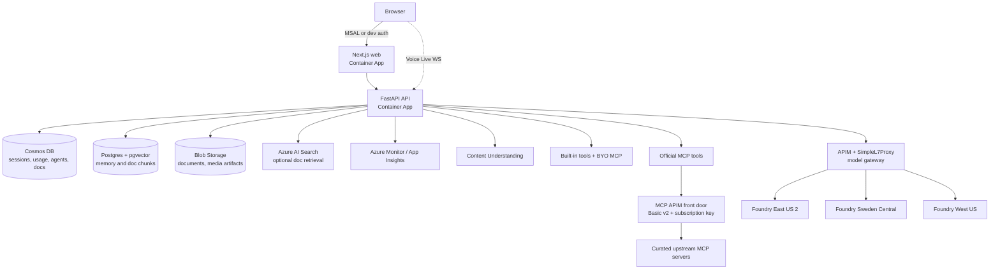

# AI4IA Architecture

AI4IA is a governed, multi-model chat and agent app on Azure Container Apps. The
web frontend calls the FastAPI backend; the backend owns auth, session state,
tools, memory, document/library access, usage metering, and all model routing.

Editable visual: [`architecture-overview.excalidraw`](./architecture-overview.excalidraw).

## High-level flow

Voice Live connects directly from the browser to the API because the Next.js HTTP
proxy cannot proxy WebSockets. The API relay still enforces auth, Origin checks,
entitlements, metering, deployment resolution, and optional governed tool calling.

## Request lifecycle

1. The browser authenticates through Entra/MSAL or local dev identity and calls the
   Next.js app.
2. The web app forwards API requests server-side with the current identity context
   and feature visibility from runtime environment variables.
3. The FastAPI service normalizes the user id, enforces admin/feature/tool gates,
   loads session state, and builds the governed model/tool plan.
4. Model calls route through APIM and SimpleL7Proxy to the selected Foundry
   deployment. Native Azure service planes such as Content Understanding, Azure
   Monitor, Key Vault, Blob Storage, Cosmos, and AI Search are called directly with
   managed identity or configured service auth.
5. Durable state is written to Cosmos and Blob Storage; derived memory/search/chunk
   stores are updated best-effort and can be rebuilt.

## Core principles

1. **Gateway-first model calls.** Chat, agents, embeddings, image/video generation,
   speech, and realtime models route through APIM/SimpleL7Proxy. Non-chat Azure
   service planes such as Content Understanding and Azure Monitor use their native
   endpoints with managed identity or configured service auth.
2. **Catalog-driven deployments.** `infra/models.json` is the deployment source of
   truth and generates the packaged API model catalog. Capability models stay out
   of chat pickers unless their category is explicitly allowed.
3. **Feature-gated advanced surfaces.** Voice Live, document understanding,
   document compute, inline attachment compute, custom (BYO) MCP tools, the
   official APIM-fronted MCP plane, Web IQ, search, image/video generation, and
   memory all have explicit config gates and fail-closed prerequisites.
4. **Cosmos is canonical; derived stores are rebuildable.** Sessions, messages,
   usage, user agents/workflows, MCP server records, and document manifests live in
   Cosmos. Memory vectors, document chunks, search indexes, and parsed artifacts
   can be regenerated from canonical records and blobs.
5. **Per-user isolation.** User ids are normalized at the API boundary. Cosmos
   partitions, blob prefixes, vector filters, memory records, and MCP secrets are
   scoped to the authenticated user; document sharing widens reads through a
   single access gate.
6. **Telemetry without blocking the hot path.** Usage writes, custom events,
   resource metrics, and optional App Insights export are best-effort and never
   break a chat turn.

## Components

| Layer | Tech | Notes |
|---|---|---|
| Web | Next.js + TypeScript | Chat, voice, library/media, admin, auth runtime config |
| API | FastAPI + Pydantic | Auth, chat, agents, tools, documents, usage, metrics |
| Agent runtime | In-process Python | Gateway-native tool loop and user-defined agents |
| Model gateway | APIM + SimpleL7Proxy | Routing, managed identity to Foundry, telemetry |
| App data | Cosmos DB | Sessions, messages, usage, agents, workflows, documents |
| Memory/chunks | Postgres + pgvector / mem0 | Per-user semantic recall and document chunks |
| Search | Azure AI Search | Optional hybrid/semantic document retrieval backend |
| Storage | Blob Storage | Raw documents, parsed artifacts, generated media |
| AI services | Foundry + Content Understanding | Models, realtime, speech, image/video, CU ingest |
| Observability | Log Analytics + App Insights + Monitor | Logs, traces, metrics, admin resource panels |

## MCP tool planes

Remote MCP tools reach the model through two independent planes that share one
governed per-turn executor:

- **BYO (bring-your-own).** Per-user servers a signed-in user registers. Called
  **directly** behind the SSRF guard (DNS-rebind re-validation at call time), with
  credentials in per-user Key Vault. Untrusted by default, so their tools are
  approval-gated.
- **Official (curated).** An admin-defined catalog (`infra/mcp-servers.json`)
  reached **through a dedicated MCP APIM front door** (`mcpgateway.bicep`, APIM
  Basic v2) gated on one app-global subscription key. Trusted ⇒ pre-approved. The
  model gateway stays a separate APIM so model traffic keeps its scale-to-zero
  economics.

Both planes are **default-OFF**, and the official catalog also ships empty. Each
turn builds the official plane first and BYO second, then merges them: on a tool
name collision the **official tool wins**, auto-approvals are unioned, and a
single per-turn budget caps total MCP calls across both planes.

## Regions

See [region-capability-matrix.md](./region-capability-matrix.md). The default
strategy uses:

- **East US 2** for the primary US model set, realtime, image/video, router, and
  evaluations.
- **Sweden Central** for EU-resident model parity where available.
- **West US** for targeted models such as MAI Image and deep research.

## Current gaps

- External ID/CIAM is not wired; current auth is Entra workforce/B2B.
- Folder-level document sharing and unauthenticated public links are not
  implemented; `public` documents are tenant-walled.
- The library UI does not yet expose custom analyzer authoring or first-class
  non-document modality uploads.
- Memory lacks a global user-facing toggle and recalled-memory indicator.
