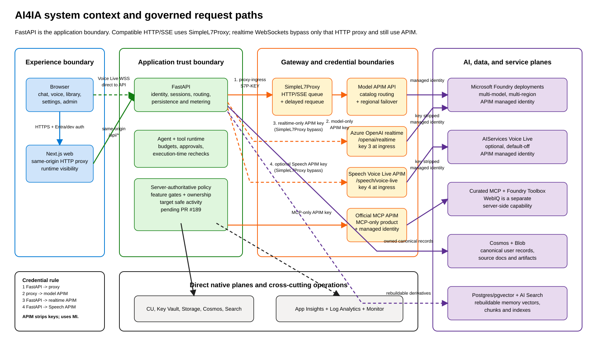
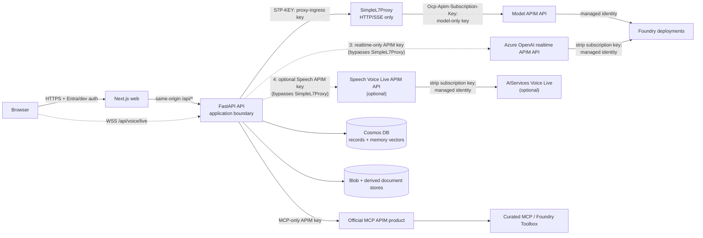

# AI4IA Architecture

AI4IA is a governed, multi-model chat and agent platform on Azure Container Apps.
The Next.js app is the browser experience; FastAPI is the application trust
boundary and owns identity, authorization, sessions, tools, memory, documents,
usage, and model routing.

Editable source:
[`architecture-overview.excalidraw`](./architecture-overview.excalidraw). The SVG
is a deterministic, dependency-free rendering of the same coordinates and labels;
it is generated locally and never through excalidraw.com.

## Architectural invariants

1. **Gateway-first compatible model traffic.** HTTP/SSE chat, agents,
   embeddings, image/video, and REST speech calls flow
   `FastAPI -> SimpleL7Proxy -> model APIM -> Foundry`.
2. **WebSockets bypass only the HTTP proxy.** Realtime and Voice Live flow
   `Browser -> FastAPI relay -> realtime APIM -> Foundry` because
   SimpleL7Proxy does not support WebSockets. They never bypass APIM.
3. **Three credentials protect the core gateway hops.** FastAPI holds a
   proxy-ingress key and a separately scoped realtime APIM key. SimpleL7Proxy
   alone holds the model-APIM key. The proxy strips the ingress key before
   injecting its model key. Optional Speech Voice Live adds a fourth,
   independently scoped APIM key.
4. **Models are catalog-driven.** `infra/models.json` is authoritative for
   deployments, regions, categories, per-model reasoning effort, capabilities, and
   generated runtime data.
5. **Cosmos is canonical.** User sessions, messages, usage, agents, workflows,
   MCP records, document manifests, and memory text/vectors are durable and
   user-scoped in Cosmos. Document chunks, search indexes, and parsed artifacts
   are derived and rebuildable.
6. **FastAPI enforces feature posture.** Browser visibility is not authorization.
   Startup validation fails closed for enabled features with missing prerequisites.
7. **Tools are authorized when they run.** Registration-time checks do not replace
   execution-time scope, approval, ownership, host, and SSRF validation.

## Components

| Boundary | Component | Responsibility |
| --- | --- | --- |
| User | Browser | Chat, agents, workflows, library/media, voice, settings, and admin views |
| Web edge | Next.js Container App | MSAL integration, same-origin HTTP proxy, runtime feature visibility, and static UI |
| Application | FastAPI Container App | Auth, user normalization, sessions, chat/agent execution, tool governance, documents, memory, usage, and telemetry |
| Compatible model edge | SimpleL7Proxy Container App | Authenticated HTTP/SSE ingress, in-memory queueing, delayed requeue, and per-replica circuit breaking |
| AI gateway | Basic v2 APIM | Model catalog routing, bounded immediate regional failover, scoped subscriptions, policy enforcement, and managed identity to Foundry |
| Agent tools | Built-ins, BYO MCP, official MCP, and Foundry Toolbox | Governed tool discovery and execution with budgets, approvals, redaction, and health state |
| Web grounding | WebIQ | Separate feature-gated server-side search/browse tools whose bounded results are treated as untrusted model context |
| Canonical state | Cosmos DB and Blob Storage | User-scoped records and memory text/vectors plus source documents and durable generated artifacts |
| Derived state | Azure AI Search or optional Postgres/pgvector | Rebuildable document chunks and retrieval indexes |
| Native Azure planes | Content Understanding, Monitor, Key Vault, Storage, Cosmos, Search | Non-model control/data planes called directly with managed identity or configured service auth |
| Observability | Application Insights, Log Analytics, Azure Monitor | Correlated logs, traces, usage, resource metrics, and fixed operator queries |

## Trust boundaries and request paths

### Credential map

| Credential | Holder | Permitted hop | Scope |
| --- | --- | --- | --- |
| Proxy-ingress key | FastAPI and proxy ingress validator | FastAPI -> SimpleL7Proxy | Opaque `S7P-KEY`; the backing APIM product has no APIs, so it cannot call model or realtime APIs |
| Model-APIM subscription key | SimpleL7Proxy only | SimpleL7Proxy -> model APIM | Normal compatible model API only; stored as proxy Container App secret |
| Realtime APIM subscription key | FastAPI only | FastAPI relay -> `/openai/realtime` | Realtime API only; cannot invoke the normal model API |
| Speech Voice Live key (optional) | FastAPI only when enabled | FastAPI relay -> `/speech/voice-live/realtime` | Separate default-off API and subscription; distinct from all three core keys |
| Official MCP subscription key | FastAPI official MCP service | FastAPI -> official MCP APIM product | MCP APIs only; cannot invoke model/realtime APIs |

Each APIM API validates its own scoped subscription at ingress, removes the
subscription-key header before the backend hop, and uses managed identity for
Foundry or the approved AIServices backend. User tokens and gateway keys therefore
do not flow downstream. Browser-supplied internal identity headers are not
authoritative.

### Compatible HTTP/SSE lifecycle

1. The browser calls the same-origin Next.js API route with Entra identity, or the
   development proxy supplies the configured local identity.
2. FastAPI normalizes the internal user id, loads the owned session, checks feature
   and entitlement posture, composes memory/document context, and authorizes tools.
3. FastAPI sends the catalog-shaped request to SimpleL7Proxy with the
   proxy-ingress key.
4. SimpleL7Proxy strips caller auth/internal headers, injects its own model-APIM
   key, and forwards the original compatible path.
5. APIM validates the model catalog, performs bounded immediate attempts across
   eligible regions, and calls Foundry with managed identity.
   Responses-API requests explicitly set `store=false`; AI4IA resends Cosmos
   history instead of chaining provider-stored turns with `previous_response_id`.
6. If every eligible backend is throttled, APIM returns the
   `429` + `S7PREQUEUE` + `retry-after-ms` contract; SimpleL7Proxy owns delayed
   requeue. `MaxAttempts=1` prevents retry multiplication.
7. FastAPI streams the answer and persists messages and usage.

### Realtime and voice lifecycle

The browser opens `/api/voice/live` directly on FastAPI because the Next.js HTTP
proxy and SimpleL7Proxy do not proxy WebSockets. FastAPI validates auth, Origin,
session ownership, feature gates, entitlements, provider/model selection, and
voice-capable tools before opening the APIM socket. The API replaces client voice
instructions with the selected agent persona or saved session prompt.

`azure_openai` resolves a realtime deployment from `infra/models.json`. The
optional `speech_voice_live` provider is implemented but default-off and has a
separate APIM API/key and account-scoped managed-identity path. Its production
enablement remains subject to the operator gates in
[`runbooks/feature-enablement.md`](./runbooks/feature-enablement.md).
FastAPI presents key 3 only to the Azure OpenAI realtime APIM API and optional key
4 only to the Speech Voice Live APIM API; neither key crosses the APIM boundary.
Turn-based transcription and text-to-speech remain compatible HTTP calls and use
the normal SimpleL7Proxy path.

## State, ownership, and consistency

| Data | System of record | Ownership and consistency |
| --- | --- | --- |
| Sessions and messages | Cosmos | Partitioned and queried by normalized internal user id; writes use field-scoped patches and guarded replacement |
| Usage and entitlements | Cosmos | User-scoped ledger; unknown provider usage is represented as unknown, not fabricated zero |
| User agents/workflows | Cosmos | Owned records; selected/inherited tools are re-authorized at execution |
| MCP server records | Cosmos | User-owned metadata; durable secrets live in Key Vault, not Cosmos |
| Document manifests/shares | Cosmos | Owner-scoped writes and a common access predicate for owned, email-shared, and tenant-public reads |
| Source documents and artifacts | Blob Storage | Private; bytes are served through authenticated API routes |
| Memory text and vectors | Cosmos `memories` | Canonical; `/userId` partition, point operations always include the authenticated user partition, ETag writes, per-user write epochs, and scoped deletion cutoffs |
| Document chunks/indexes | Azure AI Search or optional Postgres/pgvector | Derived, filtered by user/document ownership, and rebuildable from canonical manifests/blobs |

Session policy changes use atomic patches. Explicit document selection is an exact
allowlist; missing selection preserves legacy all-accessible behavior, while an
empty list disables library context. Revoked access is rechecked at retrieval and
tool execution, so stale ids do not restore access. Summary writes carry a
monotonic version so stale workers cannot reintroduce cleared context.

Telemetry and secondary-index updates are best-effort and may be partial, but
canonical message/session writes must report failures rather than presenting a
false success.

Cosmos memory stores plaintext and its embedding in one item. Explicit create,
update, and delete use idempotency receipts and ETags; user-created or edited
records are locked against automatic planner mutation. Forget first advances a
per-user write epoch, then purges only matching older records, so stale writes
cannot resurrect deleted memory and post-forget writes survive. Document memory
replacement and source markers share a partition transaction; a permanent source
tombstone prevents a stale save from recreating memory after its document is
deleted. See [Memory architecture](./memory.md).

## Agent and tool execution

The in-process agent runtime receives only server-approved tool schemas. Per turn:

1. FastAPI composes built-in, official MCP, and optional BYO MCP capabilities.
2. Remote MCP tools receive deterministic provider-safe aliases while dispatch
   retains the exact remote name. Plane/server identity is part of the alias and
   approval binding; deterministic precedence resolves any remaining collision.
3. The registry rechecks scopes, approvals, ownership, host policy, and SSRF rules.
4. Tool errors and denials become structured outcomes the model can handle; call
   budgets and orchestration depth bound fan-out.
5. The assistant answer, usage, artifacts, and metadata-only activity trace are
   persisted.

BYO MCP servers are untrusted and approval-gated. DNS/public-HTTPS validation is
performed again when a request runs to resist DNS rebinding. Official MCP servers
are admin-curated and reached through an MCP-only APIM product. Foundry Toolbox is
one official MCP upstream; WebIQ search is a separate feature-gated server-side
capability whose bounded output is treated as untrusted model context.

### Activity visibility

The activity contract is **not chain-of-thought**: user-facing activity and
ordinary INFO telemetry contain only structured step kind, coarse outcome, a
validated tool alias/name, and fixed server-owned reason/category
strings. They never contain raw or summarized arguments/results, prompts or
queries, credentials, hidden reasoning, URLs, remote exception text, audio, or
transcripts. Live steps are announced while a turn runs; the same bounded shape is
stored with the completed turn.

## Failure behavior

| Failure | Required behavior |
| --- | --- |
| Invalid/missing feature prerequisite | API startup fails closed or the capability reports disabled |
| Unknown model/deployment | Catalog validation rejects it; no default deployment fallback |
| Regional throttling | APIM attempts bounded compatible backends, then proxy delayed requeue |
| Proxy saturation/expiry | Explicit timeout/429; no durable or globally ordered queue claim |
| Tool denial/error | Structured activity/tool outcome; no swallowed success |
| BYO MCP DNS/host change | Execution-time SSRF validation blocks the call |
| Stale memory edit/delete | `409` conflict; reload the current ETag before retrying |
| Concurrent forget/write | Epoch fence rejects stale writes; conditional purge preserves post-forget records |
| Derived memory/search failure | Canonical chat can continue where safe; degraded context is observable and rebuildable |
| Canonical persistence failure | Surface an error/partial state; do not claim durable completion |
| Voice socket/provider failure | Close with bounded safe details and correlation metadata; preserve the typed-chat session |
| Telemetry backend unavailable | User path continues; operator panel reports partial/stale/unavailable rather than zero |

## Observability

Correlation ids connect browser/API requests, model gateway calls, usage records,
and custom events. Telemetry permits metadata, latency, status, provider/model
target, and bounded activity categories, but excludes credentials, prompt/response
bodies, URLs, remote exception text, raw audio, transcripts, and tool
arguments/results. Browser error reporting uses a content-free schema: an event
enum, allowlisted error code, severity, and booleans only, with client deduplication
and server-side rate limiting. Admin operations use fixed, bounded server-owned
KQL; users cannot submit arbitrary KQL.

Voice Live audio is carried in JSON `input_audio_buffer.append` WebSocket **text**
frames. A zero `clientBinaryFrames` count is therefore expected and does not mean
the microphone was silent. Diagnose capture with `clientTextFrames`, sampled safe
event types, connection outcome, and lifecycle events; binary-frame counters only
describe actual binary WebSocket messages.

SimpleL7Proxy exports health and routing metadata, but exact queue fairness,
cross-replica ordering, circuit-breaker state, and end-to-end provider quota
forecasting are not fully observable with stable dimensions. Operator views must
label those gaps rather than infer precision.

## Security controls

- Entra bearer validation checks signature, issuer, audience, tenant, and expiry.
- Local `X-Dev-User` identity is controlled by the same-origin proxy and is not
  trusted in production.
- Cosmos partitions, blob prefixes, vector queries, memory records, MCP secrets,
  and document checks are user-scoped.
- API endpoints enforce admin/feature/ownership posture even when the UI hides a
  control.
- Gateway subscriptions are API/product scoped; proxy ingress, model APIM,
  realtime APIM, Speech Voice Live, and official MCP credentials are not reused.
- APIM-to-AI calls use managed identity and least-scope data-plane roles.
- Responses-API chat turns opt out of provider-side storage (`store=false`) so
  Cosmos remains the only conversation system of record.
- BYO MCP endpoints require public HTTPS, execution-time SSRF checks, approvals,
  and Key Vault-backed secrets.
- Log, activity, and browser-client-event contracts exclude user content and
  secrets by construction and validate remote tool names before persistence.
- Generated artifacts and document bytes are served through authenticated API
  routes, not public blob URLs.

## Tradeoffs and residual gaps

- SimpleL7Proxy queue/fairness state is in-memory and per replica; it is neither
  durable nor globally ordered.
- Basic v2 APIM capacity is a single-region cost/reliability decision; the prior
  Consumption APIM is retained only as an inactive rollback plane.
- Proxy application profiles remain blocked until ingress derives a verified
  workload identity rather than trusting caller-supplied profile headers.
- Speech Voice Live is default-off pending approved live validation of its APIM
  policy, managed-identity audience/RBAC, what-if, canary, and manual browser path.
- Memory has no global user-facing consent toggle or recalled-memory provenance
  indicator. Users can create, edit, and delete individual owned records.
- Active-store deletion removes Cosmos plaintext and vectors, but Azure backup
  retention is governed by the account policy and is not an instantaneous
  physical purge guarantee.
- Anonymous public document links, folder-level sharing, and custom analyzer
  authoring are not implemented.
- Some tool, voice, proxy, and provider telemetry remains metadata-only or
  unavailable; absence is reported explicitly.
- Repository state is documented here; operators still need to record revision
  SHAs and smoke-test evidence after each deploy because live parity is temporal.
- Outstanding governance decisions, open work, and owner actions are tracked in
  [`roadmap.md`](./roadmap.md).
