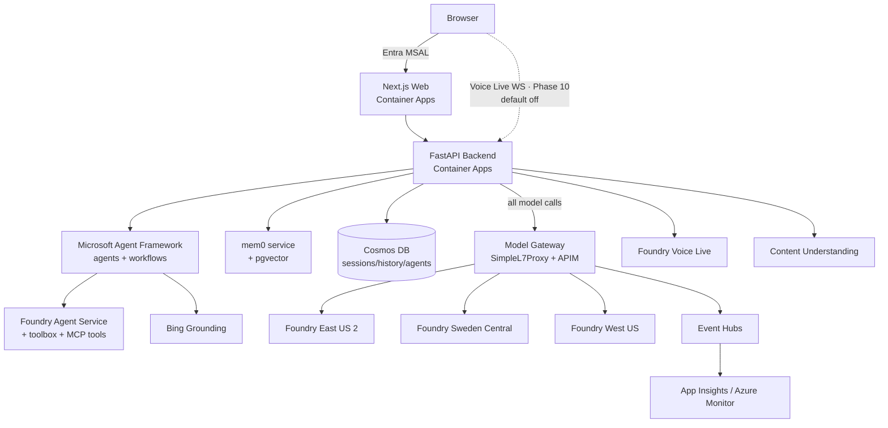

# AI4IA Architecture

AI4IA is a multi-model, multi-region **agentic chat application** for personal use and
customer demos, defined entirely as Infrastructure-as-Code in this repo.

## High-level diagram



> **Voice Live (Phase 10, default OFF).** Real-time speech-to-speech uses a
> WebSocket the browser opens **directly to the API's external ingress**
> (`/api/voice/live`) — the dashed edge above — because the Next.js HTTP proxy
> can't proxy WebSockets. The API relay still enforces all governance (auth via a
> WS subprotocol, the entitlement gate, usage metering, and `Origin` validation)
> and opens the upstream realtime socket through the **same model gateway** as
> every other model call, so the "all model traffic through the gateway" principle
> holds. The browser owns the conversation shape (it sends `session.update`), so it
> picks the **voice** from the model's supported set; the relay can additionally run
> **governed tool calling** in-session (flag `AI4IA_REALTIME_TOOLS_ENABLED`,
> inert unless realtime is on): it injects the safe built-in tools into the
> client's `session.update` and executes the model's function calls in-process
> through the **same registry/executor as chat** (authorize → validate → run), so
> live voice never gains a capability the gateway didn't authorize. When the
> feature flag is off, the route refuses and no live-voice UI is shown — the
> default behavior is unchanged.

## Core principles
1. **Model gateway from day one.** The backend never calls Foundry models directly — every
   model call flows through the gateway (SimpleL7Proxy + APIM), so governance, cost telemetry,
   routing, and entitlements are wired once. A minimal gateway path ships in Phase 1.5; the
   full capacity-sharing/entitlement layer arrives in Phase 6.
2. **Data-driven model catalog.** `infra/models.json` is the single source of truth for which
   models deploy to which regions/SKUs. Bicep iterates over it; no hand-maintained per-model
   resources. The catalog is generated/validated from live Azure availability. Each model carries
   a `category`; the catalog derives a `conversational` flag from it (chat, chat-fast, reasoning,
   reasoning-oss, router, research) so the chat/agent model pickers only offer text-chat targets.
   Capability models (image, video, tts, transcription, embedding, rerank) and voice models
   (realtime, audio) are reached through their own surfaces/tools — the chat API rejects them
   with a 422 rather than running them down the chat-completions path. Surfacing image/video/speech
   models as invokable agent tools (or a dedicated "Generate" tab) is future work.
3. **Identity decoupled from IdP.** Users carry a canonical internal ID independent of the
   Entra object ID, with an IdP-mapping table. This lets us add Entra External ID (CIAM)
   later without rewriting data.
4. **Cosmos is canonical; memory is rebuildable.** Chat sessions/history/agents/workflows live
   in Cosmos DB. mem0 + pgvector hold derived memory that can be rebuilt from Cosmos. Deletion
   is tombstone + async purge + cross-store verification. The per-user document library
   (Phase 11A; `userDocuments` + `analyzers` containers, partitioned by `/userId`) is likewise
   canonical in Cosmos. It is feature-flagged **default-OFF** (`AI4IA_DOCUMENT_UNDERSTANDING_ENABLED`):
   when off, the `/api/library` API refuses (404) and nothing is constructed, so there is no
   behavior change. Content Understanding ingest, chunking, and retrieval build on this spine in
   later Phase 11 sub-phases.
5. **Least privilege.** Managed identities + Key Vault/App Configuration for all secrets; no
   secrets in code or images.

## Regions
See [region-capability-matrix.md](./region-capability-matrix.md). v1 deploys:
- **East US 2** (US data zone) — full chat/voice/image/video + evaluations.
- **Sweden Central** (EU data zone) — feature parity incl. voice + tts/tts-hd.
- **West US** — targeted for MAI-Image-2.x and o3-deep-research (exclusive to it).

## Components
| Layer | Tech | Host |
|---|---|---|
| Web | Next.js + TypeScript | Container Apps |
| API | Python FastAPI | Container Apps |
| Agents | Microsoft Agent Framework (in-process w/ API for v1) | Container Apps |
| Model gateway | SimpleL7Proxy (.NET) + APIM | Container Apps + APIM |
| Memory | mem0 (OSS) + Postgres Flexible (pgvector) | Container Apps + PaaS |
| App data | Cosmos DB (NoSQL) | PaaS |
| AI | Foundry (Cognitive) accounts/projects + deployments | PaaS, 3 regions |
| Observability | App Insights + Log Analytics + Azure Monitor + Event Hubs | PaaS |
| Identity | Entra (MSAL workforce + B2B guests; External ID later) | Entra |

## Repo layout
```
/infra      Bicep modules + main.bicep + models.json (azd targets)
/app/web    Next.js + TS (chat UI, theming, a11y, @/ commands)
/app/api    FastAPI (agents, sessions, memory, tools, auth)
/app/agents MAF agent + workflow definitions, custom tools
/proxy      SimpleL7Proxy + config
/scripts    teardown, purge, inventory, seed-models, hooks
/docs       architecture, runbooks, region map, naming/tagging
azure.yaml  azd service map
```
