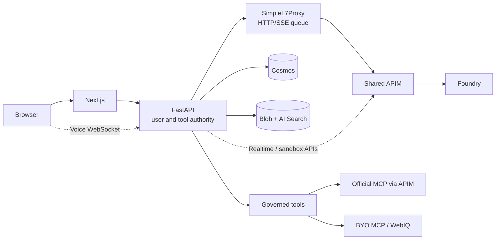

# AI4IA Architecture

AI4IA separates three concerns: **the workspace**, **authority to act**, and
**model execution**. Next.js presents the workspace. FastAPI owns identity,
user data, permissions, context, and tools. A governed gateway routes model
requests without giving the browser provider credentials.

The design demonstrates how Azure services compose into an agent application.
It does not claim that using managed services, multiple model regions, or
safety annotations automatically creates a private, highly available, or
production-complete system.

The [editable diagram](./architecture-overview.excalidraw) is kept locally with
its SVG; rendering does not send the architecture to an external drawing service.

## Architectural invariants

1. Compatible HTTP/SSE model traffic goes through **SimpleL7Proxy -> APIM ->
   Foundry**. Provider adapters do not create direct model egress.
2. Realtime WebSockets and stateful Code Interpreter operations bypass only
   SimpleL7Proxy, using separately scoped APIM APIs.
3. `infra/models.json` owns the model/deployment contract. Generated runtime
   catalogs and gateway policies must agree with it.
4. Cosmos owns user records and memory text/vectors; Blob owns source documents
   and generated artifacts. Retrieval indexes are derived.
5. The API enforces feature gates, ownership, entitlements, and tool permissions.
   Browser visibility is not authorization.
6. Tools recheck scopes, approvals, ownership, destinations, and SSRF policy
   **at dispatch**, including after discovery or consent.
7. Execution receipts expose bounded application evidence, never hidden model
   reasoning. Credentials do not belong in logs or Cosmos MCP records.

## Components

| Azure feature on display | Role in AI4IA | Design implication |
| --- | --- | --- |
| Container Apps revisions, probes, and scaling | Separate web, API, and SimpleL7Proxy containers | Replicas can be replaced; local state cannot be the durable record |
| API Management policies and managed identity | Scoped model, realtime, sandbox, and official MCP APIs on one gateway | Central authority and less duplication, but a shared gateway failure affects multiple capabilities |
| Foundry model deployments | Catalogued providers, pinned versions, regional/SKU choices | Model availability and processing location are explicit contracts, not assumptions from an endpoint name |
| Cosmos DB for NoSQL | User partitions, transactional coordination, ETags, memory vectors, continuous backup | Consistency and recovery are application concerns as well as storage features |
| Blob Storage | Source files, parsed artifacts, generated media | Bytes stay private and are delivered by authenticated API routes; durable storage is not a complete backup plan |
| Azure AI Search | Hybrid keyword/vector document retrieval and semantic reranking | An index can be rebuilt; authorization must still filter every query |
| Durable Task Scheduler | Persistent orchestration state for opted-in workflows | Work can survive an API restart; scheduling does not make external effects exactly-once |
| Entra ID, managed identities, and Key Vault | User authentication, service permissions, durable MCP secrets | End-user identity and application identity are distinct; RBAC does not replace user-level ownership checks |
| App Configuration | Warm proxy configuration and sentinel-driven refresh | Only supported warm settings change without a revision; it is not a second authority for all application features |
| Application Insights, Log Analytics, Azure Monitor | Correlation, operational signals, fixed admin queries | Metadata-only telemetry is distinct from owner-visible execution receipts |

WebIQ is a separate, feature-gated grounding service. Content Understanding is a
native Azure analysis data plane. Neither is an alternative route for ordinary
chat inference.

## Trust boundaries and request paths

The browser uses the same-origin HTTP proxy and `apiFetch`. In Entra mode,
MSAL supplies a bearer token that FastAPI validates for signature, issuer,
audience, tenant, and expiry. The API derives an internal user id rather than
using arbitrary request identifiers as ownership.

Local development uses `X-Dev-User`, but the Next.js proxy supplies or removes
that header. A browser-supplied development identity is not trusted in production.

### Credential map

| Credential | Holder and allowed use |
| --- | --- |
| Proxy-ingress key | FastAPI authenticates to SimpleL7Proxy; its backing APIM product has no APIs |
| Model-APIM key | SimpleL7Proxy alone calls the compatible model API |
| Realtime key | FastAPI relay calls the Azure OpenAI WebSocket API |
| Speech Voice Live key | Optional provider's separate APIM WebSocket API |
| Code Interpreter key | FastAPI calls the constrained Responses/Files sandbox API |
| Official MCP key | FastAPI's official MCP service calls only that product's APIs |

These application credentials are scoped and are not reused across hops.
APIM strips caller credentials before authenticating to Foundry with managed
identity. Foundry local-key authentication is disabled by default. FastAPI has
no direct model-inference role; its native Content Understanding permission is
separate. User MCP credentials live in Key Vault, with opaque references in Cosmos.

### Compatible HTTP/SSE lifecycle

1. FastAPI loads the owned session, checks entitlement/feature posture, resolves
   the catalog model, and constructs the effective instructions and context.
2. It offers only the permitted tools and sends the request through SimpleL7Proxy.
3. The proxy authenticates the caller, replaces internal/auth headers, queues the
   request, and stamps the catalog deployment identity.
4. APIM selects an eligible backend, enforces provider-specific policy, and uses
   managed identity for the upstream call.
5. FastAPI streams observable activity and output, then persists messages,
   receipts, and usage.

Chat Completions is the agent loop's internal shape. Adapters translate it to
Responses or Anthropic Messages where the catalog requires those protocols.
Provider-native image/video paths stay catalog-bound through the same gateway.
Responses chat uses `store=false` and resends Cosmos history rather than chaining
provider-stored conversations. Opaque encrypted reasoning items needed within a
tool loop remain transient and are not persisted as messages or receipts.

Retry ownership is deliberately split:

| Layer | Owns | Does not promise |
| --- | --- | --- |
| APIM | Bounded immediate attempts across eligible backends | A complete regional disaster-recovery solution |
| SimpleL7Proxy | Delayed requeue, queue expiry, per-replica circuit breaking | Durable queueing or globally ordered fairness |
| FastAPI | User-visible outcome, governance, and usage accounting | Infinite retries hidden from the caller |

When all eligible backends throttle, APIM returns the `429` / `S7PREQUEUE` /
`retry-after-ms` contract. Proxy `MaxAttempts=1` avoids multiplying APIM's
immediate attempts. See the [proxy integration](../proxy/README.md).

### Realtime and voice lifecycle

The browser opens `/api/voice/live` directly on FastAPI: neither the Next.js HTTP
proxy nor SimpleL7Proxy carries WebSockets. The relay validates the user, Origin,
session, entitlements, provider, and allowed tools before opening APIM.
Instructions come from the selected agent or saved conversation, not an
independent client-controlled voice prompt.

Azure OpenAI is the server-authoritative default in the shipped profile and
resolves realtime deployments from the model catalog. Speech Voice Live defaults
off in that profile and Bicep; when enabled, it uses its own curated catalog,
APIM API/key, and East US 2 backend. Settings apply on the next connection.
Finalized turns join the same conversation; a persistence failure cannot keep
the microphone running.
Turn-based transcription and text-to-speech remain ordinary gateway HTTP calls.

### Code Interpreter

Document/attachment compute uses a dedicated APIM API because Files and stateful
Responses sandboxes are not ordinary catalog deployment calls. The policy
requires the configured model, `store=false`, and exactly one
`code_interpreter` tool. Multipart uploads and deletes retain their file contract.
Ownership, entitlement, file-size, approval, and attempt-metering checks still
apply at the caller.

The sandbox is Azure-managed execution, not arbitrary shell access to an API
replica. [ACA Sandboxes research](aca-sandboxes-evaluation.md) is a separate
evaluation, not a deployed replacement or permission to bypass this boundary.

## State, ownership, and consistency

| State | Canonical location | Boundary |
| --- | --- | --- |
| Sessions, messages, usage, entitlements | Cosmos | Normalized user ownership; guarded writes |
| Agents, workflows, MCP metadata | Cosmos | Owned definitions; permissions rechecked when used |
| Document manifests and shares | Cosmos | Owner writes; explicit private/shared/tenant-public reads |
| Memory text and vectors | Cosmos `memories` | Same user partition/item, ETags, write epochs, source tombstones |
| Source files and generated artifacts | Private Blob containers | Authenticated API delivery |
| MCP credentials | Key Vault | Cosmos stores references, not secret values |
| Document chunks and retrieval indexes | Azure AI Search | Derived and rebuildable from manifests and stored artifacts |
| Durable orchestration progress | Durable Task Scheduler | Task-hub-scoped service access; application results remain in Cosmos |

User isolation is not delegated to managed-identity RBAC alone. The API's identity
can access shared services; each repository operation must also bind the
authenticated user's partition, prefix, or access predicate.

Explicit document selection is an allowlist. An empty selection disables library
context; a missing legacy selection permits all accessible sources. Sharing is
rechecked during retrieval and tool execution. Tenant-public is authenticated
sharing, not anonymous access.

Session patches preserve unrelated concurrent fields. Summary versions prevent
stale workers from restoring cleared context. Workflow cancellation/checkpoint
writes compare the caller's message snapshot as well as the storage ETag; a
shared `running` status and lease are not sufficient concurrency evidence.

Shutdown follows the same dependency graph: stop and drain durable workers,
document enrichment, and directory writes before closing their stores and shared
HTTP transport. Otherwise paid work can finish after its usage ledger or receipt
store has already been closed.

Memory forgetting advances an epoch before deleting old records. Writes started
under the previous epoch cannot resurrect forgotten data. Document tombstones
likewise prevent stale memory saves after document deletion. Explicit CRUD failures
surface to users; best-effort recall/planning can fail without failing chat.
See [memory architecture](memory.md).

The admin usage overview is the deliberate cross-user read: one projected,
row-capped scan supplies all its rollups. Truncation is reported as incomplete
coverage, not an exact total. This avoids multiple copies of the same large
ledger window in a replica also serving conversations.

Default entitlements read prior usage rather than atomically reserving capacity.
Parallel admissions and missing provider meters can overshoot a budget.
Ledger-check failures allow work; entitlement-store failures retain a cached
disabled override or use the configured default policy. These are soft checks,
not a hard quota or spending guarantee.

The separate [hard admission source contract](hard-quota-admission.md) is
default-off and refuses deployed activation pending a reviewed bootstrap and
fleet cutover. Its guarded dispatches never use the soft ledger as an atomic
balance, and unsupported token/dollar meters refuse rather than count as free.
The disabled-user guard remains authoritative even with numeric enforcement off.

## Agent and tool execution

Built-ins, synthetic capabilities, BYO MCP, and official MCP share execution-time
governance. Tool aliases retain plane/server identity so a remote name collision
cannot silently switch the dispatch target.

Official MCP goes through a dedicated product on the shared APIM. Foundry
Toolbox is a curated upstream, not a second agent runtime. Only approved generated
catalog entries may supply instruction resources. Skills advertise bounded
metadata first and load their full instructions through `load_skill`; BYO MCP
resources do not become instructions merely by existing.

Retrieved documents, memories, skills, and tool results are untrusted context.
Nonce fences protect delimiters, but **a text fence is not an information-flow
barrier**: source text can still influence the model's proposed next action.

### Per-invocation tool approval

A held call is bound to the authenticated user, session, tool, exact argument
digest, and short expiry. The server consumes its approval with a conditional
write and spends the grant on one dispatch. Another user, session, argument
object, or repeated emission cannot reuse it.

Browsing and sandbox execution are held even without retrieved context. Some
first-party tools with server-fixed destinations use an injection-only posture:
they prompt when untrusted context can have influenced the request. An
unclassified synthetic capability is refused rather than implicitly trusted.

Optional session/run consent is an alternative to repeated prompts, not
`ApprovalPolicy.off`. The default-off operator gate only permits user opt-in.
Consent snapshots the enabled contracts, including advertised skill-resource
metadata, and is checked for scope, expiry, revocation, and configuration changes
at dispatch. It grants no new tool, destination, or permission.

Direct and durable workflow steps also need authority for gated calls. Without
run consent they fail visibly; the chat workflow bridge remains safe/read-only.
Revocation stops subsequent dispatch but cannot retract an external call already
sent. See the [user controls](user-guide.md#auto-approving-enabled-tools) and
[operator configuration](runbooks/feature-enablement.md).

### Execution receipts, not hidden reasoning

Receipts retain the effective redacted prompt, admitted/displaced context,
source versions and hashes, tool offers/calls, bounded arguments/results,
approval provenance, usage/safety coverage, and correlation metadata. Payload
and whole-receipt limits keep them bounded; step receipts preserve later workflow
evidence beyond the aggregate limit.

`ReceiptRuntime.modelCalls` captures a typed scalar allowlist from the actual
gateway request body after model-capability and provider-adapter normalization.
Each initial, later tool-loop, and final no-tool call has its own posture:
sampling controls, output-token limit and field, effort setting, and tool-choice
controls when supplied. Model selection and request/default provenance are
explicit. Workflows and linked agents record their own defaults, never copied
parent parameters. A setting the application did not send is not a claim about
the provider's internal default.

`ReceiptUsage.cost` is an immutable estimate or known subtotal for model tokens,
including nested executions, not a bill or a hard-budget policy. Per-call rates
and price-book version are frozen before the provider await and use the existing
pricing helper. Completed calls keep their estimates if a later call or delivery
fails; missing, malformed, incomplete, or unpriced usage remains unknown.
Tool, media, search, and other service charges are outside this token estimate.
Receipt reads never reprice against the current book. Historical rows lack these
fields and render as not recorded; no migration or retrospective rewrite runs.
Call details are bounded and keep pre-bound counts, while the complete receipt
still fits 32 KiB, including ASCII-escaped durable-task serialization.

They are diagnostic evidence, not a complete replay log or a model's private
reasoning. Historical receipts can retain admitted source text after a source is
deleted, just as a past answer can. Active-store deletion is therefore not
retroactive erasure from conversation history or provider backups.

### Durable workflow execution

Ordinary workflows run within the request. An opted-in durable run returns a
run handle and moves onto Durable Task Scheduler, while the worker still runs
inside the API Container App. Both paths use the same step runner and governed
model gateway.

The scheduler persists orchestration state; it does not create a separate
compute fleet or bypass tool approval. The API identity is scoped to the task
hub, and run handles enforce ownership before lookup. The deployment keeps an
API worker available for durable work; a feature flag alone is not a worker.

For the Azure mechanism, see
[durable execution on Container Apps](https://learn.microsoft.com/azure/container-apps/workflows-overview).
For AI4IA's opt-in behavior and prerequisites, use the
[feature runbook](runbooks/feature-enablement.md).

## Failure behavior

| Failure | Application behavior |
| --- | --- |
| Missing enabled-feature prerequisite | Fail closed at startup or report unavailable; no pretend implementation |
| Unknown model or incompatible capability | Reject before provider dispatch; no invented default deployment |
| Backend throttling / proxy saturation | Bounded retry or explicit failure, not unbounded background work |
| Tool denial, changed host, revoked consent | Structured denial/error; no success-shaped fallback |
| Stale edit, forget race, or checkpoint | Conflict/fence protects newer state |
| Canonical write failure | Surface failure or partial completion; do not claim the result was saved |
| Unsupported durable request | Reject rather than silently execute synchronously |
| Voice capture/provider failure | Close safely; preserve the typed conversation and retryable persistence state |
| Missing billing or telemetry dimensions | Unknown, partial, stale, or unavailable; never fabricated zero |

## Observability

Correlation ids connect requests, gateway activity, usage records, and operational
events. General telemetry excludes prompts, replies, raw audio, transcripts,
URLs, credentials, and tool payloads. Browser error events use an allowlisted,
content-free schema. Admin Log Analytics queries are fixed and bounded; the user
cannot submit arbitrary KQL.

Owner-visible receipts are a separate, content-bearing diagnostic surface.
Metadata-only logs cannot answer every question about model output or queue
fairness. Voice audio travels in WebSocket JSON text frames, so zero binary-frame
counts do not mean the microphone was silent.

See [telemetry and diagnostics](runbooks/telemetry.md) for sources, freshness,
coverage, and operational interpretation.

## Availability, regions, and deployment

**Model redundancy is narrower than application redundancy.** Foundry
deployments span East US 2, Sweden Central, and targeted West US capabilities.
The application/gateway/data topology has its own regional dependencies.
The shared Basic v2 APIM is not a Premium multi-region gateway, and a single
Search replica is not a redundant search tier.

Model SKU determines processing geography. A Sweden Central `GlobalStandard`
deployment is not EU-only inference. Choosing a data-zone model also does not
move Cosmos history, Blob documents, telemetry, or third-party tool requests.
The [region map](region-capability-matrix.md) explains these separate boundaries;
Microsoft documents the underlying [deployment-type semantics](https://learn.microsoft.com/azure/ai-services/openai/how-to/deployment-types)
and [APIM multi-region capability](https://learn.microsoft.com/azure/api-management/api-management-howto-deploy-multi-region).

There are several authorities, each for a different concern:

| Concern | Authority |
| --- | --- |
| Topology, identities, role scopes, service settings | Bicep modules |
| Deployable overrides and showcase defaults | `infra/main.parameters.json` plus explicit deployment inputs |
| Model, official MCP, and voice contracts | Their catalogs under `infra` and generated artifacts |
| Running application bytes | Release-built registry image digests, not Bicep's greenfield placeholders |
| Foundry toolbox/skill versions | Validated manifests reconciled on the data plane |
| Tenant registrations, consent, DNS, provider entitlements | Explicit operator setup outside the resource template |
| Current deployed facts | Dated read-only inventory and revision evidence |

The release captures rollback targets **before** provisioning, then builds
and deploys exact digests and checks the served application. It does not promote
the same image built on a PR; the release performs its own build. Infrastructure
reconciliation and application release are different operations.

ARM incremental deployment does not delete retired resources or role assignments.
Disabling a feature can leave retained privilege or cost. Reconcile such drift
with an explicit, reviewed cleanup, not by blindly making the template match
whatever happens to be live.

## Tradeoffs and residual gaps

| Choice or gap | Implication |
| --- | --- |
| Public endpoints with identity-based access | This is not private networking. The partial `vnetIsolationEnabled` / `dataTierPrivate` scaffolding is not exposed by the supported deployment path |
| One shared APIM and an in-memory proxy queue | Lower operational complexity, with shared failure domains and per-replica rather than global fairness |
| Optional paid capabilities | Search, durable orchestration, model capacity, and supporting services need explicit cost/quota review; a budget alert is not a spending cap |
| Library without an Azure Search endpoint | An in-memory chunk store is allowed outside local development, so vector retrieval becomes replica-local/restart-volatile even while manifests and source bytes remain durable |
| Cross-container conversation deletion | A writer authorized before deletion can insert a child after the deletion scan. Transactional co-location or durable orphan reconciliation needs a separate data/retention design |
| Cosmos continuous backup; incomplete Blob recovery | Rebuildable infrastructure is not recoverable user data. Read the [recovery runbook](runbooks/teardown.md#rollback) before deletion |
| Key Vault purge protection defaults off | Rebuild flexibility trades away irreversible-delete protection; enabling it is an irreversible operational decision |
| Non-blocking safety assessment policy | Provider refusals still apply; missing assessments are not safe verdicts. Coverage, disclosure, monitoring, and escalation remain incomplete in the [decision record](rai-decision-record.md) |
| No per-user memory opt-out | Users can manage active records, but cannot switch the capability off for their profile |
| Pinned vendored proxy | Local patches are auditable; upstream upgrades require a dedicated compatibility review |

For implementation work, [AGENTS.md](../AGENTS.md) owns invariants and CI commands.
For operations, use the [configuration reference](configuration-reference.md),
[deployment runbook](runbooks/deployment.md), and [infrastructure guide](../infra/README.md).
