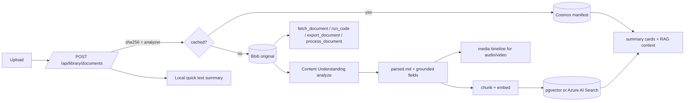

# Document & Multimodal Understanding

AI4IA has two document paths:

1. **Per-session attachments** (`/api/sessions/{id}/documents`) extract capped
   local text and inject it into that session as untrusted context.
2. **The cross-session library** (`/api/library`) stores user-owned documents,
   enriches them with Content Understanding, indexes chunks for retrieval, and
   exposes governed tools over ready documents.

The library is feature-gated by `AI4IA_DOCUMENT_UNDERSTANDING_ENABLED` /
`documentUnderstandingEnabled`. When disabled, the API refuses library routes and
the web app hides the library.

The chat composer exposes one Attach action. When the library is enabled, image,
audio, and video files use the same authenticated Content Understanding ingest path
as reusable documents and show stored/analyzing/ready/failed state. A selected ready
library document is stored on the conversation and scopes retrieval; removing it
from the conversation does not delete the durable library artifact.

Selection is distinct from readiness: a fresh upload is associated while it is
stored/analyzing, remains visible if processing fails, and automatically becomes
effective context when it reaches `ready`. Missing/null selection on a legacy
session means all accessible ready documents; explicit `[]` means none; a non-empty
list is the exact allowlist used by summary/RAG, `fetch_document`, `run_code`,
`export_document`, and `process_document`.

## Pipeline

Upload returns quickly with a manifest and quick-text fallback. Enrichment runs
asynchronously. Only `ready` documents contribute to chat, retrieval, tools, media
playback, memory save, or sharing.

## Storage model

- **Cosmos `userDocuments`**: canonical manifest, partitioned by `/userId`.
  Includes filename, modality, size, content hash, status, analyzer id, summary,
  sources, chunk count, versions, annotations, `visibility`, and email ACL.
- **Cosmos `analyzers`**: built-in analyzer descriptors and user analyzer records.
  Built-ins are not persisted as user records and cannot be shadowed.
- **Blob Storage**: raw bytes, `parsed.md`, `chunks.jsonl`, media timeline
  sidecars, and versioned/exported artifacts under a user/document prefix.
- **pgvector / Azure AI Search**: per-user document chunks. Azure AI Search, when
  configured, provides hybrid vector + BM25 retrieval with optional semantic
  reranking.
- **Memory store**: explicit save-to-memory promotes a ready document's summary
  and bounded excerpts into the user's memory backend; forget/delete cascades
  remove those derived memories.

## Retrieval and tools

- **Tier 1:** summary cards for ready accessible documents.
- **Tier 2:** top-k RAG chunks, nonce-fenced as untrusted context.
- **Tier 3:** `fetch_document` for full/partial parsed Markdown.
- **Compute:** `run_code` and `export_document` use Azure OpenAI Responses API
  Code Interpreter when `AI4IA_DOCUMENT_COMPUTE_ENABLED=true`. By default the
  sandbox receives the document's **parsed text**, not the file itself; set
  `AI4IA_CODE_INTERPRETER_RAW_FILES_ENABLED=true` to upload the **original bytes**
  instead, so the model reads real spreadsheet cells and PDF layout. Unsupported
  types, oversize originals, and upload failures all fall back to parsed text.
- **Inline compute:** `analyze_attachment` can hand the original bytes of an
  inline composer attachment to the same Responses API Code Interpreter endpoint
  when `AI4IA_INLINE_DOCUMENT_COMPUTE_ENABLED=true`; it is independent of the
  durable library flag and uses short-lived attachment storage.
- **Processing:** `process_document` produces bounded inline output or a durable
  markdown artifact.
- **Media:** audio/video timelines and `[[cite:FILENAME@MM:SS]]` citations open
  the web media player at the cited timestamp.

All tool paths re-check ownership/access, require `ready` status, apply caps, and
sanitize untrusted strings before returning them to the model.

## Sharing and privacy

Documents default to `private`. Owners can set:

- `shared` with an email ACL.
- `public`, which means tenant-authenticated users can open the document; it is
  not an anonymous public link.

Shared documents are searchable/openable by grantees through the same access gate.
Annotations and saved memories remain owner-private and never travel with a share.

## Configuration

Core flags and knobs (these are the **runtime settings** the container receives,
not repo variables — see
[configuration reference](configuration-reference.md#feature-flags-and-prerequisites)
for which of them a repo variable can actually change):

- `AI4IA_DOCUMENT_UNDERSTANDING_ENABLED`
- `AI4IA_CU_BASE_URL`, `AI4IA_CU_API_VERSION`, `AI4IA_CU_AUTH_MODE`
- `AI4IA_DOCUMENT_BLOB_ACCOUNT_URL`, `AI4IA_DOCUMENT_BLOB_CONTAINER`
- `AI4IA_SEARCH_ENDPOINT`, `AI4IA_SEARCH_INDEX_NAME`
- `AI4IA_DOCUMENT_COMPUTE_ENABLED`
- `AI4IA_CODE_INTERPRETER_BASE_URL`, `AI4IA_CODE_INTERPRETER_MODEL`
- `AI4IA_CODE_INTERPRETER_RAW_FILES_ENABLED`, `AI4IA_CODE_INTERPRETER_MAX_RAW_FILE_BYTES`
- `AI4IA_INLINE_DOCUMENT_COMPUTE_ENABLED`
- `AI4IA_MEMORY_STORE`, `AI4IA_MEMORY_DOCUMENT_MAX_ITEMS`

Outside local, document understanding requires Cosmos session storage, a blob
account URL, and a CU endpoint. Document compute and inline attachment compute
require the Responses API endpoint and model.

## Current gaps

- Custom analyzer authoring is not exposed in the web UI.
- Folder/collection-level sharing is not implemented.
- Anonymous public links are not implemented; `public` remains tenant-walled.
- Optional direct-download SAS for very large files is not implemented.
