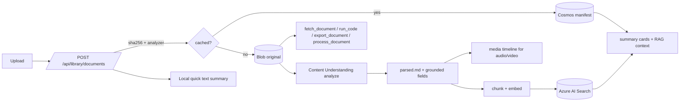

# Document & Multimodal Understanding

AI4IA has two document paths:

1. **Per-session attachments** (`/api/sessions/{id}/documents`) extract capped
   local text and inject it into that session as untrusted context.
2. **The cross-session library** (`/api/library`) stores user-owned documents,
   enriches them with Content Understanding, indexes chunks for retrieval, and
   exposes governed tools over ready documents.

The library is feature-gated by `AI4IA_DOCUMENT_UNDERSTANDING_ENABLED` /
`documentUnderstandingEnabled`. When disabled, the API refuses library routes and
the web app hides the library.

The chat composer exposes one Attach action. When the library is enabled, image,
audio, and video files use the same authenticated Content Understanding ingest path
as reusable documents and show stored/analyzing/ready/failed state. A selected ready
library document is stored on the conversation and scopes retrieval; removing it
from the conversation does not delete the durable library artifact.

Selection is distinct from readiness: a fresh upload is associated while it is
stored/analyzing, remains visible if processing fails, and automatically becomes
effective context when it reaches `ready`. Missing/null selection on a legacy
session means all accessible ready documents; explicit `[]` means none; a non-empty
list is the exact allowlist used by summary/RAG, `fetch_document`, `run_code`,
`export_document`, and `process_document`.

## Pipeline

Upload returns quickly with a manifest and quick-text fallback. Enrichment runs
asynchronously. Only `ready` documents contribute to chat, retrieval, tools, media
playback, memory save, or sharing.

## Storage model

- **Cosmos `userDocuments`**: canonical manifest, partitioned by `/userId`.
  Includes filename, modality, size, content hash, status, analyzer id, summary,
  sources, chunk count, versions, annotations, `visibility`, and email ACL.
- **Cosmos `analyzers`**: built-in analyzer descriptors and user analyzer records.
  Built-ins are not persisted as user records and cannot be shadowed.
- **Blob Storage**: raw bytes, `parsed.md`, `chunks.jsonl`, media timeline
  sidecars, and versioned/exported artifacts under a user/document prefix.
- **Azure AI Search**: per-user document chunks. Azure AI Search, when
  configured, provides hybrid vector + BM25 retrieval with optional semantic
  reranking.
- **Memory store**: explicit save-to-memory promotes a ready document's summary
  and bounded excerpts into the user's memory backend; forget/delete cascades
  remove those derived memories.

## Retrieval and tools

- **Tier 1:** summary cards for ready accessible documents.
- **Tier 2:** top-k RAG chunks, nonce-fenced as untrusted context.
- **Tier 3:** `fetch_document` for full/partial parsed Markdown.
- **Compute:** `run_code` and `export_document` use Azure OpenAI Responses API
  Code Interpreter through a dedicated API-scoped APIM route when
  `AI4IA_DOCUMENT_COMPUTE_ENABLED=true`. The sandbox
  receives the document's **parsed text** unless
  `AI4IA_CODE_INTERPRETER_RAW_FILES_ENABLED=true`, which uploads the **original
  bytes** instead so the model reads real spreadsheet cells and PDF layout.
  Unsupported types, oversize originals, and upload failures all fall back to
  parsed text. The setting ships default-`false`, but **this deployment enables
  it** (`infra/main.parameters.json`), so treat original file bytes — not just
  extracted text — as reaching the sandbox when assessing data handling.
- **Inline compute:** `analyze_attachment` can hand the original bytes of an
  inline composer attachment to the same APIM-fronted Responses API Code
  Interpreter endpoint when `AI4IA_INLINE_DOCUMENT_COMPUTE_ENABLED=true`; it is
  independent of the durable library flag and uses short-lived attachment storage.
- **Processing:** `process_document` produces bounded inline output or a durable
  markdown artifact.
- **Media:** audio/video timelines and span-id citations (`[[cite:S1]]`) open the
  web media player at the cited timestamp. The id resolves to the span's own
  `documentId` and start offset, so two ready documents sharing a filename no
  longer collide; rows written before that change still carry the older
  `[[cite:FILENAME@MM:SS]]` token and still resolve by name.

All tool paths re-check ownership/access, require `ready` status, apply caps, and
sanitize untrusted strings before returning them to the model.

## Alternate parsers: Mistral Document AI / OCR

`mistral-document-ai-2512` (GA) and `mistral-ocr-4-0` (Preview) are catalog
deployments and explicit built-in Analyzer choices. They are image-to-text
models, not conversational models: the API accepts PDF and supported image input,
enforces at most 30 pages / 30 MB, and sends the bytes through
SimpleL7Proxy → APIM → Foundry's `/providers/mistral/azure/ocr` route.

Mistral is a selectable parser, not a second canonical store. Its synchronous
`pages[].markdown` response is normalized into the existing `CUResult` and then
uses the identical `parsed.md` / manifest / chunk / embed / search path as Content
Understanding. The manifest persists the analyzer id plus provider, model/version,
deployment, region, SKU, data zone, residency, and returned page count. Analyzer
selection remains part of the content-dedupe key and ownership, retry, deletion,
and rebuild semantics do not change.

Usage is metered by returned page count rather than invented token counts. The
best-effort Global Standard list-price estimates are $3/1K pages for Document AI
2512 and $4/1K pages for OCR 4; OCR annotation pricing is not applied because the
app does not request annotations. These are estimates from the Azure Retail Prices
API, not billing records.

Microsoft Learn's Foundry capability table currently lists `en`, while Mistral's
provider material claims broader multilingual coverage. Treat the deployed
language contract as unverified until live fixtures prove it; the app does not
promote the provider marketing number.

Content Understanding remains the automatic default because it handles documents,
images, audio, and video through one durable pathway. Mistral is never a silent
fallback, so a provider outage cannot change a document's parsing semantics.

## August 2026 Content Understanding update

The production default remains the refreshed **CU 1.0 GA** API
(`2025-11-01`). Existing `prebuilt-*Search` ingestion automatically receives the
new grounding efficiency and confidence model, and the resource defaults now map
both the prebuilt aliases and the direct `gpt-5.2` /
`text-embedding-3-large` model names to the exact primary deployments.
Postprovision reads `supportedModels` from `prebuilt-documentSearch` and fails
unless those two models are advertised.

Although CU now supports a broader GPT-5 family, AI4IA deliberately selects
GPT-5.2 `2025-12-11`: it is the only current AI4IA catalog deployment whose
model/version exactly matches the CU supported-model contract. GPT-5.1,
GPT-5.4, mini, nano, and future GPT-5.5 choices are not inferred from similar
names; add them only after the exact CU-supported version is deployed and the
same postprovision contract verifies it.

When `cuPreviewEnabled` is explicitly on, the Library adds:

- **Read (synchronous preview)** — immediate in-memory OCR with no polling.
- **Layout (synchronous preview)** — immediate document structure, tables,
  figures, signatures, and embedded metadata.
- Five preview tax analyzers for 1041, 1120-S, 1065, and 8865 Schedule K-1
  forms plus Minnesota M1.

Both use `2026-06-01-preview`, carry no SLA, accept at most 10 MB, and process at
most five PDF pages. Unlike normal enrichment, the upload request waits for their
terminal result. The automatic analyzer never silently switches to preview.

Because the request waits, the synchronous path takes the *same* admission
control as background enrichment — the shared pending cap and the four-way
concurrency semaphore — so concurrent synchronous uploads cannot open unbounded
concurrent CU calls. It waits only briefly for a slot
(`INLINE_ENRICH_ADMISSION_TIMEOUT_S`, because a user is holding the
request open); if none frees up the upload settles as retryable rather than
hanging. Deleting the document while its synchronous analyzer is still running
returns **404**, and turning preview off while a preview-analyzed document is
still awaiting enrichment **fails** that document instead of quietly re-analyzing
it with the default analyzer.

Every CU result now persists a bounded owner-scoped `analysis.json` sidecar with
structured fields, source/confidence evidence, signatures/metadata, warnings,
usage, and content-filter records. The library card surfaces evidence counts and
average confidence; **Evidence** opens the detailed response through an
**owner-only** gate — a shared reader can read and cite the document but cannot
fetch its evidence sidecar. Model tokens and page meters are recorded in the
usage ledger instead of treating CU as an unpriced unknown call. CU page meters
are priced per minimal/basic/standard tier (the synchronous `*Inline` variants
fold into those same three rows), contextualization is billed as two independent
tiers taken from the service's own `contextualizationTokens` and
`advancedContextualizationTokens` usage properties rather than from a locally
authored analyzer label, and GPT-5.2 and embedding token rows use their existing
model prices and exact deployment names.

**Agentic mode remains operator-gated.** It appears only when an existing remote
analyzer id is supplied. The `agentic.*` workflow resolution and the 400K TPM
floor on the primary GPT-5.2 deployment are **provisioning-time** checks
(`scripts/validate-feature-prereqs.py` and `scripts/postprovision.ps1`); the API
does not re-verify them per request, so setting the analyzer id directly on a
running container bypasses them. The live deployment is currently 50K TPM, so
AI4IA does not advertise Agentic mode yet.

The announcement's semantic chunking feature belongs to the Azure AI Search
Content Understanding **skill** (`2026-05-01-preview`). AI4IA does not use that
indexer skill: it owns canonical Markdown, deterministic chunks, embeddings, and
rebuild semantics in the API. This release therefore does not silently replace
existing chunks or mix a second indexer into the canonical pipeline.

### Analyzer-call guarantees

Four properties hold for every outbound analyzer call, CU or Mistral:

- **Entitlement is re-checked immediately before provider IO, not only at
  upload.** Enrichment is queued work, so the account that was entitled when the
  file was accepted may be disabled by the time the analyzer actually runs. A
  disabled owner (403) aborts the crack before any bytes leave, and the attempt
  is recorded with `provider_completed=false` so nothing is metered as spend.
  Rate/budget limits (429) deliberately do **not** re-apply — they are admission
  concerns, and re-applying them would fail work already accepted.
- **Only pages the service metered are billed as pages.** Content Understanding
  `contents` are timed segments for audio/video, so the display page-count
  fallback is not a billing signal; CU page units come solely from its own
  `documentPages*` meters. Mistral's contents *are* pages, so it keeps the count.
- **`Canceled` is terminal.** A cancelled operation ends the poll loop with the
  real outcome instead of being polled until the budget expires and reported as
  a 408 timeout.
- **`Retry-After` is honoured** when the service sends it, clamped to 30s per
  sleep so one bad header cannot consume the whole poll budget.

Read endpoints are deliberately **not** gated on entitlement. The disabled-account
gate guards spend (upload, memory writes, analyzer creation); a document, its
media timeline, and its evidence sidecar are already-paid output, and gating only
some of them would break the evidence viewer without creating any real boundary.
Ownership and sharing checks still apply to every read.

`AI4IA_CU_BASE_URL` is validated at startup outside `local`: it must be `https`
with no embedded credentials, query, or fragment. CU receives raw document bytes
and a Cognitive Services token, so the endpoint is a confidentiality boundary
rather than a connectivity setting.

## Sharing and privacy

Documents default to `private`. Owners can set:

- `shared` with an email ACL.
- `public`, which means tenant-authenticated users can open the document; it is
  not an anonymous public link.

Shared documents are searchable/openable by grantees through the same access gate.
Annotations and saved memories remain owner-private and never travel with a share.

## Configuration

Core flags and knobs (these are the **runtime settings** the container receives,
not repo variables — see
[configuration reference](configuration-reference.md#feature-flags-and-prerequisites)
for which of them a repo variable can actually change):

- `AI4IA_DOCUMENT_UNDERSTANDING_ENABLED`
- `AI4IA_CU_BASE_URL`, `AI4IA_CU_API_VERSION`, `AI4IA_CU_AUTH_MODE`
- `AI4IA_CU_PREVIEW_ENABLED`, `AI4IA_CU_AGENTIC_ANALYZER_ID`,
  `AI4IA_CU_COMPLETION_MODEL`
- `AI4IA_DOCUMENT_BLOB_ACCOUNT_URL`, `AI4IA_DOCUMENT_BLOB_CONTAINER`
- `AI4IA_SEARCH_ENDPOINT`, `AI4IA_SEARCH_INDEX_NAME`,
  `AI4IA_SEARCH_INDEX_PER_USER`, `AI4IA_SEARCH_SEMANTIC_RANKING`
- `AI4IA_DOCUMENT_COMPUTE_ENABLED`
- `AI4IA_CODE_INTERPRETER_BASE_URL`, `AI4IA_CODE_INTERPRETER_MODEL`
- `AI4IA_CODE_INTERPRETER_RAW_FILES_ENABLED`, `AI4IA_CODE_INTERPRETER_MAX_RAW_FILE_BYTES`
- `AI4IA_INLINE_DOCUMENT_COMPUTE_ENABLED`
- `AI4IA_MEMORY_STORE`, `AI4IA_MEMORY_DOCUMENT_MAX_ITEMS`

Outside local, document understanding requires Cosmos session storage, a blob
account URL, and a CU endpoint. Document compute and inline attachment compute
require the Responses API endpoint and model.

## Current gaps

- Custom analyzer authoring is not exposed in the web UI.
- Folder/collection-level sharing is not implemented.
- Anonymous public links are not implemented; `public` remains tenant-walled.
- Optional direct-download SAS for very large files is not implemented.
