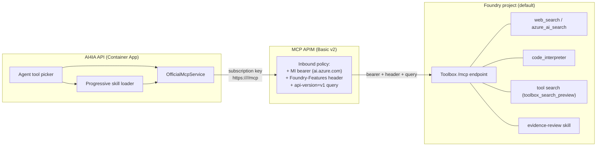

# Foundry Agent Service toolbox — fronted through the official-MCP APIM

> **Status: ACTIVATED in this repo, public preview.** The `ai4ia-toolbox` toolbox is live in the
> primary Foundry project, registered in `infra/mcp-servers.json`, and `enableOfficialMcp` +
> `enableFoundryToolbox` + `enablePrivateToolCatalog` are `true` in `infra/main.parameters.json`. The
> bicep param *defaults* remain `false`, so a consumer of this template starts off; this repo has
> opted in. Every Foundry capability referenced here (toolboxes, tool search, browser
> automation, computer use, private tool catalog, routines, A2A) is **public preview** — do not use
> in production without your own validation.
>
> **Portability (1:1 standup):** the toolbox is a data-plane resource, so `azd up`
> alone cannot create it. Run the access check and ensure commands below. Automatic
> reconciliation consumes the exact deploy artifact; manual dispatch supplies the
> explicit `project_endpoint` input shown below. The
> `mcp-servers.json` entry stays portable — it omits `upstreamUrl`, which `main.bicep` computes
> per environment. `foundry/toolbox.manifest.json` is the canonical toolbox definition.

## TL;DR — the bridge

An Azure AI Foundry **toolbox is itself an MCP endpoint**:

```
{project_endpoint}/toolboxes/{toolbox_name}/mcp?api-version=v1
```

It requires an AAD bearer for `https://ai.azure.com` and the combined header
`Foundry-Features: Toolboxes=V1Preview,Skills=V1Preview`. So instead of rewriting the app onto the Foundry
managed agent runtime, AI4IA registers that one endpoint as a **single "official MCP server"**
in `infra/mcp-servers.json`. The MCP APIM front door injects the
managed-identity bearer, the static feature header, and the `api-version=v1` query; the app
then consumes toolbox tools — web/AI search, code interpreter, and tool search —
through the existing `OfficialMcpService` + agent tool picker. Toolbox skills use
the same endpoint's MCP resources: AI4IA advertises bounded skill metadata and
loads the full `SKILL.md` only when the model selects `load_skill`.

This is the maximal "through the proxy + APIM" outcome with minimal surface: one catalog
entry, one RBAC grant, one feature flag.

### Foundry web search is not WebIQ

The Toolbox `web_search` tool and AI4IA's WebIQ integration are independent
capabilities. WebIQ is built directly into the FastAPI agent runtime as eleven
feature-gated tools: web/news/video/image search, classic structured answers,
finance, places, sports, Sonic blended search, autosuggest, and browsing.
It uses `AI4IA_WEB_SEARCH_ENABLED` plus API-key or managed-identity auth and the
official SDK's public auth/transport for fixed v3 REST contracts. Its bounded
results retain nested source/timestamp metadata and are fenced as untrusted model
context. See the [complete tool inventory](user-guide.md#custom-tools-and-web-search).
Enabling the
Foundry Toolbox does not enable WebIQ, and disabling WebIQ does not remove the
Toolbox's own `web_search`.

## Why this approach

- **Reuse, don't rebuild.** The app is a custom in-process agent runtime; tools are the
  abstraction. The official MCP plane already knows how to discover, gate, budget, and call an
  APIM-fronted MCP server. A toolbox *is* one, so it drops straight into that seam.
- **One governance path.** Every tool inside the toolbox inherits the same APIM
  subscription-key gate, managed-identity egress, and per-turn call budget as the rest of the
  official plane. There is no second auth path to reason about.
- **No runtime dependency creep.** `azure-ai-projects` is a *provisioning-time* extra
  (`app/api[foundry]`), never pulled into the runtime container. The app talks only MCP-over-HTTP.

## Architecture



The app never sees the Foundry endpoint, the AAD token, or the preview header — APIM owns all
three. From the app's perspective this is just another official MCP server named
`foundry-toolbox`.

## The one seam gap and its fix (shipped: `upstreamHeaders` / `upstreamQueryParams`)

The original official-MCP policy could inject the MI bearer and the subscription key, but not a
**static header** or a **query-string parameter** — both of which the toolbox endpoint
requires. The general, reusable fix (already in the schema and the gateway module):

- `infra/mcp-servers.schema.json` gains optional `upstreamHeaders` and `upstreamQueryParams`
  string maps.
- `infra/modules/mcpgateway.bicep` emits a `set-header` / `set-query-parameter` policy fragment
  for each pair, after the bearer and before the backend route.
- `scripts/gen-mcp-catalog.py` and the packaged runtime catalog are unaffected — these are
  infra-only fields that never leak into the app image (pinned by
  `app/api/tests/test_official_mcp_catalog_gen.py`).

## RBAC and Bicep wiring

| Concern | How it's wired |
| --- | --- |
| **Who can call the toolbox** | The MCP APIM system-assigned managed identity. |
| **Who reconciles canonical assets** | The OIDC deployment/foundry-assets identity supplied as `deploymentPrincipalId`; this is provisioning-only and is not an app runtime identity. |
| **What grant they need** | The **"Foundry User"** role (`53ca6127-db72-4b80-b1b0-d745d6d5456d`, formerly "Azure AI User") at **project** scope — data-plane, not the account-scope Cognitive Services roles. |
| **Where it's granted** | `infra/modules/foundry.bicep` adds a project-scoped role-assignment loop over `toolboxPrincipalIds`, passed only to the **primary** Foundry region from `main.bicep`. |
| **How each identity is gated** | `main.bicep` adds the APIM MI only under `enableOfficialMcp && enableFoundryToolbox`; it separately adds the nonempty deployment **principal/object ID** under `enableFoundryToolbox` so the asset workflow can reconcile the manifest. |
| **Project endpoint for scripts** | `main.bicep` output `AZURE_FOUNDRY_PROJECT_ENDPOINT`, composed by `foundry.bicep` as `https://{toLower(accountName)}.services.ai.azure.com/api/projects/{project.name}`. |

The Agent Service host (`*.services.ai.azure.com`) is deliberately **not** the account's
inference host (`*.cognitiveservices.azure.com`); the endpoint output composes the former from
the deterministic custom subdomain rather than reading the ARM property (which returns the
latter).

## The manifest

`foundry/toolbox.manifest.json` is the declarative, operator-owned, **canonical** definition of the
single toolbox — it captures the live `ai4ia-toolbox` composition (web_search, code_interpreter,
toolbox_search_preview) that a new tenant reproduces 1:1 via `provision-foundry-toolbox.py --create`.
It is validated in CI against `foundry/toolbox.manifest.schema.json` (`infra-validate` workflow).
`name` uses the same slug pattern as `infra/mcp-servers.schema.json`, so the projected catalog entry is always
valid.

| Field | Meaning |
| --- | --- |
| `name` | Toolbox name; also the `{toolbox_name}` path segment and the mcp-servers.json entry name. |
| `description` | Human-readable scope (helps agents and operators). |
| `raiPolicyName` | Optional Responsible AI policy already on the project (`foundry.bicep` provisions `ai4ia-annotate-only`). |
| `connections` | Project connections referenced by name (credentials live in the connection, never here). |
| `tools` | Built-in and MCP tools (see per-tool table below). At most one tool may be unnamed across the entire toolbox, regardless of `type`. |
| `skills` | Foundry skill references. Unpinned active references must have a repository-owned `foundry/skills/<name>/SKILL.md`; reconciliation creates or reuses an immutable version and advances its default before reconciling the toolbox. |

`camelCase` keys in the manifest (e.g. `serverLabel`, `projectConnectionId`) are translated to
the API's `snake_case` by `scripts/provision-foundry-toolbox.py`.

## Per-tool configuration (all preview)

These are the tool types that can be placed **in a toolbox** via `azure-ai-projects` (2.5.0),
mapped one-to-one to the SDK's discriminated `*ToolboxTool` models by
`scripts/provision-foundry-toolbox.py`:

| `type` | Purpose | Key manifest fields | Notes |
| --- | --- | --- | --- |
| `web_search` | Grounded web search | `name`, `description`, `filters`/`userLocation`/`searchContextSize` (optional), `customSearchConfiguration` (optional) | Connectionless by default. `filters.allowedDomains` scopes results to specific domains; `userLocation` (`country`/`region`/`city`/`timezone`, all optional strings -- the SDK auto-sets its own internal `type` discriminator, so do not set one) biases results toward a locale; `searchContextSize` is one of `low`/`medium`/`high`. `customSearchConfiguration` (SDK 2.5.0's `WebSearchConfiguration`) independently scopes search to a Bing Custom Search instance instead of the general web; its `projectConnectionId` and `instanceName` are **both required together** when present (the SDK model has no default for either). |
| `azure_ai_search` | RAG over an AI Search index | `azureAiSearch.indexes[]`: either `indexAssetId` alone, or `indexName` + `projectConnectionId` together | Nested shape (SDK 2.5.0's `AzureAISearchToolResource`); do **not** put these fields at the tool root -- the SDK constructor silently ignores them there (no error, fields just deserialize to `None`). Exactly one index per tool. `indexName` + `projectConnectionId` (Microsoft's documented "Configure tool parameters" form) and `indexAssetId` (a direct reference to an already-registered index asset -- also a real SDK 2.5.0 `AISearchIndexResource` field, though no current Microsoft Learn doc for this tool shows it as an alternative) are **mutually exclusive**: the schema rejects an index entry that sets both, or neither. |
| `code_interpreter` | Sandboxed Python | `container`, `allowedCallers` (optional) | Foundry-managed sandbox (distinct from AI4IA's APIM-fronted Responses-API Code Interpreter). `container`, if set, is either an **existing container ID** (string; a pre-registered container resource) or a nested `{"type": "auto", ...}` object (SDK 2.5.0's `AutoCodeInterpreterToolParam`) for the managed sandbox with custom `fileIds`/`memoryLimit`/`networkPolicy`. `allowedCallers` restricts invocation to `direct` model calls and/or `programmatic` calls from another tool. Omit `container` for the plain default sandbox. `networkPolicy` (SDK 2.5.0's `ContainerNetworkPolicyParam`) restricts sandbox outbound network access: `{"type": "disabled"}` or `{"type": "allowlist", "allowedDomains": [...]}` (non-empty). The SDK's allowlist variant also supports `domainSecrets` (a literal secret **value** injected per allowed domain); AI4IA intentionally does not expose that field here -- this manifest is committed to source control, so a per-domain secret value has no safe home in it (see AGENTS.md's "no secret sprawl" rule). |
| `file_search` | Search uploaded files | `vectorStoreIds`, `maxNumResults`/`rankingOptions`/`filters` (all optional) | Connectionless once files are attached. `vectorStoreIds`, if set, must be non-empty (an empty list is inert). `maxNumResults` is an integer 1-50. `rankingOptions.ranker` is `auto` or `default-2024-11-15`; `.scoreThreshold` is 0-1; `.hybridSearch`, if present, requires both `embeddingWeight` and `textWeight` (0-1 each). `filters` is a comparison (`type`/`key`/`value`, one of `eq`/`ne`/`gt`/`gte`/`lt`/`lte`/`in`/`nin`) or compound (`type`: `and`/`or` plus nested `filters[]`) tree over vector-store file metadata -- a **different shape** from `web_search.filters` above despite the shared name; each type's shape is independently schema-enforced. |
| `browser_automation_preview` | Drive a hosted browser | `browserAutomationPreview.connection.projectConnectionId` | Nested shape (SDK 2.5.0's `BrowserAutomationToolParameters`). The connection must be a **Playwright Workspace** connection, not a plain API connection. Preview; heavier isolation review recommended. |
| `openapi` | Call an OpenAPI-described API | `openapi` (nested `name`, `spec`, `auth`) | Wraps a REST API as a tool; `auth.type` is `anonymous` (no other field), `project_connection` (ONLY `auth.securityScheme.projectConnectionId`), or `managed_identity` (ONLY `auth.securityScheme.audience`) -- each is a strictly closed shape (schema `oneOf`, `additionalProperties: false` at every level), so e.g. a stray `securityScheme` on `anonymous` or an extra key alongside `projectConnectionId`/`audience` is rejected, not silently ignored. `spec` is passed through **byte-for-byte unmodified** -- its property names describe someone else's API and are never snake_cased, so a JSON-schema property genuinely named e.g. `topK` is never corrupted into `top_k`. There is no `functions` manifest field: the SDK's `OpenApiFunctionDefinition.functions` is read-only (server-populated, presumably extracted from `spec`) and is stripped from the wire request by the SDK's own `exclude_readonly` JSON encoding regardless of what a caller sets, so exposing it here would be a silently-inert no-op, not a real setting. |
| `toolbox_search_preview` | **Tool search** — let the model pick tools from a large set | none | Preview spelling. Add this (or `toolbox_search`) so the toolbox self-describes its tools to the model. |
| `toolbox_search` | **Tool search (GA spelling)** — let the model pick tools from a large set | none | SDK 2.4.0's `ToolSearchToolboxTool`, added alongside — not replacing — `toolbox_search_preview`; both discriminators remain live and carry an identical field set (only the common `name`/`description`/`toolConfigs`). Prefer this in new manifests, and put only one of the two in a real toolbox. |
| `mcp` | Nest another MCP server as a tool | `serverLabel`, one of `serverUrl`/`connectorId`/`tunnelId`, `requireApproval`, `projectConnectionId`, `serverDescription`/`allowedTools`/`allowedCallers`/`deferLoading` (optional) | Lets the toolbox aggregate upstream MCP servers. Identified by `serverLabel`. `tunnelId` selects a Secure MCP Tunnel instead of a direct URL or built-in connector. `allowedCallers` restricts invocation to `direct` and/or `programmatic` callers. Unlike `azure_ai_search`/`browser_automation_preview`, `mcp`'s `projectConnectionId` genuinely is a tool-root field in the SDK. `requireApproval` is the literal `"always"`/`"never"`, or an object with `always`/`never` keys each holding a tool filter (`toolNames`/`readOnly`); an empty object is rejected. `allowedTools` is either a non-empty array of tool-name strings or that same tool-filter shape, restricting which discovered upstream tools are exposed. `serverDescription` is free text surfaced to the model; `deferLoading` (boolean) defers fetching the server's tool list until first use. There is no BYO-container-image tool type; if you need to run genuinely custom execution logic, wrap it in your own server and expose it as an `mcp` tool instead of trying to pass a custom image to `code_interpreter.container`. The SDK's `mcp` model also exposes `authorization` (an OAuth bearer token) and `headers` (which can carry auth material); AI4IA does not expose either for the same secret-sprawl reason as `networkPolicy.domainSecrets` above -- put credentials in the referenced project connection instead. |
| `a2a` | Delegate to a remote Agent-to-Agent (A2A) protocol agent | `a2aVersion` (`"1.0"`, required), at least one of `projectConnectionId`/`baseUrl`, `agentCardPath`/`sendCredentialsForAgentCard` (optional) | SDK 2.5.0's GA `A2AToolboxTool` discriminator. It retains the preview model's endpoint/connection fields and adds the required `a2aVersion`. Prefer this spelling for new manifests. |
| `a2a_preview` | Delegate to a remote Agent-to-Agent (A2A) protocol agent | at least one of `projectConnectionId`/`baseUrl`, `agentCardPath`/`sendCredentialsForAgentCard` (optional) | SDK 2.4.0's `A2APreviewToolboxTool` -- the **inbound** direction (AI4IA's toolbox *calling out* to someone else's A2A agent), the inverse of the "Routines and Agent-to-Agent (A2A)" section below (AI4IA *exposing* its own agent as an A2A endpoint for others to call). Use `projectConnectionId` to delegate through a project connection storing the remote agent's endpoint and auth (Microsoft's documented approach), `baseUrl` (+ optional `agentCardPath`, `sendCredentialsForAgentCard`) for a self-contained, connectionless call to an anonymous agent, or both together (e.g. `baseUrl` as the target plus `projectConnectionId` for auth) -- the SDK constructor and schema both accept either or both; neither is client-side exclusive of the other. At least one is required; fields specific to other tool types (e.g. `serverLabel`, `requireApproval`) are rejected. |
| `fabric_iq_preview` | Ground responses in a Microsoft Fabric IQ knowledge source | `projectConnectionId` (required), `serverLabel`/`serverUrl`/`requireApproval` (optional) | SDK 2.5.0's `FabricIQPreviewToolboxTool`. Shares the `serverLabel`/`serverUrl`/`requireApproval` field *names* with `mcp`, but not `allowedTools`/`serverDescription`/`deferLoading` (those are mcp-only and rejected here). |
| `work_iq_preview` | Ground responses in Microsoft 365 Work IQ | `projectConnectionId` (required; the tool's only field) | SDK 2.5.0's `WorkIQPreviewToolboxTool`. Unlike `fabric_iq_preview`, does **not** accept `serverLabel`/`serverUrl`/`requireApproval` or any other field. |
| `reminder_preview` | Let the model schedule reminders for the caller | none | SDK 2.5.0's `ReminderPreviewToolboxTool`. No type-specific fields or connection required -- only the common `name`/`description`/`toolConfigs` below. |

> **`toolConfigs` (every tool type):** an optional map from tool name (or `"*"` for the
> catch-all default) to `{"pin": <bool>, "additionalSearchText": <string>}` (SDK 2.5.0's common
> `ToolConfig`) -- `pin` keeps a tool always loaded/visible; `additionalSearchText` adds extra text
> the model uses when `toolbox_search_preview` picks tools. Unknown keys under a `toolConfigs`
> entry are rejected. The map's own keys (the tool names) are caller-defined and always preserved
> exactly as written -- the provisioner never runs them through its camelCase-to-snake_case table,
> even when a tool name happens to collide with an unrelated manifest keyword (e.g. a tool
> literally named `topK` stays `topK`, it is never coerced to `top_k`).

> **Deliberate gaps (not modeled, by design):** two different reasons, not one. **Genuine
> secrets:** `code_interpreter`'s `container.networkPolicy.domainSecrets` (a literal secret
> **value** per allowed domain) and `mcp.authorization`/`mcp.headers` (credential material for the
> upstream MCP server) are real, SDK-constructible fields that AI4IA deliberately never models in
> this committed manifest schema (AGENTS.md "no secret sprawl") -- put credentials in a project
> connection instead. **Read-only/server-computed:** `openapi.functions`
> (`OpenApiFunctionDefinition.functions`) is declared `rest_field(visibility=["read"])` in the
> locked SDK and is stripped from every request body by `ToolboxesOperations.create_version()`'s
> `exclude_readonly=True` encoding regardless of what a caller sets -- modeling it as a settable
> manifest field would be a silently-inert, success-shaped no-op, so the schema rejects it via
> `additionalProperties: false` instead. Every other field the SDK's toolbox tool models accept --
> including `indexAssetId`, `web_search.filters`/`.userLocation`/`.searchContextSize`,
> `file_search.maxNumResults`/`.rankingOptions`/`.filters`,
> `mcp.serverDescription`/`.allowedTools`/`.deferLoading`, and the common `toolConfigs` -- is
> modeled and schema-enforced as of this round. `app/api/tests/test_foundry_toolbox.py`'s
> reflection-driven parity test enumerates every `azure.ai.projects.models.*ToolboxTool` subclass
> via the real locked SDK (walking `__mro__`-merged `__annotations__`, since
> `inspect.signature`/`typing.get_type_hints` don't resolve on these generated model classes) and
> fails if a future SDK field or type is left uncovered.

> **Available vs. deployed:** this table is every tool type the schema/provisioning script
> support (14 as of azure-ai-projects 2.5.0). The live canonical `ai4ia-toolbox`
> (`foundry/toolbox.manifest.json`) currently uses only three: `web_search`, `code_interpreter`,
> and `toolbox_search_preview`. See `foundry/toolbox.manifest.example.json` for a populated
> reference covering all 14 types (18 tools total, including both the
> `indexName`+`projectConnectionId` and `indexAssetId` forms of `azure_ai_search`) as a starting
> point for adding more.

> **Not toolbox tools:** `computer_use` and `bing_custom_search` exist only as *agent-level* tools
> in the SDK (`ComputerUsePreviewTool` / `BingCustomSearchPreviewTool`) with no `*ToolboxTool`
> counterpart, so they cannot be added to a toolbox. Attach them directly to an agent instead.

> **Identifier rule:** the service allows at most **one tool total** without an identifier. Every
> other tool needs a unique `name` (or `serverLabel` for `mcp`). The provisioning script and schema
> both enforce this.

> **Nested shapes are enforced, not just documented:** `foundry/toolbox.manifest.schema.json` sets
> `additionalProperties: false` on every tool and has a strict per-`type` branch (required nested
> fields, cardinality, and which fields are legal for that type) for **all fourteen** tool types --
> not just `azure_ai_search`/`browser_automation_preview`. For example: `azure_ai_search` requires
> exactly one `azureAiSearch.indexes[]` entry with either `indexAssetId` alone or `indexName` AND
> `projectConnectionId` together (mutually exclusive) and rejects root-level `indexName`/
> `projectConnectionId`; `code_interpreter.container.networkPolicy` requires `allowedDomains`
> (non-empty) when `type` is `allowlist`; `browser_automation_preview` requires
> `browserAutomationPreview.connection`; `mcp` requires `serverLabel` plus one of
> `serverUrl`/`connectorId`/`tunnelId`; `openapi` requires `openapi.name`/`.spec`/`.auth` and enforces `auth`'s
> per-type nested fields; `a2a` requires `a2aVersion` plus one of
> `projectConnectionId`/`baseUrl`, while `a2a_preview` requires only the latter pair;
> `fabric_iq_preview`/`work_iq_preview` require `projectConnectionId`.
> `scripts/provision-foundry-toolbox.py` **applies this schema itself** (via the optional
> `jsonschema` dependency, which ships with the `foundry` extra)
> before constructing any SDK model -- not just via CI's separate `check-jsonschema` lint step. `--create`
> refuses to run at all if `jsonschema` isn't installed; the dependency-free dry run best-effort
> validates when it happens to be available and otherwise only runs the hand-written structural checks.
> `scripts/provision-foundry-toolbox.py` also recursively snake_cases nested manifest keys before
> constructing SDK models (so nested camelCase config, not just top-level, is translated correctly)
> -- **except** `openapi.spec`, which is copied through untouched because it is an externally-authored
> OpenAPI document whose own property names are not AI4IA manifest keys.

Add a `description` to every tool — the model uses it for tool selection, which matters most
when `toolbox_search` (or its preview spelling) is present.

**Copy-paste starting point:** `foundry/toolbox.manifest.example.json` is a populated reference
manifest covering all 14 toolbox tool types (18 tools total -- `web_search`, `azure_ai_search`,
and `mcp` each appear twice, to show both of their alternative shapes, and tool search appears as
both its GA `toolbox_search` and preview `toolbox_search_preview` spellings -- plus seven
connections: Search, MCP-upstream, Playwright Workspace for browser automation, Bing Custom
Search, and one each for the A2A/Fabric IQ/Work IQ examples), all uniquely
identified (by `name`, or `serverLabel` for `mcp` tools).
The shipped `foundry/toolbox.manifest.json` is the canonical `ai4ia-toolbox`
definition. To start from the example, copy it to an operator-owned manifest,
prune/review it, and change `lifecycle` from `reference` to `active`; the
provisioner rejects `--create`/`--emit-yaml` for reference manifests. Create any
referenced connections, then run `provision-foundry-toolbox.py`. The script creates the toolbox via
`project.toolboxes.create_version(name, tools=[...], description=..., skills=[...], policies=...)`,
then activates that new version (see the idempotency note below).

## Progressive skill disclosure

The canonical toolbox includes `evidence-review`, sourced from
`foundry/skills/evidence-review/SKILL.md`. Foundry exposes attached skills as MCP
resources rather than tools. `OfficialMcpService` calls `resources/list` only for
generated catalog entries explicitly marked `resourcesEnabled`; phase one sets
that bit only for the repository-curated Foundry Toolbox. Generic official and
user-added MCP servers cannot become instruction sources.

At turn construction, AI4IA advertises only each validated `skill://` resource's
name and bounded description through one safe `load_skill` function. A model that
needs the skill selects its exact enum name; the handler rechecks that the URI was
advertised by that server, then calls `resources/read`. The result includes the
source server/URI, resolved version when the URI supplies one (otherwise
`default`), content SHA-256, truncation status, and the bounded instructions.
These fields are retained by the execution receipt. Because descriptions are
remote MCP metadata, merely advertising a skill taints the turn before the first
model call; loading its full body keeps that taint latched. Any
injection-sensitive or external/destructive call therefore retains the normal
exact-argument approval. Skill instructions never override system
policy, scopes, egress checks, or approvals.

This first implementation supports instruction-only `SKILL.md` resources.
Supplementary skill scripts/assets and user-authored skill CRUD remain out of
scope. Foundry Skills and toolbox skill delivery are public preview and the Skills
API currently does not support private-network-only projects. See Microsoft's
[Foundry skills guidance](https://learn.microsoft.com/azure/foundry/agents/how-to/tools/skills).

## Operator runbook (end to end)

1. **Install the provisioning extra.** `azure-ai-projects` is pinned to an exact version
   (`==2.5.0` as of this writing, not a floating floor) because the toolbox model classes this
   script constructs have already changed shape once between 2.x releases; every install path
   should land on the one version the manifest schema, provisioner, and tests were reviewed
   against:

   ```bash
   uv pip install -e "app/api[foundry]"
   ```

   CI installs this same extra (`pip install -e ".[dev,foundry]"`, see `.github/workflows/app-ci.yml`)
   so `tests/test_foundry_toolbox.py`'s real-SDK-construction cases run for real instead of
   skipping — but it is never part of the deployed runtime container image; the app talks only
   MCP-over-HTTP at runtime (see "No runtime dependency creep" above).

2. **Resolve the project endpoint.** With `enableFoundryToolbox=true` deployed, read it from
   `azd env get-values` (`AZURE_FOUNDRY_PROJECT_ENDPOINT`), or pass `--project-endpoint`.

3. **Verify data-plane access.** Azure OIDC login is authentication, not authorization.
   The workflow identity must hold the project-scoped **Foundry User** role on the primary
   Foundry project. Check it before any write:

   ```bash
   python scripts/provision-foundry-toolbox.py --check-access
   ```

4. **Populate `foundry/toolbox.manifest.json`** with tools, then ensure the
   toolbox. The dry run prints the plan, the consumer MCP URL, and a ready-to-paste
   `infra/mcp-servers.json` entry:

   ```bash
   python scripts/provision-foundry-toolbox.py            # dry run
   python scripts/provision-foundry-toolbox.py --create
   # optional: emit the `azd ai toolbox create --from-file` YAML instead
   python scripts/provision-foundry-toolbox.py --emit-yaml foundry/toolbox.azd.yaml
   ```

   > **Idempotency note:** `--create` first compares every unpinned local
   > `SKILL.md` with the active Foundry skill version, then compares the desired
   > toolbox with its served default. Changed content creates exactly one
   > immutable version and explicitly advances `default_version`. Read, create,
   > and activation errors propagate. If creation succeeded but activation
   > failed, the next run scans immutable versions, reuses the matching content,
   > and retries activation without creating a duplicate.

5. **Automated reconciliation.** Foundry asset and provisioner changes trigger
   `.github/workflows/deploy.yml` first. After that named workflow completes successfully for a
   push to `main`, `.github/workflows/foundry-assets.yml` checks out the exact deployed
   `workflow_run.head_sha` and reconciles assets. It has no direct push trigger, so it cannot race
   ahead of project creation or Foundry User role propagation. Manual dispatch remains available.
   Both paths authenticate with OIDC. The deploy workflow uploads its
   azd-produced endpoint as a 30-day `foundry-assets-context` artifact. An
   unprivileged gate verifies the triggering deploy job really ran, downloads the
   exact-run artifact, validates the endpoint, and carries it as a job output
   before production approval or reconciliation concurrency can wait. Manual
   dispatch requires an explicit `project_endpoint` input. The protected job
   receives the validated endpoint as `AZURE_FOUNDRY_PROJECT_ENDPOINT`, first
   verifies project-scoped Foundry User, then ensures the manifest's skills and
   `ai4ia-toolbox`. `main.bicep` includes `deploymentPrincipalId` in the primary project's
   assignments; the preflight still fails with remediation if that grant has not reconciled.
   No merged GitHub `vars` endpoint can redirect the automatic path. Unchanged
   runs are no-ops.

6. **Register the entry.** Paste the printed object into `infra/mcp-servers.json` (`servers[]`)
   and regenerate the packaged runtime catalog:

   ```bash
   python scripts/gen-mcp-catalog.py
   ```

7. **Flip the flags and deploy:** `enableOfficialMcp=true` **and** `enableFoundryToolbox=true`,
   then `azd up`. The toolbox surfaces in the agent tool picker as the `foundry-toolbox`
   official MCP server; the grant lets APIM's MI bearer invoke it.

To stop serving the toolbox, set `enableFoundryToolbox=false` and/or remove the
entry and regenerate the catalog. To stop serving every official MCP endpoint,
set `enableOfficialMcp=false`. These flags stop runtime wiring and stop declaring
the corresponding Bicep resources, but **do not delete** previously deployed
RBAC assignments or APIM children under ARM incremental mode. Full removal is a
separately approved, scope-by-scope teardown; verify the literal resource and
principal IDs afterward.

## Private tool catalog (Azure API Center)

`enablePrivateToolCatalog=true` provisions an **Azure API Center** (`infra/modules/apicenter.bicep`,
`Microsoft.ApiCenter/*@2024-06-01-preview`, Free plan, single `default`
workspace) as a private, governed inventory. The Bicep parameter defaults off and requires
`enableOfficialMcp=true`; the repository's deployed profile enables both. Its region is set by
`apiCenterLocation` (default `eastus`) because API Center is unavailable in some regions, including
`eastus2`.

The complete registration graph is IaC-owned. For every entry in `infra/mcp-servers.json`, Bicep
creates or updates an MCP-kind API, preview version, Streamable HTTP definition, shared production
APIM environment, and active deployment. Deployment `environmentId` and `definitionId` values are
API-Center-scoped (`/workspaces/default/...`), as required by the API Center contract rather than
full ARM IDs. Each deployment carries the **APIM consumer URL**
(`https://<shared-apim>/<name>/mcp`), never the raw upstream, so discovery and governance stay on the
same authenticated front door the app consumes. The MCP inventory and registry integration remain
public preview. When the catalog is enabled and `deploymentPrincipalId` is nonempty, that
provisioning/operator identity receives only **Azure API Center Data Reader** at the API Center
service scope; no app runtime identity or subscription-wide reader is granted. Existing
portal-created samples such as `swagger-petstore` are retained by ARM incremental deployments and
must be removed separately with `scripts/cleanup-lean-azure-retained.ps1` after verifying the exact
asset; they are not created or advertised by this repo.

## P7 — Routines and Agent-to-Agent (A2A): design artifacts only

Routine and A2A files are **design/preview artifacts**, not served capabilities.
Routine creation has no faithful translation to the pinned SDK contract. The A2A
scaffold also lacks the protocol/version, endpoint, auth, APIM operation/product/
subscription/policy, and runtime-client contracts needed to make an integration
callable. Schema validation proves only that each design is internally shaped as
documented.

### Routines

A [routine](https://learn.microsoft.com/azure/foundry/agents/how-to/use-routines) in
azure-ai-projects 2.5.0 is **not** the multi-step, tool-calling workflow this repo's manifest
schema models. There is no `project.routines` at all; the actual (public preview) surface is
`project.beta.routines.create_or_update(routine_name, *, triggers, action)`, which models an event
**trigger** (a custom event, a GitHub issue, a cron schedule, or a timer) that invokes ONE
already-existing Foundry agent by name with a static input payload -- fundamentally different from
"run these N steps, each calling toolbox tools." Our manifest schema
(`name`/`description`/`model`/`toolbox`/`steps[].{name,instructions,tools}`) has no trigger-type
field and no target-agent-name field, so there is no faithful, non-inventive translation from one
shape to the other.

**Residual gap:** rather than fake-map semantics (e.g. silently treating a step as a trigger and
guessing an agent name for `action.agent_name`), `scripts/provision-foundry-routine.py` is
permanently validation/planning-only: it loads, validates, and prints the plan (steps, model,
referenced toolbox tools, project endpoint if configured) for `foundry/routines/*.routine.json`,
and never imports or calls the Azure SDK. There is intentionally **no `--create`** -- it was
removed rather than faked. This will be revisited if AI4IA defines a manifest schema that actually
captures a trigger + target-agent shape, or the SDK's routines surface gains step-based workflow
support.

Shipped:
- `foundry/routines/routine.schema.json` + `foundry/routines/example.routine.json` -- a schema and
  a populated example routine (steps, tool references, model) documenting the workflow shape
  AI4IA plans for, kept to make the residual gap concrete and forward-compatible.
- `scripts/provision-foundry-routine.py` -- pure `load_manifest`/`validate_manifest`/`plan_steps`/
  `referenced_tools` functions (dependency-free, unit-tested in `test_foundry_routine.py`; the
  script never imports `azure.ai.projects`).
- The routine references canonical toolbox **instance names**. Semantic validation
  loads `foundry/toolbox.manifest.json` and rejects unknown names. That proves only
  namespace consistency; no runtime/APIM dispatch or inherited governance path
  exists today.

Run it: `python scripts/provision-foundry-routine.py` (validates the manifest and prints the plan;
there is no `--create`).

### Agent-to-Agent (A2A) design

[A2A](https://learn.microsoft.com/azure/foundry/agents/how-to/enable-agent-to-agent-endpoint)
can expose a Foundry agent over the Agent2Agent protocol. AI4IA retains a useful
design artifact for that direction, but it is not an implementation:

1. Select and pin the A2A protocol/version contract and endpoint discovery shape.
2. Define backend authentication and the APIM API operation, product/subscription,
   and policy.
3. Implement an authenticated runtime client and wire it to a server-authoritative
   agent/tool contract.
4. Add live-compatible tests for both APIM and runtime behavior before changing
   the lifecycle from `design-preview`.

Shipped: `foundry/a2a/a2a.schema.json`,
`foundry/a2a/example.a2a.json`, and
`scripts/provision-foundry-a2a.py`. The script validates and prints the complete
blocker inventory. It deliberately has no `--emit-az`, endpoint builder, or
`AgentSpec` projection: none would prove a callable integration.

## Testing and CI

- `app/api/tests/test_foundry_toolbox.py` pins, with no Azure SDK or network: manifest
  validation (checked-in manifest matches the live toolbox, bad name / too many unnamed tools /
  non-toolbox tool types flagged), camelCase→snake_case tool projection, the consumer URL, the
  portable mcp-servers.json entry shape (`foundryToolbox: true`, no hardcoded URL), and the azd
  YAML. `jsonschema`-guarded tests assert the projected entry validates
  against `infra/mcp-servers.schema.json` (the load-bearing cross-seam guarantee) and that the
  manifests match `toolbox.manifest.schema.json`, including strict per-type positive/negative
  cases for every one of the 13 tool types (required fields, cardinality, and cross-type field
  pollution -- a field belonging to one type showing up on another).
- `azure.ai.projects`-gated tests (`pytest.importorskip`, skipped if the optional dependency isn't
  installed) go one step further than schema shape: they construct REAL SDK
  `azure.ai.projects.models.*ToolboxTool` instances from the example manifest and from targeted
  per-field cases, so a manifest the schema accepts is also proven to reach the SDK constructor's
  actual kwargs (this is what silently broke before -- an unrecognized kwarg the SDK just dropped,
  producing `None` fields with no exception). A reflection-driven parity test in the same file
  enumerates every `*ToolboxTool` subclass the installed SDK actually exposes (merging
  `__annotations__` across each class's `__mro__`, since `inspect.signature`/
  `typing.get_type_hints` don't resolve on these generated model classes) and fails the build if a
  future SDK type or field has no `_TYPE_TO_MODEL`/`_CAMEL_TO_SNAKE` coverage and no explicit,
  documented secret exclusion.
- `infra-validate` runs `check-jsonschema` on `foundry/toolbox.manifest.json`, the populated
  `foundry/toolbox.manifest.example.json`, and the routine + A2A example manifests,
  then runs semantic design checks so unknown routine tool names and incomplete
  A2A blocker inventories fail.
- `app-ci` runs the pytest suite whenever `app/**`, `foundry/**`, or the provisioning scripts
  change.
- `scripts/tests/test_lean_azure_iac.py` pins the API Center ARM graph: every curated server is
  passed from `main.bicep`, registered as MCP, versioned, and deployed through its **APIM consumer
  URL**; it also guards the default-off Event Hubs and active App Configuration sentinel.
- `app/api/tests/test_foundry_routine.py` pins the routine script: manifest validation, canonical
  toolbox cross-validation, that `--create`/`create_routine` no longer exist
  (guarding against a silent regression back to fake-mapping), and that the dry-run plan tolerates
  a missing project endpoint. `app/api/tests/test_foundry_a2a.py` pins the design-only A2A script:
  the full blocker inventory, non-callable lifecycle metadata, and the absence of
  command emission or runtime registration.
