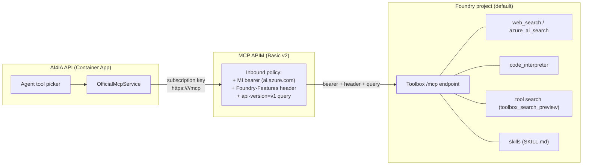

# Foundry Agent Service toolbox — fronted through the official-MCP APIM

> **Status: default-OFF, public preview.** Nothing in this document is provisioned by
> `azd up`, CI, or the app runtime. The checked-in deploy is byte-for-byte unchanged until an
> operator populates `foundry/toolbox.manifest.json`, runs the provisioning scripts, and sets
> `enableFoundryToolbox=true`. Every Foundry capability referenced here (toolboxes, skills,
> tool search, browser automation, computer use, private tool catalog, routines, A2A) is
> **public preview** — do not use in production without your own validation.

## TL;DR — the bridge

An Azure AI Foundry **toolbox is itself an MCP endpoint**:

```
{project_endpoint}/toolboxes/{toolbox_name}/mcp?api-version=v1
```

It requires an AAD bearer for `https://ai.azure.com` and the header
`Foundry-Features: Toolboxes=V1Preview`. So instead of rewriting the app onto the Foundry
managed agent runtime, AI4IA registers that one endpoint as a **single "official MCP server"**
in `infra/mcp-servers.json`. The MCP APIM front door shipped in PR #125 injects the
managed-identity bearer, the static feature header, and the `api-version=v1` query; the app
then consumes the entire toolbox — web/AI search, code interpreter, tool search, and bound
skills — through the existing `OfficialMcpService` + agent tool picker with **zero new runtime
code**.

This is the maximal "through the proxy + APIM" outcome with minimal surface: one catalog
entry, one RBAC grant, one feature flag.

## Why this approach

- **Reuse, don't rebuild.** The app is a custom in-process agent runtime; tools are the
  abstraction. The official MCP plane already knows how to discover, gate, budget, and call an
  APIM-fronted MCP server. A toolbox *is* one, so it drops straight into that seam.
- **One governance path.** Every tool and skill inside the toolbox inherits the same APIM
  subscription-key gate, managed-identity egress, and per-turn call budget as the rest of the
  official plane. There is no second auth path to reason about.
- **No runtime dependency creep.** `azure-ai-projects` is a *provisioning-time* extra
  (`app/api[foundry]`), never pulled into the runtime container. The app talks only MCP-over-HTTP.

## Architecture



The app never sees the Foundry endpoint, the AAD token, or the preview header — APIM owns all
three. From the app's perspective this is just another official MCP server named
`foundry-toolbox`.

## The one seam gap and its fix (shipped: `upstreamHeaders` / `upstreamQueryParams`)

The original official-MCP policy could inject the MI bearer and the subscription key, but not a
**static header** or a **query-string parameter** — both of which the toolbox endpoint
requires. The general, reusable fix (already in the schema and the gateway module):

- `infra/mcp-servers.schema.json` gains optional `upstreamHeaders` and `upstreamQueryParams`
  string maps.
- `infra/modules/mcpgateway.bicep` emits a `set-header` / `set-query-parameter` policy fragment
  for each pair, after the bearer and before the backend route.
- `scripts/gen-mcp-catalog.py` and the packaged runtime catalog are unaffected — these are
  infra-only fields that never leak into the app image (pinned by
  `app/api/tests/test_official_mcp_catalog_gen.py`).

## RBAC and Bicep wiring

| Concern | How it's wired |
| --- | --- |
| **Who can call the toolbox** | The MCP APIM system-assigned managed identity. |
| **What grant it needs** | The **"Foundry User"** role (`53ca6127-db72-4b80-b1b0-d745d6d5456d`, formerly "Azure AI User") at **project** scope — data-plane, not the account-scope Cognitive Services roles. |
| **Where it's granted** | `infra/modules/foundry.bicep` adds a project-scoped role-assignment loop over `toolboxPrincipalIds`, passed only to the **primary** Foundry region from `main.bicep`. |
| **How the app reaches it** | `main.bicep` var `foundryToolboxApimPrincipal` = the APIM MI principal, guarded on `enableOfficialMcp && enableFoundryToolbox`. |
| **Project endpoint for scripts** | `main.bicep` output `AZURE_FOUNDRY_PROJECT_ENDPOINT`, composed by `foundry.bicep` as `https://{toLower(accountName)}.services.ai.azure.com/api/projects/{project.name}`. |

The Agent Service host (`*.services.ai.azure.com`) is deliberately **not** the account's
inference host (`*.cognitiveservices.azure.com`); the endpoint output composes the former from
the deterministic custom subdomain rather than reading the ARM property (which returns the
latter).

## The manifest

`foundry/toolbox.manifest.json` is the declarative, operator-owned definition of the single
toolbox. It ships **inert** (empty `tools`/`skills`/`connections`) and is validated in CI
against `foundry/toolbox.manifest.schema.json` (`infra-validate` workflow). `name` uses the
same slug pattern as `infra/mcp-servers.schema.json`, so the projected catalog entry is always
valid.

| Field | Meaning |
| --- | --- |
| `name` | Toolbox name; also the `{toolbox_name}` path segment and the mcp-servers.json entry name. |
| `description` | Human-readable scope (helps agents and operators). |
| `raiPolicyName` | Optional Responsible AI policy already on the project (`foundry.bicep` provisions `ai4ia-annotate-only`). |
| `connections` | Project connections referenced by name (credentials live in the connection, never here). |
| `tools` | Built-in and MCP tools (see per-tool table below). At most one unnamed tool per `type`. |
| `skills` | Existing project skills to bind (create them first with the skills script). |

`camelCase` keys in the manifest (e.g. `serverLabel`, `projectConnectionId`) are translated to
the API's `snake_case` by `scripts/provision-foundry-toolbox.py`.

## Per-tool configuration (all preview)

These are the tool types that can be placed **in a toolbox** via `azure-ai-projects` (2.3.0),
mapped one-to-one to the SDK's discriminated `*ToolboxTool` models by
`scripts/provision-foundry-toolbox.py`:

| `type` | Purpose | Key manifest fields | Notes |
| --- | --- | --- | --- |
| `web_search` | Grounded web search | `name`, `description` | Connectionless. |
| `azure_ai_search` | RAG over an AI Search index | `indexName`, connection | Needs a project connection to the Search service. |
| `code_interpreter` | Sandboxed Python | `container` | Foundry-managed sandbox (distinct from AI4IA's existing direct Responses-API code interpreter). |
| `code_interpreter` (custom) | BYO container image | `container` (custom image ref) | "Custom code interpreter"; runs your image in the Foundry sandbox. Give it a distinct `name`. |
| `file_search` | Search uploaded files | vector store / file refs | Connectionless once files are attached. |
| `browser_automation_preview` | Drive a hosted browser | connection / config | Preview; heavier isolation review recommended. |
| `openapi` | Call an OpenAPI-described API | `spec`, connection | Wraps a REST API as a tool. |
| `toolbox_search_preview` | **Tool search** — let the model pick tools from a large set | none | Add this so the toolbox self-describes its tools to the model. |
| `mcp` | Nest another MCP server as a tool | `serverLabel`, `serverUrl`, `requireApproval`, `projectConnectionId` | Lets the toolbox aggregate upstream MCP servers. Identified by `serverLabel`. |

> **Not toolbox tools:** `computer_use` and `bing_custom_search` exist only as *agent-level* tools
> in the SDK (`ComputerUsePreviewTool` / `BingCustomSearchPreviewTool`) with no `*ToolboxTool`
> counterpart, so they cannot be added to a toolbox. Attach them directly to an agent instead.

> **Identifier rule:** the service allows at most **one tool total** without an identifier. Every
> other tool needs a unique `name` (or `serverLabel` for `mcp`). The provisioning script and schema
> both enforce this.

Add a `description` to every tool — the model uses it for tool selection, which matters most
when `toolbox_search_preview` is present.

**Copy-paste starting point:** `foundry/toolbox.manifest.example.json` is a populated reference
manifest with one of each toolbox tool (plus a connection and a bound skill), all uniquely named.
The shipped `foundry/toolbox.manifest.json` stays inert; copy the example (or pass
`--manifest foundry/toolbox.manifest.example.json`), prune what you don't need, create the
referenced connections, then run `provision-foundry-toolbox.py`. The script creates the toolbox via
`project.toolboxes.create_version(name, tools=[...], description=..., skills=[...], policies=...)`.

## Skills

A **skill** is a `foundry/skills/<name>/SKILL.md` file (Agent Skills spec,
[agentskills.io](https://agentskills.io)): YAML front matter (`name`, `description`) plus a
Markdown instruction body. `scripts/provision-foundry-skills.py` discovers, validates, and
(`--create`) uploads each via `project.beta.skills.create(...)`. Bind a skill to the toolbox by
listing it under `skills` in the manifest. The example
`foundry/skills/citation-discipline/SKILL.md` enforces grounded, cited answers.

Skill `name` must match `^[a-z0-9]([a-z0-9-]*[a-z0-9])?$` (max 64). The create path sends
`Foundry-Features: Skills=V1Preview` and uses `allow_preview=True` on the client.

## Operator runbook (end to end)

1. **Install the provisioning extra** (never installed by CI or the container):

   ```bash
   uv pip install -e "app/api[foundry]"
   ```

2. **Resolve the project endpoint.** With `enableFoundryToolbox=true` deployed, read it from
   `azd env get-values` (`AZURE_FOUNDRY_PROJECT_ENDPOINT`), or pass `--project-endpoint`.

3. **Create skills (optional).** Dry-run, then create:

   ```bash
   python scripts/provision-foundry-skills.py
   python scripts/provision-foundry-skills.py --create
   ```

4. **Populate `foundry/toolbox.manifest.json`** with tools (and any skills), then create the
   toolbox. The dry run prints the plan, the consumer MCP URL, and a ready-to-paste
   `infra/mcp-servers.json` entry:

   ```bash
   python scripts/provision-foundry-toolbox.py            # dry run
   python scripts/provision-foundry-toolbox.py --create
   # optional: emit the `azd ai toolbox create --from-file` YAML instead
   python scripts/provision-foundry-toolbox.py --emit-yaml foundry/toolbox.azd.yaml
   ```

5. **Register the entry.** Paste the printed object into `infra/mcp-servers.json` (`servers[]`)
   and regenerate the packaged runtime catalog:

   ```bash
   python scripts/gen-mcp-catalog.py
   ```

6. **Flip the flags and deploy:** `enableOfficialMcp=true` **and** `enableFoundryToolbox=true`,
   then `azd up`. The toolbox surfaces in the agent tool picker as the `foundry-toolbox`
   official MCP server; the grant lets APIM's MI bearer invoke it.

To disable: set `enableFoundryToolbox=false` (drops the RBAC grant) and/or remove the entry and
regenerate the catalog. Setting `enableOfficialMcp=false` tears down the whole MCP plane.

## Private tool catalog (Azure API Center)

`enablePrivateToolCatalog=true` provisions an **Azure API Center** (`infra/modules/apicenter.bicep`,
`Microsoft.ApiCenter/services@2024-03-01`, Free plan, system-assigned identity, single `default`
workspace) to act as a private, governed inventory of tools. Default OFF: the checked-in deploy
provisions no API Center, and the flag is independent of `enableOfficialMcp`/`enableFoundryToolbox`
(you can catalog whatever official MCP servers exist). When enabled, `azd env get-values` exposes
`AZURE_API_CENTER_NAME`.

The **catalog container** is IaC; **registering each server as an asset** is a preview, script-driven
step (MCP is a preview API kind in API Center), so it is intentionally not baked into Bicep:

```bash
# Dry run: lists each server and the APIM consumer URL that will be cataloged.
python scripts/provision-private-tool-catalog.py \
  --api-center "$AZURE_API_CENTER_NAME" \
  --gateway-url "$AZURE_OFFICIAL_MCP_GATEWAY_URL"

# Print ready-to-run `az apic api create` commands (register via CLI):
python scripts/provision-private-tool-catalog.py --emit-az \
  --api-center "$AZURE_API_CENTER_NAME" --gateway-url "$AZURE_OFFICIAL_MCP_GATEWAY_URL" \
  --resource-group "$AZURE_RESOURCE_GROUP"

# Or register directly via the SDK (needs the `foundry` extra):
python scripts/provision-private-tool-catalog.py --create \
  --api-center "$AZURE_API_CENTER_NAME" --gateway-url "$AZURE_OFFICIAL_MCP_GATEWAY_URL" \
  --resource-group "$AZURE_RESOURCE_GROUP" --subscription-id "$AZURE_SUBSCRIPTION_ID"
```

The load-bearing detail: the script catalogs the **APIM consumer URL**
(`https://<mcp-apim-gateway>/<name>/mcp`), not the raw upstream. Discovery and governance stay on
the proxy, and because API Center private tool catalogs integrate with Microsoft Foundry, Foundry
agents discover exactly the APIM-fronted URLs the app already consumes -- one governed inventory,
no second auth path. The shipped `infra/mcp-servers.json` is empty, so the script is a clean no-op
until servers are registered.

## P7 — Routines and Agent-to-Agent (A2A): shipped (scaffold; live paths preview)

Routines and A2A are Foundry **managed-agent-runtime** features. Their offline-verifiable surface
(manifests, schemas, validation/planning, `--emit-az`, unit tests) is **shipped and green**; only the
final live calls (`--create` / enabling the endpoint) run against a tenant, and those use the pinned
preview `azure-ai-projects` SDK / `az` CLI. Both keep every tool call and endpoint on the proxy.

### Routines

A [routine](https://learn.microsoft.com/azure/foundry/agents/how-to/use-routines) is a managed,
multi-step agent definition that runs *inside* the Foundry agent. Key insight for this app: **a
routine that needs tools calls the toolbox MCP endpoint, which is already fronted by APIM** -- so
routines inherit the bridge's governance for free and add no new APIM surface for our runtime.

Shipped (mirrors `provision-foundry-toolbox.py`):
- `foundry/routines/routine.schema.json` + `foundry/routines/example.routine.json` -- a schema and a
  populated example routine (steps, tool references, model).
- `scripts/provision-foundry-routine.py` -- pure `load`/`validate`/`plan`/`referenced_tools` functions
  (dependency-free, unit-tested in `test_foundry_routine.py`) plus an isolated `--create` path using the
  pinned preview SDK. Dry-run default.
- The routine references the toolbox tools by name, so every tool call it makes still flows through the
  MCP APIM. Nothing is consumed by the app runtime directly.

Run it: `python scripts/provision-foundry-routine.py` (dry run prints the plan), then `--create`.

### Agent-to-Agent (A2A) endpoint

[A2A](https://learn.microsoft.com/azure/foundry/agents/how-to/enable-agent-to-agent-endpoint) exposes
a Foundry agent over the Agent2Agent protocol at a per-agent endpoint. This is the one P7 capability
with a genuine new APIM angle, and the plan keeps it on the proxy:

1. Enable the A2A endpoint on a deployed Foundry agent (portal/CLI/SDK); capture its endpoint URL.
2. Front that URL through APIM as a dedicated route, reusing the exact pattern the toolbox bridge
   uses: APIM injects the Foundry managed-identity bearer for `https://ai.azure.com` (and any preview
   feature header), so callers present only the APIM subscription key -- no second auth path.
3. Consume the APIM-fronted A2A endpoint from the app via the existing agent **`links`
   (agent-as-tool)** seam, so a remote Foundry agent appears as a delegated tool, gated on APIM auth
   exactly like every other official MCP server.

Shipped: `foundry/a2a/a2a.schema.json` + `foundry/a2a/example.a2a.json` and
`scripts/provision-foundry-a2a.py` -- pure `validate` / `a2a_endpoint` / `consumer_url` /
`build_agent_link` functions (unit-tested in `test_foundry_a2a.py`, including that the emitted
`agents.json` stub is a valid `AgentSpec`). `--emit-az` prints the enable + APIM-front commands. Steps
1-3 above still need a live project and a deployed agent to mint the endpoint URL, and the enabling
`az`/SDK surface is public preview -- so the final enable + catalog wiring is an operator step, but the
scaffold and the APIM-fronting commands are shipped and tested.

## Testing and CI

- `app/api/tests/test_foundry_toolbox.py` pins, with no Azure SDK or network: manifest
  validation (inert rejected, populated accepted, bad name / duplicate unnamed tools flagged),
  camelCase→snake_case tool projection, the consumer URL, the projected mcp-servers.json entry
  shape, the azd YAML, and SKILL.md parse/validate. Two `jsonschema`-guarded tests assert the
  projected entry validates against `infra/mcp-servers.schema.json` (the load-bearing
  cross-seam guarantee) and that both manifests match `toolbox.manifest.schema.json`.
- `infra-validate` runs `check-jsonschema` on `foundry/toolbox.manifest.json`, the populated
  `foundry/toolbox.manifest.example.json`, and the routine + A2A example manifests, and builds
  `infra/main.bicep` (which compiles `apicenter.bicep`).
- `app-ci` runs the pytest suite whenever `app/**`, `foundry/**`, or the provisioning scripts
  change.
- `app/api/tests/test_private_tool_catalog.py` pins the API Center registration script: each
  server projects to an MCP asset carrying the **APIM consumer URL**, the emitted
  `az apic api create` command shape, and fail-closed input resolution.
- `app/api/tests/test_foundry_routine.py` and `test_foundry_a2a.py` pin the routine and A2A
  scripts: manifest validation, the toolbox-tool references a routine makes, the raw-vs-APIM
  endpoint URLs, the emitted `az` command shape, and that the A2A `agents.json` stub constructs
  as a real `AgentSpec` (so the links seam can consume it).
