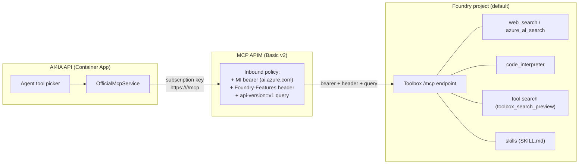

# Foundry Agent Service toolbox — fronted through the official-MCP APIM

> **Status: ACTIVATED in this repo, public preview.** The `ai4ia-toolbox` toolbox is live in the
> primary Foundry project, registered in `infra/mcp-servers.json`, and `enableOfficialMcp` +
> `enableFoundryToolbox` + `enablePrivateToolCatalog` are `true` in `infra/main.parameters.json`. The
> bicep param *defaults* remain `false`, so a consumer of this template starts off; this repo has
> opted in. Every Foundry capability referenced here (toolboxes, skills, tool search, browser
> automation, computer use, private tool catalog, routines, A2A) is **public preview** — do not use
> in production without your own validation.
>
> **Portability (1:1 standup):** the toolbox is a data-plane resource, so `azd up` alone cannot
> create it; a new subscription/tenant is **`azd up` + one command** (`provision-foundry-toolbox.py
> --create`). The `mcp-servers.json` entry is portable — it sets `foundryToolbox: true` and omits
> `upstreamUrl`, which `main.bicep` computes from the deployed project endpoint per environment.
> `foundry/toolbox.manifest.json` is the canonical toolbox definition the script reproduces.

## TL;DR — the bridge

An Azure AI Foundry **toolbox is itself an MCP endpoint**:

```
{project_endpoint}/toolboxes/{toolbox_name}/mcp?api-version=v1
```

It requires an AAD bearer for `https://ai.azure.com` and the header
`Foundry-Features: Toolboxes=V1Preview`. So instead of rewriting the app onto the Foundry
managed agent runtime, AI4IA registers that one endpoint as a **single "official MCP server"**
in `infra/mcp-servers.json`. The MCP APIM front door injects the
managed-identity bearer, the static feature header, and the `api-version=v1` query; the app
then consumes the entire toolbox — web/AI search, code interpreter, tool search, and bound
skills — through the existing `OfficialMcpService` + agent tool picker with **zero new runtime
code**.

This is the maximal "through the proxy + APIM" outcome with minimal surface: one catalog
entry, one RBAC grant, one feature flag.

## Why this approach

- **Reuse, don't rebuild.** The app is a custom in-process agent runtime; tools are the
  abstraction. The official MCP plane already knows how to discover, gate, budget, and call an
  APIM-fronted MCP server. A toolbox *is* one, so it drops straight into that seam.
- **One governance path.** Every tool and skill inside the toolbox inherits the same APIM
  subscription-key gate, managed-identity egress, and per-turn call budget as the rest of the
  official plane. There is no second auth path to reason about.
- **No runtime dependency creep.** `azure-ai-projects` is a *provisioning-time* extra
  (`app/api[foundry]`), never pulled into the runtime container. The app talks only MCP-over-HTTP.

## Architecture



The app never sees the Foundry endpoint, the AAD token, or the preview header — APIM owns all
three. From the app's perspective this is just another official MCP server named
`foundry-toolbox`.

## The one seam gap and its fix (shipped: `upstreamHeaders` / `upstreamQueryParams`)

The original official-MCP policy could inject the MI bearer and the subscription key, but not a
**static header** or a **query-string parameter** — both of which the toolbox endpoint
requires. The general, reusable fix (already in the schema and the gateway module):

- `infra/mcp-servers.schema.json` gains optional `upstreamHeaders` and `upstreamQueryParams`
  string maps.
- `infra/modules/mcpgateway.bicep` emits a `set-header` / `set-query-parameter` policy fragment
  for each pair, after the bearer and before the backend route.
- `scripts/gen-mcp-catalog.py` and the packaged runtime catalog are unaffected — these are
  infra-only fields that never leak into the app image (pinned by
  `app/api/tests/test_official_mcp_catalog_gen.py`).

## RBAC and Bicep wiring

| Concern | How it's wired |
| --- | --- |
| **Who can call the toolbox** | The MCP APIM system-assigned managed identity. |
| **What grant it needs** | The **"Foundry User"** role (`53ca6127-db72-4b80-b1b0-d745d6d5456d`, formerly "Azure AI User") at **project** scope — data-plane, not the account-scope Cognitive Services roles. |
| **Where it's granted** | `infra/modules/foundry.bicep` adds a project-scoped role-assignment loop over `toolboxPrincipalIds`, passed only to the **primary** Foundry region from `main.bicep`. |
| **How the app reaches it** | `main.bicep` var `foundryToolboxApimPrincipal` = the APIM MI principal, guarded on `enableOfficialMcp && enableFoundryToolbox`. |
| **Project endpoint for scripts** | `main.bicep` output `AZURE_FOUNDRY_PROJECT_ENDPOINT`, composed by `foundry.bicep` as `https://{toLower(accountName)}.services.ai.azure.com/api/projects/{project.name}`. |

The Agent Service host (`*.services.ai.azure.com`) is deliberately **not** the account's
inference host (`*.cognitiveservices.azure.com`); the endpoint output composes the former from
the deterministic custom subdomain rather than reading the ARM property (which returns the
latter).

## The manifest

`foundry/toolbox.manifest.json` is the declarative, operator-owned, **canonical** definition of the
single toolbox — it captures the live `ai4ia-toolbox` composition (web_search, code_interpreter,
toolbox_search_preview) that a new tenant reproduces 1:1 via `provision-foundry-toolbox.py --create`.
It is validated in CI against `foundry/toolbox.manifest.schema.json` (`infra-validate` workflow).
`name` uses the same slug pattern as `infra/mcp-servers.schema.json`, so the projected catalog entry is always
valid.

| Field | Meaning |
| --- | --- |
| `name` | Toolbox name; also the `{toolbox_name}` path segment and the mcp-servers.json entry name. |
| `description` | Human-readable scope (helps agents and operators). |
| `raiPolicyName` | Optional Responsible AI policy already on the project (`foundry.bicep` provisions `ai4ia-annotate-only`). |
| `connections` | Project connections referenced by name (credentials live in the connection, never here). |
| `tools` | Built-in and MCP tools (see per-tool table below). At most one unnamed tool per `type`. |
| `skills` | Existing project skills to bind (create them first with the skills script). |

`camelCase` keys in the manifest (e.g. `serverLabel`, `projectConnectionId`) are translated to
the API's `snake_case` by `scripts/provision-foundry-toolbox.py`.

## Per-tool configuration (all preview)

These are the tool types that can be placed **in a toolbox** via `azure-ai-projects` (2.3.0),
mapped one-to-one to the SDK's discriminated `*ToolboxTool` models by
`scripts/provision-foundry-toolbox.py`:

| `type` | Purpose | Key manifest fields | Notes |
| --- | --- | --- | --- |
| `web_search` | Grounded web search | `name`, `description`, `filters`/`userLocation`/`searchContextSize` (optional), `customSearchConfiguration` (optional) | Connectionless by default. `filters.allowedDomains` scopes results to specific domains; `userLocation` (`country`/`region`/`city`/`timezone`, all optional strings -- the SDK auto-sets its own internal `type` discriminator, so do not set one) biases results toward a locale; `searchContextSize` is one of `low`/`medium`/`high`. `customSearchConfiguration` (SDK 2.3.0's `WebSearchConfiguration`) independently scopes search to a Bing Custom Search instance instead of the general web; its `projectConnectionId` and `instanceName` are **both required together** when present (the SDK model has no default for either). |
| `azure_ai_search` | RAG over an AI Search index | `azureAiSearch.indexes[]`: either `indexAssetId` alone, or `indexName` + `projectConnectionId` together | Nested shape (SDK 2.3.0's `AzureAISearchToolResource`); do **not** put these fields at the tool root -- the SDK constructor silently ignores them there (no error, fields just deserialize to `None`). Exactly one index per tool. `indexName` + `projectConnectionId` (Microsoft's documented "Configure tool parameters" form) and `indexAssetId` (a direct reference to an already-registered index asset -- also a real SDK 2.3.0 `AISearchIndexResource` field, though no current Microsoft Learn doc for this tool shows it as an alternative) are **mutually exclusive**: the schema rejects an index entry that sets both, or neither. |
| `code_interpreter` | Sandboxed Python | `container` (optional) | Foundry-managed sandbox (distinct from AI4IA's existing direct Responses-API code interpreter). `container`, if set, is either an **existing container ID** (string; a pre-registered container resource) or a nested `{"type": "auto", ...}` object (SDK 2.3.0's `AutoCodeInterpreterToolParam`) for the managed sandbox with custom `fileIds`/`memoryLimit`/`networkPolicy`. Omit it entirely for the plain default sandbox. `networkPolicy` (SDK 2.3.0's `ContainerNetworkPolicyParam`) restricts sandbox outbound network access: `{"type": "disabled"}` or `{"type": "allowlist", "allowedDomains": [...]}` (non-empty). The SDK's allowlist variant also supports `domainSecrets` (a literal secret **value** injected per allowed domain); AI4IA intentionally does not expose that field here -- this manifest is committed to source control, so a per-domain secret value has no safe home in it (see AGENTS.md's "no secret sprawl" rule). |
| `file_search` | Search uploaded files | `vectorStoreIds`, `maxNumResults`/`rankingOptions`/`filters` (all optional) | Connectionless once files are attached. `vectorStoreIds`, if set, must be non-empty (an empty list is inert). `maxNumResults` is an integer 1-50. `rankingOptions.ranker` is `auto` or `default-2024-11-15`; `.scoreThreshold` is 0-1; `.hybridSearch`, if present, requires both `embeddingWeight` and `textWeight` (0-1 each). `filters` is a comparison (`type`/`key`/`value`, one of `eq`/`ne`/`gt`/`gte`/`lt`/`lte`/`in`/`nin`) or compound (`type`: `and`/`or` plus nested `filters[]`) tree over vector-store file metadata -- a **different shape** from `web_search.filters` above despite the shared name; each type's shape is independently schema-enforced. |
| `browser_automation_preview` | Drive a hosted browser | `browserAutomationPreview.connection.projectConnectionId` | Nested shape (SDK 2.3.0's `BrowserAutomationToolParameters`). The connection must be a **Playwright Workspace** connection, not a plain API connection. Preview; heavier isolation review recommended. |
| `openapi` | Call an OpenAPI-described API | `openapi` (nested `name`, `spec`, `auth`) | Wraps a REST API as a tool; `auth.type` is `anonymous` (no other field), `project_connection` (ONLY `auth.securityScheme.projectConnectionId`), or `managed_identity` (ONLY `auth.securityScheme.audience`) -- each is a strictly closed shape (schema `oneOf`, `additionalProperties: false` at every level), so e.g. a stray `securityScheme` on `anonymous` or an extra key alongside `projectConnectionId`/`audience` is rejected, not silently ignored. `spec` is passed through **byte-for-byte unmodified** -- its property names describe someone else's API and are never snake_cased, so a JSON-schema property genuinely named e.g. `topK` is never corrupted into `top_k`. There is no `functions` manifest field: the SDK's `OpenApiFunctionDefinition.functions` is read-only (server-populated, presumably extracted from `spec`) and is stripped from the wire request by the SDK's own `exclude_readonly` JSON encoding regardless of what a caller sets, so exposing it here would be a silently-inert no-op, not a real setting. |
| `toolbox_search_preview` | **Tool search** — let the model pick tools from a large set | none | Add this so the toolbox self-describes its tools to the model. |
| `mcp` | Nest another MCP server as a tool | `serverLabel`, one of `serverUrl`/`connectorId`, `requireApproval`, `projectConnectionId`, `serverDescription`/`allowedTools`/`deferLoading` (optional) | Lets the toolbox aggregate upstream MCP servers. Identified by `serverLabel`. Unlike `azure_ai_search`/`browser_automation_preview`, `mcp`'s `projectConnectionId` genuinely is a tool-root field in the SDK. `requireApproval` is the literal `"always"`/`"never"`, or an object with `always`/`never` keys each holding a tool filter (`toolNames`/`readOnly`); an empty object is rejected. `allowedTools` is either a non-empty array of tool-name strings or that same tool-filter shape, restricting which discovered upstream tools are exposed. `serverDescription` is free text surfaced to the model; `deferLoading` (boolean) defers fetching the server's tool list until first use. There is no BYO-container-image tool type; if you need to run genuinely custom execution logic, wrap it in your own server and expose it as an `mcp` tool instead of trying to pass a custom image to `code_interpreter.container`. The SDK's `mcp` model also exposes `authorization` (an OAuth bearer token) and `headers` (which can carry auth material); AI4IA does not expose either for the same secret-sprawl reason as `networkPolicy.domainSecrets` above -- put credentials in the referenced project connection instead. |
| `a2a_preview` | Delegate to a remote Agent-to-Agent (A2A) protocol agent | at least one of `projectConnectionId`/`baseUrl`, `agentCardPath`/`sendCredentialsForAgentCard` (optional) | SDK 2.3.0's `A2APreviewToolboxTool` -- the **inbound** direction (AI4IA's toolbox *calling out* to someone else's A2A agent), the inverse of the "Routines and Agent-to-Agent (A2A)" section below (AI4IA *exposing* its own agent as an A2A endpoint for others to call). Use `projectConnectionId` to delegate through a project connection storing the remote agent's endpoint and auth (Microsoft's documented approach), `baseUrl` (+ optional `agentCardPath`, `sendCredentialsForAgentCard`) for a self-contained, connectionless call to an anonymous agent, or both together (e.g. `baseUrl` as the target plus `projectConnectionId` for auth) -- the SDK constructor and schema both accept either or both; neither is client-side exclusive of the other. At least one is required; fields specific to other tool types (e.g. `serverLabel`, `requireApproval`) are rejected. |
| `fabric_iq_preview` | Ground responses in a Microsoft Fabric IQ knowledge source | `projectConnectionId` (required), `serverLabel`/`serverUrl`/`requireApproval` (optional) | SDK 2.3.0's `FabricIQPreviewToolboxTool`. Shares the `serverLabel`/`serverUrl`/`requireApproval` field *names* with `mcp`, but not `allowedTools`/`serverDescription`/`deferLoading` (those are mcp-only and rejected here). |
| `work_iq_preview` | Ground responses in Microsoft 365 Work IQ | `projectConnectionId` (required; the tool's only field) | SDK 2.3.0's `WorkIQPreviewToolboxTool`. Unlike `fabric_iq_preview`, does **not** accept `serverLabel`/`serverUrl`/`requireApproval` or any other field. |
| `reminder_preview` | Let the model schedule reminders for the caller | none | SDK 2.3.0's `ReminderPreviewToolboxTool`. No type-specific fields or connection required -- only the common `name`/`description`/`toolConfigs` below. |

> **`toolConfigs` (every tool type):** an optional map from tool name (or `"*"` for the
> catch-all default) to `{"pin": <bool>, "additionalSearchText": <string>}` (SDK 2.3.0's common
> `ToolConfig`) -- `pin` keeps a tool always loaded/visible; `additionalSearchText` adds extra text
> the model uses when `toolbox_search_preview` picks tools. Unknown keys under a `toolConfigs`
> entry are rejected. The map's own keys (the tool names) are caller-defined and always preserved
> exactly as written -- the provisioner never runs them through its camelCase-to-snake_case table,
> even when a tool name happens to collide with an unrelated manifest keyword (e.g. a tool
> literally named `topK` stays `topK`, it is never coerced to `top_k`).

> **Deliberate gaps (not modeled, by design):** two different reasons, not one. **Genuine
> secrets:** `code_interpreter`'s `container.networkPolicy.domainSecrets` (a literal secret
> **value** per allowed domain) and `mcp.authorization`/`mcp.headers` (credential material for the
> upstream MCP server) are real, SDK-constructible fields that AI4IA deliberately never models in
> this committed manifest schema (AGENTS.md "no secret sprawl") -- put credentials in a project
> connection instead. **Read-only/server-computed:** `openapi.functions`
> (`OpenApiFunctionDefinition.functions`) is declared `rest_field(visibility=["read"])` in the
> locked SDK and is stripped from every request body by `ToolboxesOperations.create_version()`'s
> `exclude_readonly=True` encoding regardless of what a caller sets -- modeling it as a settable
> manifest field would be a silently-inert, success-shaped no-op, so the schema rejects it via
> `additionalProperties: false` instead. Every other field the SDK's toolbox tool models accept --
> including `indexAssetId`, `web_search.filters`/`.userLocation`/`.searchContextSize`,
> `file_search.maxNumResults`/`.rankingOptions`/`.filters`,
> `mcp.serverDescription`/`.allowedTools`/`.deferLoading`, and the common `toolConfigs` -- is
> modeled and schema-enforced as of this round. `app/api/tests/test_foundry_toolbox.py`'s
> reflection-driven parity test enumerates every `azure.ai.projects.models.*ToolboxTool` subclass
> via the real locked SDK (walking `__mro__`-merged `__annotations__`, since
> `inspect.signature`/`typing.get_type_hints` don't resolve on these generated model classes) and
> fails if a future SDK field or type is left uncovered.

> **Available vs. deployed:** this table is every tool type the schema/provisioning script
> support (12 as of azure-ai-projects 2.3.0). The live canonical `ai4ia-toolbox`
> (`foundry/toolbox.manifest.json`) currently uses only three: `web_search`, `code_interpreter`,
> and `toolbox_search_preview`. See `foundry/toolbox.manifest.example.json` for a populated
> reference covering all 12 types (16 tools total, including both the
> `indexName`+`projectConnectionId` and `indexAssetId` forms of `azure_ai_search`) as a starting
> point for adding more.

> **Not toolbox tools:** `computer_use` and `bing_custom_search` exist only as *agent-level* tools
> in the SDK (`ComputerUsePreviewTool` / `BingCustomSearchPreviewTool`) with no `*ToolboxTool`
> counterpart, so they cannot be added to a toolbox. Attach them directly to an agent instead.

> **Identifier rule:** the service allows at most **one tool total** without an identifier. Every
> other tool needs a unique `name` (or `serverLabel` for `mcp`). The provisioning script and schema
> both enforce this.

> **Nested shapes are enforced, not just documented:** `foundry/toolbox.manifest.schema.json` sets
> `additionalProperties: false` on every tool and has a strict per-`type` branch (required nested
> fields, cardinality, and which fields are legal for that type) for **all twelve** tool types --
> not just `azure_ai_search`/`browser_automation_preview`. For example: `azure_ai_search` requires
> exactly one `azureAiSearch.indexes[]` entry with either `indexAssetId` alone or `indexName` AND
> `projectConnectionId` together (mutually exclusive) and rejects root-level `indexName`/
> `projectConnectionId`; `code_interpreter.container.networkPolicy` requires `allowedDomains`
> (non-empty) when `type` is `allowlist`; `browser_automation_preview` requires
> `browserAutomationPreview.connection`; `mcp` requires `serverLabel` plus one of
> `serverUrl`/`connectorId`; `openapi` requires `openapi.name`/`.spec`/`.auth` and enforces `auth`'s
> per-type nested fields; `a2a_preview` requires one of `projectConnectionId`/`baseUrl`;
> `fabric_iq_preview`/`work_iq_preview` require `projectConnectionId`.
> `scripts/provision-foundry-toolbox.py` **applies this schema itself** (via the optional
> `jsonschema` dependency, which ships with the `foundry` extra)
> before constructing any SDK model -- not just via CI's separate `check-jsonschema` lint step. `--create`
> refuses to run at all if `jsonschema` isn't installed; the dependency-free dry run best-effort
> validates when it happens to be available and otherwise only runs the hand-written structural checks.
> `scripts/provision-foundry-toolbox.py` also recursively snake_cases nested manifest keys before
> constructing SDK models (so nested camelCase config, not just top-level, is translated correctly)
> -- **except** `openapi.spec`, which is copied through untouched because it is an externally-authored
> OpenAPI document whose own property names are not AI4IA manifest keys.

Add a `description` to every tool — the model uses it for tool selection, which matters most
when `toolbox_search_preview` is present.

**Copy-paste starting point:** `foundry/toolbox.manifest.example.json` is a populated reference
manifest covering all 12 toolbox tool types (16 tools total -- `web_search`, `azure_ai_search`,
and `mcp` each appear twice, to show both of their alternative shapes -- plus seven connections:
Search, MCP-upstream, Playwright Workspace for browser automation, Bing Custom Search, and one
each for the A2A/Fabric IQ/Work IQ examples, and a bound skill), all uniquely identified (by
`name`, or `serverLabel` for `mcp` tools).
The shipped `foundry/toolbox.manifest.json` is the canonical `ai4ia-toolbox` definition; edit it (or
the example, passing `--manifest foundry/toolbox.manifest.example.json`), prune what you don't need,
create any referenced connections, then run `provision-foundry-toolbox.py`. The script creates the toolbox via
`project.toolboxes.create_version(name, tools=[...], description=..., skills=[...], policies=...)`,
then activates that new version (see the idempotency note below).

## Skills

A **skill** is a `foundry/skills/<name>/SKILL.md` file (Agent Skills spec,
[agentskills.io](https://agentskills.io)): YAML front matter (`name`, `description`) plus a
Markdown instruction body. `scripts/provision-foundry-skills.py` discovers, validates, and
(`--create`) uploads each via `project.beta.skills.create(..., default=True)`, which both creates
the version and activates it as the default in the same call (see the idempotency note below for
how this differs from the toolbox script's two-call create-then-activate). Bind a skill to the
toolbox by listing it under `skills` in the manifest. The example
`foundry/skills/citation-discipline/SKILL.md` enforces grounded, cited answers.

Skill `name` must match `^[a-z0-9]([a-z0-9-]*[a-z0-9])?$` (max 64). The create path sends
`Foundry-Features: Skills=V1Preview` and uses `allow_preview=True` on the client.

## Operator runbook (end to end)

1. **Install the provisioning extra.** `azure-ai-projects` is pinned to an exact version
   (`==2.3.0` as of this writing, not a floating floor) because the toolbox model classes this
   script constructs have already changed shape once between 2.x releases; every install path
   should land on the one version the manifest schema, provisioner, and tests were reviewed
   against:

   ```bash
   uv pip install -e "app/api[foundry]"
   ```

   CI installs this same extra (`pip install -e ".[dev,foundry]"`, see `.github/workflows/app-ci.yml`)
   so `tests/test_foundry_toolbox.py`'s real-SDK-construction cases run for real instead of
   skipping — but it is never part of the deployed runtime container image; the app talks only
   MCP-over-HTTP at runtime (see "No runtime dependency creep" above).

2. **Resolve the project endpoint.** With `enableFoundryToolbox=true` deployed, read it from
   `azd env get-values` (`AZURE_FOUNDRY_PROJECT_ENDPOINT`), or pass `--project-endpoint`.

3. **Create skills (optional).** Dry-run, then create:

   ```bash
   python scripts/provision-foundry-skills.py
   python scripts/provision-foundry-skills.py --create
   ```

4. **Populate `foundry/toolbox.manifest.json`** with tools (and any skills), then create the
   toolbox. The dry run prints the plan, the consumer MCP URL, and a ready-to-paste
   `infra/mcp-servers.json` entry:

   ```bash
   python scripts/provision-foundry-toolbox.py            # dry run
   python scripts/provision-foundry-toolbox.py --create
   # optional: emit the `azd ai toolbox create --from-file` YAML instead
   python scripts/provision-foundry-toolbox.py --emit-yaml foundry/toolbox.azd.yaml
   ```

   > **Idempotency note:** re-running `--create` with the same manifest `name` does not fail or
   > duplicate the toolbox -- it calls `create_version(name, ...)` again, which adds a new version
   > under the same named toolbox. `create_version` alone does **not** change what the toolbox's
   > MCP endpoint serves: a toolbox's `default_version` pointer is fixed at creation and does not
   > auto-advance to newer versions. So after every successful `create_version`, the script also
   > calls `project.toolboxes.update(name, default_version=<new version>)` to explicitly activate
   > it -- without that, repeat `--create` runs would keep creating versions that are never
   > actually served, silently. That makes repeat runs *safe* (each one activates cleanly) but not
   > a true no-op: each `--create` still accumulates an immutable version even when the manifest is
   > unchanged. There is no script-side dedup/diff against the latest version's content, so avoid
   > scripting unconditional `--create` on every deploy; run it deliberately when the manifest
   > changes. **Skills differ:** `provision-foundry-skills.py`'s `skills.create(name, ...,
   > default=True)` is a single idempotent call that both creates the version (auto-creating the
   > parent skill on first use) AND activates it as the default, so there is no separate
   > "create-then-activate" step to forget for skills the way there is for the toolbox.

5. **Register the entry.** Paste the printed object into `infra/mcp-servers.json` (`servers[]`)
   and regenerate the packaged runtime catalog:

   ```bash
   python scripts/gen-mcp-catalog.py
   ```

6. **Flip the flags and deploy:** `enableOfficialMcp=true` **and** `enableFoundryToolbox=true`,
   then `azd up`. The toolbox surfaces in the agent tool picker as the `foundry-toolbox`
   official MCP server; the grant lets APIM's MI bearer invoke it.

To disable: set `enableFoundryToolbox=false` (drops the RBAC grant) and/or remove the entry and
regenerate the catalog. Setting `enableOfficialMcp=false` tears down the whole MCP plane.

## Private tool catalog (Azure API Center)

`enablePrivateToolCatalog=true` provisions an **Azure API Center** (`infra/modules/apicenter.bicep`,
`Microsoft.ApiCenter/services@2024-03-01`, Free plan, system-assigned identity, single `default`
workspace) to act as a private, governed inventory of tools. `enablePrivateToolCatalog` is `true` in
this repo (activated); the bicep param default is `false`. Its region is set by `apiCenterLocation`
(default `eastus`) because API Center is not available in every region (notably not `eastus2`). The
flag is independent of `enableOfficialMcp`/`enableFoundryToolbox` (you can catalog whatever official
MCP servers exist). When enabled, `azd env get-values` exposes `AZURE_API_CENTER_NAME`.

The **catalog container** is IaC; **registering each server as an asset** is a preview, script-driven
step (MCP is a preview API kind in API Center), so it is intentionally not baked into Bicep:

```bash
# Dry run: lists each server and the APIM consumer URL that will be cataloged.
python scripts/provision-private-tool-catalog.py \
  --api-center "$AZURE_API_CENTER_NAME" \
  --gateway-url "$AZURE_OFFICIAL_MCP_GATEWAY_URL"

# Print ready-to-run `az apic api create` commands (register via CLI):
python scripts/provision-private-tool-catalog.py --emit-az \
  --api-center "$AZURE_API_CENTER_NAME" --gateway-url "$AZURE_OFFICIAL_MCP_GATEWAY_URL" \
  --resource-group "$AZURE_RESOURCE_GROUP"

# Or register directly via the SDK (needs the `foundry` extra):
python scripts/provision-private-tool-catalog.py --create \
  --api-center "$AZURE_API_CENTER_NAME" --gateway-url "$AZURE_OFFICIAL_MCP_GATEWAY_URL" \
  --resource-group "$AZURE_RESOURCE_GROUP" --subscription-id "$AZURE_SUBSCRIPTION_ID"
```

The load-bearing detail: the script catalogs the **APIM consumer URL**
(`https://<mcp-apim-gateway>/<name>/mcp`), not the raw upstream. Discovery and governance stay on
the proxy, and because API Center private tool catalogs integrate with Microsoft Foundry, Foundry
agents discover exactly the APIM-fronted URLs the app already consumes -- one governed inventory,
no second auth path. The shipped `infra/mcp-servers.json` now contains the activated
`ai4ia-toolbox` entry, so the script plans that MCP asset by default; an empty catalog is still a
clean no-op for consumers who remove all official servers.

## P7 — Routines and Agent-to-Agent (A2A): mixed status (routines validation-only by design; A2A endpoint scaffold shipped)

Routines and A2A are Foundry **managed-agent-runtime** features, but their offline-verifiable
surface diverges by design, not by omission. **Routines** is permanently validation/planning-only
-- see below for why no faithful `--create` exists against the pinned SDK. **A2A**'s
schema/validation/`--emit-az` scaffold is shipped and green; only the final live calls (enabling
the endpoint on a tenant) remain an operator step, using the pinned preview `az` CLI / SDK. Both
keep every tool call and endpoint on the proxy.

### Routines

A [routine](https://learn.microsoft.com/azure/foundry/agents/how-to/use-routines) in
azure-ai-projects 2.3.0 is **not** the multi-step, tool-calling workflow this repo's manifest
schema models. There is no `project.routines` at all; the actual (public preview) surface is
`project.beta.routines.create_or_update(routine_name, *, triggers, action)`, which models an event
**trigger** (a custom event, a GitHub issue, a cron schedule, or a timer) that invokes ONE
already-existing Foundry agent by name with a static input payload -- fundamentally different from
"run these N steps, each calling toolbox tools." Our manifest schema
(`name`/`description`/`model`/`toolbox`/`steps[].{name,instructions,tools}`) has no trigger-type
field and no target-agent-name field, so there is no faithful, non-inventive translation from one
shape to the other.

**Residual gap:** rather than fake-map semantics (e.g. silently treating a step as a trigger and
guessing an agent name for `action.agent_name`), `scripts/provision-foundry-routine.py` is
permanently validation/planning-only: it loads, validates, and prints the plan (steps, model,
referenced toolbox tools, project endpoint if configured) for `foundry/routines/*.routine.json`,
and never imports or calls the Azure SDK. There is intentionally **no `--create`** -- it was
removed rather than faked. This will be revisited if AI4IA defines a manifest schema that actually
captures a trigger + target-agent shape, or the SDK's routines surface gains step-based workflow
support.

Shipped:
- `foundry/routines/routine.schema.json` + `foundry/routines/example.routine.json` -- a schema and
  a populated example routine (steps, tool references, model) documenting the workflow shape
  AI4IA plans for, kept to make the residual gap concrete and forward-compatible.
- `scripts/provision-foundry-routine.py` -- pure `load_manifest`/`validate_manifest`/`plan_steps`/
  `referenced_tools` functions (dependency-free, unit-tested in `test_foundry_routine.py`; the
  script never imports `azure.ai.projects`).
- The routine references toolbox tools by name, so if/when a live path exists, every tool call it
  makes will still flow through the MCP APIM. Nothing is consumed by the app runtime today.

Run it: `python scripts/provision-foundry-routine.py` (validates the manifest and prints the plan;
there is no `--create`).

### Agent-to-Agent (A2A) endpoint

[A2A](https://learn.microsoft.com/azure/foundry/agents/how-to/enable-agent-to-agent-endpoint) exposes
a Foundry agent over the Agent2Agent protocol at a per-agent endpoint. This is the one P7 capability
with a genuine new APIM angle, and the plan keeps it on the proxy:

1. Enable the A2A endpoint on a deployed Foundry agent (portal/CLI/SDK); capture its endpoint URL.
2. Front that URL through APIM as a dedicated route, reusing the exact pattern the toolbox bridge
   uses: APIM injects the Foundry managed-identity bearer for `https://ai.azure.com` (and any preview
   feature header), so callers present only the APIM subscription key -- no second auth path.
3. Consume the APIM-fronted A2A endpoint from the app via the existing agent **`links`
   (agent-as-tool)** seam, so a remote Foundry agent appears as a delegated tool, gated on APIM auth
   exactly like every other official MCP server.

Shipped: `foundry/a2a/a2a.schema.json` + `foundry/a2a/example.a2a.json` and
`scripts/provision-foundry-a2a.py` -- pure `validate` / `a2a_endpoint` / `consumer_url` /
`build_agent_link` functions (unit-tested in `test_foundry_a2a.py`, including that the emitted
`agents.json` stub is a valid `AgentSpec`). `--emit-az` prints the enable + APIM-front commands. Steps
1-3 above still need a live project and a deployed agent to mint the endpoint URL, and the enabling
`az`/SDK surface is public preview -- so the final enable + catalog wiring is an operator step, but the
scaffold and the APIM-fronting commands are shipped and tested.

## Testing and CI

- `app/api/tests/test_foundry_toolbox.py` pins, with no Azure SDK or network: manifest
  validation (checked-in manifest matches the live toolbox, bad name / too many unnamed tools /
  non-toolbox tool types flagged), camelCase→snake_case tool projection, the consumer URL, the
  portable mcp-servers.json entry shape (`foundryToolbox: true`, no hardcoded URL), the azd YAML,
  and SKILL.md parse/validate. `jsonschema`-guarded tests assert the projected entry validates
  against `infra/mcp-servers.schema.json` (the load-bearing cross-seam guarantee) and that the
  manifests match `toolbox.manifest.schema.json`, including strict per-type positive/negative
  cases for every one of the 12 tool types (required fields, cardinality, and cross-type field
  pollution -- a field belonging to one type showing up on another).
- `azure.ai.projects`-gated tests (`pytest.importorskip`, skipped if the optional dependency isn't
  installed) go one step further than schema shape: they construct REAL SDK
  `azure.ai.projects.models.*ToolboxTool` instances from the example manifest and from targeted
  per-field cases, so a manifest the schema accepts is also proven to reach the SDK constructor's
  actual kwargs (this is what silently broke before -- an unrecognized kwarg the SDK just dropped,
  producing `None` fields with no exception). A reflection-driven parity test in the same file
  enumerates every `*ToolboxTool` subclass the installed SDK actually exposes (merging
  `__annotations__` across each class's `__mro__`, since `inspect.signature`/
  `typing.get_type_hints` don't resolve on these generated model classes) and fails the build if a
  future SDK type or field has no `_TYPE_TO_MODEL`/`_CAMEL_TO_SNAKE` coverage and no explicit,
  documented secret exclusion.
- `infra-validate` runs `check-jsonschema` on `foundry/toolbox.manifest.json`, the populated
  `foundry/toolbox.manifest.example.json`, and the routine + A2A example manifests, and builds
  `infra/main.bicep` (which compiles `apicenter.bicep`).
- `app-ci` runs the pytest suite whenever `app/**`, `foundry/**`, or the provisioning scripts
  change.
- `app/api/tests/test_private_tool_catalog.py` pins the API Center registration script: each
  server projects to an MCP asset carrying the **APIM consumer URL**, the emitted
  `az apic api create` command shape, and fail-closed input resolution.
- `app/api/tests/test_foundry_routine.py` pins the routine script: manifest validation, the
  toolbox-tool references a routine makes, that `--create`/`create_routine` no longer exist
  (guarding against a silent regression back to fake-mapping), and that the dry-run plan tolerates
  a missing project endpoint. `app/api/tests/test_foundry_a2a.py` separately pins the A2A endpoint
  script: manifest validation, the raw-vs-APIM endpoint URLs, the emitted `az` command shape, and
  that the emitted `agents.json` stub constructs as a real `AgentSpec` (so the links seam can
  consume it). `app/api/tests/test_foundry_skills.py` pins the skills script: `SKILL.md`
  parse/validate/discover, and that `create_skill()` always passes `default=True` so a new version
  is activated on both first create and later updates.
