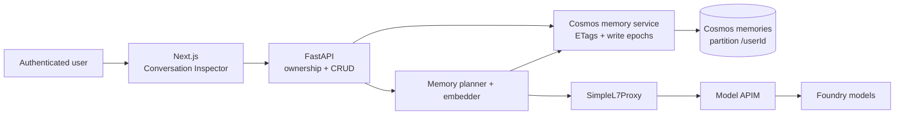

# Memory architecture

AI4IA memory is canonical, user-partitioned data in Azure Cosmos DB for NoSQL.
The same item holds the readable memory and its embedding, so text and vector
cannot drift into separate stores. PostgreSQL and replica-local SQLite are not
runtime memory stores.

> Production status: the Cosmos memory backend is the only supported backend,
> and the PostgreSQL Flexible Server that preceded it has been **retired**.
> There is no PostgreSQL fallback path.

## Why Cosmos

The previous design split durable vectors/text into PostgreSQL while a library
also kept plaintext history in replica-local SQLite. That made ownership harder
to reason about, prevented a verified cross-replica delete, and added a second
database solely for memory.

Cosmos consolidates:

- plaintext, embeddings, source metadata, ownership, and versions in one item;
- all of one user's coordination records in one logical partition;
- full create, read, update, delete, and scoped forget operations;
- transactional state fencing for concurrent replicas;
- the existing managed-identity and user-partition repository pattern.

PostgreSQL was retired once the migration completed and Azure AI
Search became the only document-chunk index. It is neither a memory backend nor a
provisioned resource.

## Request and model paths

Planner and embedding calls obey the normal compatible model route:

`FastAPI -> SimpleL7Proxy -> model APIM -> Foundry`

Cosmos is a native Azure data plane, so FastAPI accesses it directly with the API
managed identity.

## Container and index

`infra/modules/data.bicep` creates the `memories` container:

| Property | Value |
| --- | --- |
| Partition key | `/userId` |
| Vector path | `/embedding` |
| Data type | `float32` |
| Dimensions | 3,072 |
| Distance | cosine |
| Vector index | `quantizedFlat` |
| Normal indexing | `/embedding/*` excluded; all other paths consistently indexed |
| Default TTL | off (`-1`); operation receipts set their own seven-day TTL |

The Cosmos account enables `EnableNoSQLVectorSearch`. The dimension must continue
to match the catalog-selected embedding deployment and
`AI4IA_MEMORY_EMBEDDING_DIMENSIONS`.

## Item types

Every item uses the authenticated internal user id as `userId`.

| Type | Purpose | Sensitive content |
| --- | --- | --- |
| `memory` | Canonical text, embedding, scope/source ids, origin/lock state, model, version, write epoch, and timestamps | Plaintext and embedding |
| `state` | One per user: write epoch, scoped forget cutoffs, automatic-memory preference, and preference generation | No memory text or embedding |
| `operation` | Idempotency receipt for create/update/delete; expires after seven days | Opaque ids and operation metadata only |
| `documentState` | Active/deleted marker that fences document save against document deletion | Opaque document hash/state only |

Operation receipts and document-state records never copy prompts, memory text,
embeddings, prior values, or document content.

## Identity, authorization, and isolation

AI4IA uses two layers rather than granting each end user direct Cosmos access:

1. Entra authentication (or the controlled local development proxy) establishes
   the caller. FastAPI derives `AuthenticatedUser.internal_user_id`.
2. The API managed identity has Cosmos data-plane RBAC. Application code supplies
   the internal user id as the partition key on every point read/write and as a
   filter plus partition key on every query.

Request bodies never choose `userId`. A memory id from another partition resolves
as not found, which avoids disclosing that another user's record exists. End
users do not receive Cosmos credentials or broad account-level RBAC.

## Explicit CRUD

The owner-scoped API is `/api/memories`.

| Operation | Contract |
| --- | --- |
| `GET /api/memories?limit=50` | Lists at most 200 active records in the caller's partition and advertises supported capabilities |
| `POST /api/memories` | Creates a locked, user-origin record; accepts optional `Idempotency-Key` |
| `PATCH /api/memories/{id}` | Requires `If-Match`; re-embeds text, increments the version, and returns the new ETag |
| `DELETE /api/memories/{id}` | Conditionally deletes the current version; accepts optional `If-Match` and `Idempotency-Key` |

Text is trimmed, must be non-empty, and is capped at 2,000 characters. Create and
edit responses return the Cosmos ETag both in the payload and the `ETag` header.
A stale update/delete returns `409`; cross-user or missing ids return `404`.

The Conversation Inspector uses this contract for accessible create, inline edit,
and item-labelled confirmed delete controls. User-created or edited memories use
`origin="user"` and `locked=true`, so automatic planning cannot rewrite them.

## Automatic remember and recall

The owner's **Automatic memory** switch in **Context > Memory** defaults **on**.
It is a capability preference, not consent, a tool permission, or a deletion
request. The server's `AI4IA_MEMORY_STORE` gate remains authoritative: the switch
cannot enable a disabled backend.

`GET /api/memories/preference` returns `automaticMemoryEnabled` and an opaque
preference `etag`. `PATCH /api/memories/preference` requires `If-Match` and a
strict Boolean `automaticMemoryEnabled`; bodies cannot select a user. Both
responses are `no-store`. A stale preference ETag returns `409`, an unavailable
preference store returns `503`, and a server-disabled backend returns `404`.
The browser shows loading/saving states and rolls a failed change back to the
last confirmed display, marked **unconfirmed** until it reloads the server value.
Preference state and pending writes belong to the authenticated owner, outside
conversation-keyed and collapsible inspector components. Navigating between
conversations or closing the inspector cannot replace a pending write with a
stale confirmed setting. Settlement triggers a canonical reread for the same
active owner; switching accounts cannot apply the result to the next account
or issue that reread with the next account's credentials.

The preference lives in the existing `memories` container's per-user `state`
item, as `automaticMemoryEnabled` and `preferenceVersion`. Missing historical
fields mean on/version zero without rewriting the existing item on read. No
directory cache, new container, resource, index, or data migration is involved.
The local/dev `in_memory` backend keeps the same preference in its per-user
in-process store; it is not durable across restarts.

After a successful turn, sufficiently long user text can enter the best-effort
memory planner. The planner receives bounded candidate memories and returns one
strictly validated operation: `add`, `update`, `delete`, or `noop`.

- It may update/delete only unlocked `origin="implicit"` candidates.
- Unknown ids and locked/user-authored targets are rejected.
- It does not persist or expose model rationale.
- Planner, embedding, or recall failure does not break the chat turn.

Recall embeds the current query, executes a vector query inside only the caller's
partition, treats Cosmos cosine output as similarity (higher is more relevant),
applies the score threshold, and injects a bounded, explicitly untrusted context
block. Explicit CRUD and forget are not best-effort: failures surface to the
caller.

When the preference is off, automatic recall, consolidation, and model-invoked
`recall_memory` / `remember_memory` cannot read or save memories. This includes
model-mediated slash commands, chat and agent turns on both transports,
in-request workflows, and delayed/resumed durable workflow activities. Explicit
owner create/list/edit/delete, document save/forget, `/forget`, and `/forget me`
remain available. Existing records and other users' preferences are unchanged.

Automatic operations recheck after embedding, search, and planner awaits.
Before each model request, a current-preference check removes withheld recalled
context, including turn-local recall-tool returns; receipt admission is corrected
when the block was never sent. An unavailable preference never falls back to on.
A prompt already sent cannot be withdrawn, and memory-derived text in existing
conversation history is not erased or hidden by this switch.
SDK transport or authentication failures withhold memory just like an unavailable
Cosmos response; cancellation still propagates. Cancellation or failure while
preparing a later request preserves completed usage, tool activity, and request
evidence without counting an unsent request. First-request failure receipts retain
the filtered prompt, not a draft that still contains withheld memory.

The turn's execution receipt records which memories were admitted, including
their source identity, version, score, hash, and admitted text. This is input
provenance, not evidence of which memory caused a particular model statement.
The collapsed **Memories supplied** view reads those snapshots, offers links to
the owner's current inspector items, and opens the full execution receipt.
A missing item may have been deleted or be outside the bounded recent list;
the UI does not substitute current text for the historical snapshot.

### Preference write fence

Each preference change conditionally replaces the same state item that every
memory mutation checks in its transactional batch. The monotonically increasing
preference generation is separate from the forget epoch and does not establish
a purge cutoff. If a planner's state ETag loses to a disable, its retry refuses
the changed generation even if memory has since been reenabled. Thus an
in-flight automatic add, update, or delete cannot commit across the disabling
fence. Explicit owner mutations may retry the state change and remain available.
Ordinary memory writes do not invalidate the preference's separate ETag.

## Concurrency-safe forgetting

Deletion is not implemented as an uncoordinated query followed by blind deletes.

1. The service conditionally increments the user's `state.epoch` and records a
   cutoff for `user`, `session`, or `document` scope.
2. Every planned or explicit write captures the state ETag and epoch before model
   or embedding work, then commits the state check and mutation in one
   same-partition transactional batch.
3. A write that started before forget loses the conditional state check and
   returns a conflict instead of resurrecting old data.
4. Purge candidates are deleted with their individual ETags.
5. If a record changed after the cutoff, its delete receives a precondition
   failure; the purge re-queries and preserves the new-epoch version.
6. The cutoff is removed only after a verification query finds no matching
   pre-cutoff records.

This supports whole-profile `/forget me`, conversation `/forget`, document-scoped
forget, retries, concurrent scoped cutoffs, and post-forget writes without a
global lock.

## Document memory

Saving a ready library document creates bounded summary/excerpt memories marked
with its `documentId`. Replacement records and an active `documentState` marker
commit atomically in the user's partition.

Document deletion first permanently marks that source deleted and purges its
older memories. A stale save racing after the tombstone fails, so it cannot
recreate orphaned memory after the source manifest is gone.

## Privacy and deletion boundary

- Memory text and embeddings are intentionally stored in Cosmos because they are
  the product feature's canonical data.
- Logs, traces, activity records, idempotency receipts, migration quarantine, and
  custom telemetry exclude memory text and vectors.
- Active-store delete removes both text and embedding items.
- Azure backup retention and restore behavior are governed by the Cosmos account
  policy. Active deletion is not a promise of immediate physical removal from
  every provider-maintained backup.
- Historical messages and execution receipts are not rewritten when a memory is
  deleted. A receipt may retain the redacted text previously supplied to a turn;
  it is separate from metadata-only telemetry and idempotency receipts.
- The migration intentionally ignores replica-local SQLite history.
- Conversation deletion is separate from forgetting memories. The opt-in
  [resumable deletion protocol](runbooks/conversation-deletion.md) removes
  conversation content and inline originals, not reusable library documents,
  memories, or user-scoped generated media.

## Failure behavior

| Failure | Behavior |
| --- | --- |
| Cosmos endpoint missing for `memoryStore=cosmos` | Startup validation fails closed |
| Memory model absent from the catalog | Factory disables memory and logs a metadata-only warning |
| Recall/planner/embedding transient failure | Chat continues without new/recalled memory |
| Unknown or unreadable automatic-memory preference | Automatic memory is withheld; preference API returns an error, never an enabled default |
| Preference changed while automatic work was in flight | Recalled context is withheld; planned mutation is not committed |
| Explicit CRUD data-plane failure | Request fails; no success-shaped fallback |
| Stale ETag or changed write epoch | `409` conflict |
| Cross-user id | `404` |
| Document save/delete race | Permanent source tombstone prevents recreation |

## Provenance and rollout limits

- Historical messages without a receipt remain **unrecorded**, not backfilled.
- Receipts are bounded and may omit text, item references, or nested executions.
  A recorded memory-tool return alone is not proof of delivery to a later model
  request; consult retained request evidence in the full receipt.
- Receipts identify supplied memories, not hidden model reasoning or causal
  influence on the answer.
- All API replicas and durable workers must run the preference-aware release
  before the switch's guarantees apply deployment-wide. Older writers do not
  understand or preserve the preference fields. Rollout and mixed-revision
  coordination are separate from this no-migration application change.

## Primary implementation files

- `app/api/src/ai4ia_api/memory/cosmos_store.py`
- `app/api/src/ai4ia_api/memory/cosmos_service.py`
- `app/api/src/ai4ia_api/memory/planner.py`
- `app/api/src/ai4ia_api/memory/preferences.py`
- `app/api/src/ai4ia_api/memory/context.py`
- `app/api/src/ai4ia_api/routers/memories.py`
- `app/web/src/components/ConversationInspector.tsx`
- `app/web/src/components/MemoryPreferenceControl.tsx`
- `app/web/src/components/MemoryProvenance.tsx`
- `infra/modules/data.bicep`
- `scripts/migrate-memory-to-cosmos.py`
