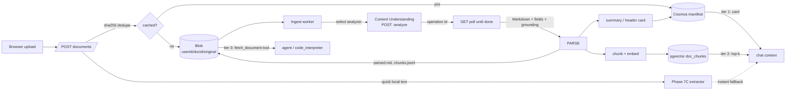

# Phase 11 — Document & Multimodal Understanding

Extends Phase 7C (upload → local text extract → untrusted chat context) into a
governed, **multimodal** ingestion + retrieval system: a user uploads *anything*
— PDFs, Office docs, images, audio, video, code/text — and can **question,
interrogate, annotate, cite, save to memory, and get it back**. Documents are
cracked by **Azure AI Content Understanding (CU)**, indexed for retrieval, and
surfaced to chat/agents cheapest-context-first. Per-user by default,
sharing-ready by design, and **feature-flagged default-OFF** so the current
behavior is byte-for-byte unchanged until enabled.

This document plans the **whole arc** (11A–11E) up front for consistency. Each
sub-phase ships behind the flag and is independently shippable.

## Core principles (additive to the repo's)

1. **Storage by tier.** Blob for raw bytes + parsed artifacts, Cosmos for the
   manifest, Postgres/pgvector for retrieval vectors. Each store does only what
   it is good at; no large blobs in Cosmos, no metadata scans over blob.
2. **Per-user isolation, sharing-ready.** The owner is `userId` everywhere
   (Cosmos partition key / blob path prefix / pgvector row filter). *All* access
   is API-mediated through a single `can_access(user, doc)` gate. v1 implements
   that gate as **owner-only**; enabling sharing later is an additive grant
   lookup, never a data migration. We cater to a *user*, not an org — most
   content is never shared — but nothing here blocks it.
3. **CU is the single front door.** Every modality is normalized to RAG-ready
   **Markdown + grounded fields**. One parse per unique file, cached by content
   hash, so re-uploads and repeat questions cost nothing.
4. **Cheapest-context-first retrieval.** Three tiers: a small **summary card**
   (always in context) → **RAG chunks** (retrieved on demand) → a **full-document
   fetch tool** (when the agent needs everything). The model has access to *all*
   of a document without *all of it* in context.
5. **Progressive enhancement.** Upload returns instantly — raw bytes stored plus
   the existing Phase 7C quick local text as an immediate fallback. CU enriches
   asynchronously and swaps in richer artifacts when its operation completes. CU
   never blocks a chat turn; any failure degrades to the quick-text path.
6. **Governed like every model call.** CU and embedding calls run the
   entitlement gate, are metered into the per-user usage ledger (CU costs real
   money, unlike local extraction), prefer the model gateway, and keep the
   untrusted-context (nonce-fence) framing for everything injected or fetched.
7. **Default-OFF, fail-closed.** Inert behind `AI4IA_DOCUMENT_UNDERSTANDING_ENABLED`;
   `validate_runtime()` refuses half-configured deployments; when off, Phase 7C
   behavior is unchanged.

## Pipeline



## Data model

### Blob layout (new Storage account; API-mediated, no public access)

```
uploads/{ownerUserId}/{documentId}/original.{ext}     # raw bytes
                                  /parsed.md           # CU Markdown
                                  /chunks.jsonl        # {chunkId, text, grounding}
                                  /versions/{n}/...    # edits / exports (11C+)
```

Bytes are encrypted at rest (account default), reached only through the API with
the api managed identity — the browser never gets a blob URL. Per-user SAS,
scoped + time-bound, is reserved for a later direct-download path if needed.

### Cosmos `userDocuments` manifest — **partition `/userId`**

A **new** container (`userDocuments`), separate from the existing Phase 7C
`documents`/`/sessionId` container — Cosmos can't repartition a container in
place, and a dedicated container leaves the session-scoped one untouched (true
zero regression). It's a personal cross-session library: a doc is associated with
sessions but owned by a user.

| Field | Notes |
|---|---|
| `id` | documentId |
| `userId` | **partition key**, the owner |
| `contentHash` | sha256 of raw bytes → dedupe/cache key with `analyzerId` |
| `filename`, `contentType`, `modality` | modality ∈ document/image/audio/video/text |
| `size`, `createdAt`, `updatedAt`, `schemaVersion` | |
| `status` | `pending`→`stored`→`analyzing`→`ready`/`failed` (+ stage detail) |
| `sources` | blob paths: original, parsedMarkdown, chunks |
| `analyzerId` | CU analyzer used (prebuilt or custom) |
| `cuOperation` | `{id, url, submittedAt}` for polling/resume |
| `summary` | header card: title, abstract, key fields, outline |
| `chunkCount`, `grounding` | chunkId → page/segment/timestamp map (citations) |
| `sessionLinks[]` | sessions that reference it (association, **not** partition) |
| `visibility` | `private` (v1 always) — reserved for `shared` |
| `acl[]` | reserved, empty in v1 (future grant principals) |

`visibility` + `acl` exist from v1 so sharing is a field flip, not a migration.

### Cosmos `analyzers` registry — **partition `/userId`** (+ `global`)

Users can define **custom CU analyzers** (field schemas, mode) reused on upload.

| Field | Notes |
|---|---|
| `id`, `userId` | `userId="global"` for the shipped prebuilt set |
| `name`, `modality`, `mode` | mode ∈ `standard` \| `pro` |
| `cuAnalyzerId` | service-side CU analyzer id (created via PUT, ensure-exists) |
| `fieldSchema` | fields to extract (CU field definitions) |
| `createdAt`, `updatedAt` | |

v1 ships the prebuilt analyzers (document/image/audio/video) and the registry +
selection plumbing; a custom-analyzer **authoring UI** can follow, but the data
model and the "pick an analyzer at upload" path exist from the start.

### pgvector `doc_chunks` (reuses the memory store's AAD pool + embedder)

`id, user_id, document_id, chunk_id, content, embedding vector(3072), grounding,
created_at`. Filtered by `user_id` (+ `document_id`), exact cosine scan — same
constraints/pattern as `memories` (3072-dim exceeds the ANN ceiling).

### Reserved for sharing (not created in v1): `grants`

`grants` partitioned by `/granteeUserId` → `{documentId, ownerUserId, scope}`.
Enables "find docs shared *with me*" without scanning owners. Cross-partition
read of one shared doc by id is fine; this index is only for enumeration.

## Content Understanding integration

CU is its **own async REST surface** (not an OpenAI deployment): `PUT` to
create/update a custom analyzer, `POST …:analyze` to submit (returns an operation
id), `GET` the operation to **poll until `succeeded`**. Large media can take a
while — hence async ingest + polling with backoff, not an inline call.

- **Output** (RAG-ready): Markdown + extracted fields with **confidence &
  grounding**; `standard` vs `pro` mode (pro = multi-step cross-validation,
  knowledge linking — slower, pricier, opt-in for high-stakes docs).
- **Per modality:** documents/images → Markdown + OCR + tables/fields; audio →
  transcript + speaker diarization + timings; video → keyframes + scene
  segmentation + per-segment descriptions + transcript.
- **Client** mirrors the gateway auth construction (api-key vs bearer / managed
  identity, Cognitive Services scope). Prefer routing through APIM/the gateway
  when it fronts the AI Services account; otherwise a configured `cu_base_url`
  with the api managed identity — the one justified non-OpenAI direct path,
  still governed (gated + metered).

## Retrieval & routing

- **Tier 1 — summary card:** always injected (cheap), so the model knows the doc
  exists and its shape.
- **Tier 2 — RAG chunks:** top-k from pgvector by the user's question, injected
  inside the existing nonce-fenced untrusted block (`_document_context`).
- **Tier 3 — `fetch_document(document_id, range)` tool:** returns full/partial
  parsed Markdown from blob when the agent needs everything (long-doc tail).
- **Intent router (11C, implemented).** A deterministic, dependency-free
  classifier (`library/router.py`) labels each turn **qa** (→ Tiers 1–3 RAG),
  **compute** (totals, stats, charts, tabular → the `run_code` tool), or
  **transform** ("adjust & return it" → the `export_document` tool). CU/RAG is
  always the front door; CI is **never the default** — the router only *offers* the
  compute tools (the model still chooses), since CI is the slowest path and weak at
  corpus search. `run_code` rides the Azure OpenAI **Responses API** built-in
  `code_interpreter` tool — a sandboxed Azure-managed Python container: `POST
  {code_interpreter_base_url}/openai/v1/responses` with
  `tools:[{type:"code_interpreter",container:{type:"auto"}}]`, synchronous
  (`status: "completed"`, `output_text` + `output[]`). The v1 GA surface omits
  `api-version`; `?api-version=preview` opts into preview features. Verified on
  Microsoft Learn — *"Use the Azure OpenAI Responses API"* → **Code Interpreter**
  section (learn.microsoft.com/azure/foundry/openai/how-to/responses; REST schema at
  learn.microsoft.com/rest/api/aifoundry/azureopenai/responses). v1 hands CI the **ready-gated parsed Markdown**
  (handing CI the original-file container `file_ids` is a documented future
  enhancement).
- **Citations** come from the grounding map (page "p.4", timestamp "02:13",
  segment), enabling deep-link-back in the UI.

## Governance & security

- **Entitlement gate + metering** on every CU/embed op (disabled user blocked;
  CU ops recorded to the usage ledger).
- **Isolation** at blob path / Cosmos partition / pgvector row; bytes encrypted
  at rest; **no public blob access**; browser never sees deployment or credential.
- **Prompt injection:** CU Markdown is untrusted → the per-message nonce fence is
  retained for injected chunks/summaries *and* `fetch_document` output.
- **Cost/size/time guards:** per-modality max size, max docs per user, CU
  page/duration caps, async timeout + polling backoff, content-hash cache.
- **Lifecycle/PII:** CU can surface PII; retention + erase extend the existing
  tombstone + async purge + cross-store verification across blob, Cosmos, and
  pgvector.

## The arc

- **11A — Storage spine & manifest.** Per-user manifest data model
  (`userDocuments` partitioned `/userId`); `analyzers` registry container;
  `can_access` resolver (owner-only); API CRUD with ownership checks;
  content-hash dedupe. **No blob, no CU yet** — Phase 7C extraction stays the
  parse path. Flag default-OFF; off ⇒ today's behavior.
- **11B — CU ingest (docs/images).** New blob Storage account + `documents`
  container + api-MI RBAC (infra); `POST /api/library/documents` upload (store +
  manifest with an instant quick-text summary); async CU client + ingest worker;
  Markdown → summary card + chunks → pgvector; progressive-enhancement swap-in
  over the instant quick-text fallback; status surfaced to the UI. Split for
  review isolation: **11B-1** ships the ingest *producer* (this list, plus the
  blob/upload/CU/chunk pipeline), and **11B-2** ships the retrieval *consumer* —
  wiring tiers 1–2 into the chat hot path, the `fetch_document` tool (tier 3),
  and the web UI — since the chat hot path is the highest-regression-risk surface.
  Prebuilt + selectable analyzers. **11B-2 implemented:** a universal system-block
  injection (Tier 1 summary cards + Tier 2 RAG excerpts) built by
  `library/retrieval.py`'s `DocumentRetrievalService`, the `fetch_document` synthetic
  tool (`library/chat_capability.py`, tool-enabled agents only) for Tier 3, and a
  sidebar **Document library** panel (flag `DOCUMENT_LIBRARY_ENABLED`, default OFF).
  Status-gated end to end — only `ready` documents contribute, the pgvector search is
  scoped to ready doc ids, all injection is best-effort (never breaks a turn) and
  nonce-fenced as untrusted, preserving the producer invariant that a document which
  never reaches `ready` exposes no retrievable chunks.
- **11C — Intent router + code_interpreter + "adjust & return" export.**
  **Implemented:** a deterministic, dependency-free `IntentRouter`
  (`library/router.py`) classifies each turn — **qa** (Q&A / interrogate / cite →
  the 11B-2 Tier-1/2 RAG already shipped), **compute** (totals, stats, charts,
  tabular → `run_code`), or **transform** ("adjust & return it" → `export_document`).
  CU/RAG stays the front door; **code_interpreter is never the default** — the
  router only *offers* the compute tools when the ask is genuinely
  compute/tabular/transform (the model still decides), since CI is the slowest path
  and weak at corpus search. `run_code` is a governed Azure OpenAI **Responses API**
  built-in `code_interpreter` tool (sandboxed Azure-managed Python container; `POST
  {base}/openai/v1/responses` with
  `tools:[{type:"code_interpreter",container:{type:"auto"}}]` — see the Microsoft
  Learn citation in *Retrieval & routing*) handed the **ready-gated** parsed document
  text. `export_document` writes a **new versioned blob** under
  `…/versions/{n}/…` and bumps a `versions[]` entry on the manifest, leaving the
  original immutable. All of it is a **second** default-OFF flag
  (`document_compute_enabled`, layered on top of document understanding) guarding the
  chat hot path: when off, the router never runs, neither synthetic tool is
  advertised, the version-download endpoint refuses, and chat is byte-for-byte
  unchanged. Governance mirrors 11B exactly — per-user ownership re-check, `ready`
  status-gate on every doc-access path (CI input + export source), generic not-found
  on cross-user (no existence leak), per-turn budgets (max runs/exports), usage
  metering, and the per-turn nonce fence + `_one_line`/`_safe_filename` on **every**
  new untrusted string (CI stdout/stderr, artifact filenames, exported content
  metadata) in both success **and** error results. Router/CI/export failures are
  best-effort: they swallow and fall through to the normal RAG answer, never breaking
  a turn. Tool names (`run_code`, `export_document`) are disjoint from the
  builtins/`delegate_to_agent`/`fetch_document` (the runtime keeps its fail-closed
  collision assert).
- **11D — Multimodal (audio/video).** Audio (transcript + diarization) and video
  (keyframes + segmentation) analyzers; grounded timestamp/segment citations and
  deep-link-back.
- **11E — Knowledge & lifecycle.** Save-to-memory (promote chunks/summaries into
  pgvector/mem0); annotations (Cosmos sub-resource keyed by
  `(documentId, chunk/segment)`); versioning/immutable history; retention/erase;
  **sharing enablement** — create the `grants` container, flip `can_access` to
  consult grants, extend the retrieval filter to accessible owners/docs.
  - **11E-1 implemented (save-to-memory).** `POST
    /api/library/documents/{id}/memory` promotes a ready document's gist — its
    summary plus a bounded set of leading parsed excerpts (sourced via the
    already-governed `DocumentRetrievalService.read_parsed` → `chunk_markdown`) —
    into the caller's durable memory as `kind="document"` records, so the model
    can recall the document across sessions even when the library isn't queried.
    Owner-only and `ready`-gated (mirroring read/delete); 404 when document
    understanding is off, 409 when memory is disabled, 422 when the document has
    no content, 502 on a transient memory failure. The explicit action bypasses
    the trivia gate and (unlike passive `remember`) surfaces failures. Knobs:
    `memory_document_max_items = 6`, `memory_document_chunk_chars = 600`.
    Re-saving is not yet idempotent (duplicate records) — source-tracked dedupe
    / forget-by-document is deferred to the retention increment.

## Speed / accuracy / robustness levers

Content-hash cache (skip CU on repeats) · `standard` default, `pro` opt-in ·
async ingest + instant local-text fallback · tiered retrieval (small, relevant
context) · idempotent best-effort degradation · polling backoff · per-modality
caps.

## Config (new `AI4IA_*` knobs — all default-OFF/empty)

`document_understanding_enabled: bool = False` · `cu_base_url` ·
`cu_api_version = "2025-11-01"` · `cu_auth_mode` (none|api_key|bearer) ·
`cu_timeout_seconds` · `cu_poll_interval_seconds` · `cu_max_poll_seconds` ·
blob account/container settings · `document_chunk_chars`/`document_chunk_overlap` ·
`document_max_upload_bytes` · `document_max_per_user` · default analyzer per
modality · retrieval-consumer knobs (`document_retrieval_top_k = 6`,
`document_context_max_docs = 20`, `document_context_max_chars = 8000`,
`document_fetch_max_chars = 12000`). Add fail-closed `validate_runtime()` checks
(enabled ⇒ blob + CU endpoint configured), mirroring the realtime/voice-live
pattern.

**Compute over the library (Phase 11C, all default-OFF/empty):**
`document_compute_enabled: bool = False` (the second flag guarding the chat hot
path; enabling it requires `document_understanding_enabled` — `validate_runtime`
fails closed otherwise) · `code_interpreter_base_url` (bare Azure OpenAI resource
endpoint; `/openai/v1` is appended by the client) · `code_interpreter_model`
(both **required** when compute is enabled outside `local`) ·
`code_interpreter_api_version = ""` (empty ⇒ Responses v1 GA; `preview` opts in) ·
`code_interpreter_auth_mode` (bearer AAD / api_key) · `code_interpreter_api_key`
(required when `auth_mode == api_key`) ·
`code_interpreter_aad_scope = "https://ai.azure.com/.default"` ·
`code_interpreter_timeout_seconds = 120` ·
`code_interpreter_max_input_chars = 60000` (parsed text handed to CI per run) ·
`document_export_max_chars = 200000` (one exported artifact).

**Save-to-memory (Phase 11E-1, reuses the existing memory store):**
`memory_document_max_items = 6` (max records stored per save: the summary plus
leading excerpts) · `memory_document_chunk_chars = 600` (size of each parsed
excerpt). Gated by the existing `memory_store` (no new flag); when memory is
disabled the endpoint returns 409.

## Open items / future

Sharing UX + link-sharing semantics · OCR confidence thresholds / human-review
queue (CU `pro`) · corpus-level (cross-document) synthesis · custom-analyzer
authoring UI · optional per-user time-boxed SAS for direct large-file download.
